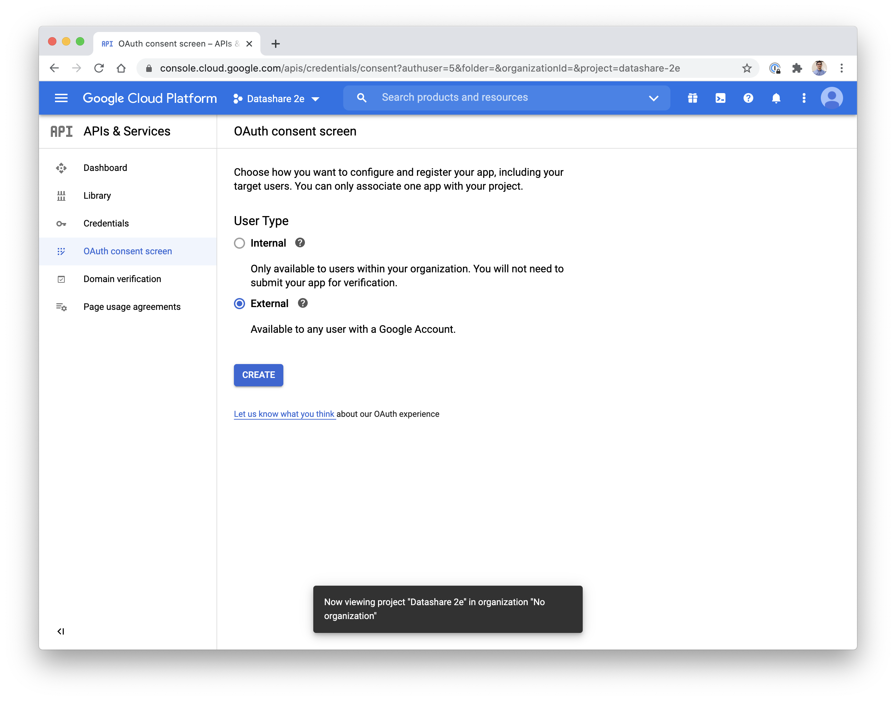

[Back to Datashare](./README.md)

# Overview
The OAuth 2.0 Client ID setup is required in order to provide a credential for the UI to access the APIs. This step must be performed manually through the Google Cloud Console, as there is no CLI to perform the steps due to security concerns. If you need additional assistance, then follow the steps in [Creating your credentials](https://cloud.google.com/docs/authentication/end-user#creating_your_client_credentials)
in our public documentation.

# Pre-requisites
Before starting credential setup, ensure that you've [configured your domain](./DOMAIN_SETUP.md). Also, if you have not already, configure the [OAuth consent screen](https://console.cloud.google.com/apis/credentials/consent).

# OAuth consent setup
If you have not yet configured the [OAuth consent screen](https://console.cloud.google.com/apis/credentials/consent), you should configure it before proceeding.

1. Select the user type and then click 'CREATE'. If you will have Datashare users outside of your organization, choose external, otherwise you can choose internal.

    

2. Complete the form information for the app registration, and then click 'SAVE AND CONTINUE'.

    

3. Click 'SAVE AND CONTINUE' on the 'Scopes' page.
4. Click 'SAVE AND CONTINUE' on the 'Optional info' page.
5. Click 'BACK TO DASHBOARD'.

# Setting up OAuth credential
1. Go to https://console.cloud.google.com/apis/credentials.
2. Click 'Create Credentials'.

    

3. Select the 'OAuth client ID' option.

    

4. Select application type 'Web application'.

    

5. Provide a name for the credential.

    

6. Add the following URIs to the 'Authorized JavaScript origins' by clicking on '+ ADD URI' within the section.
    - https://{DOMAIN}

    

7. Add the following URIs to the 'Authorized redirect URIs' by clicking on '+ ADD URI' within the section.
    - https://{DOMAIN}/
    - https://{DOMAIN}/myProducts
    - https://{DOMAIN}/activation

    

8. Click the 'CREATE' button.

    

9. Copy the client ID from the section titled 'Your Client ID' in the modal dialog. This will be used later when configuring the VUE_APP_GOOGLE_APP_CLIENT_ID value for the UI.

# Next
[Deploy Datashare](./DEPLOY.md)