[Back to Datashare](./README.md)

# Installing Datashare

1. Complete the [Datashare marketplace prerequisites](./marketplace/PREREQUISITES.md)

2. Open the [Datashare solution](https://console.cloud.google.com/marketplace/details/gcp-financial-services-public/datashare-vm)
3. Click 'LAUNCH' to start the installation.

    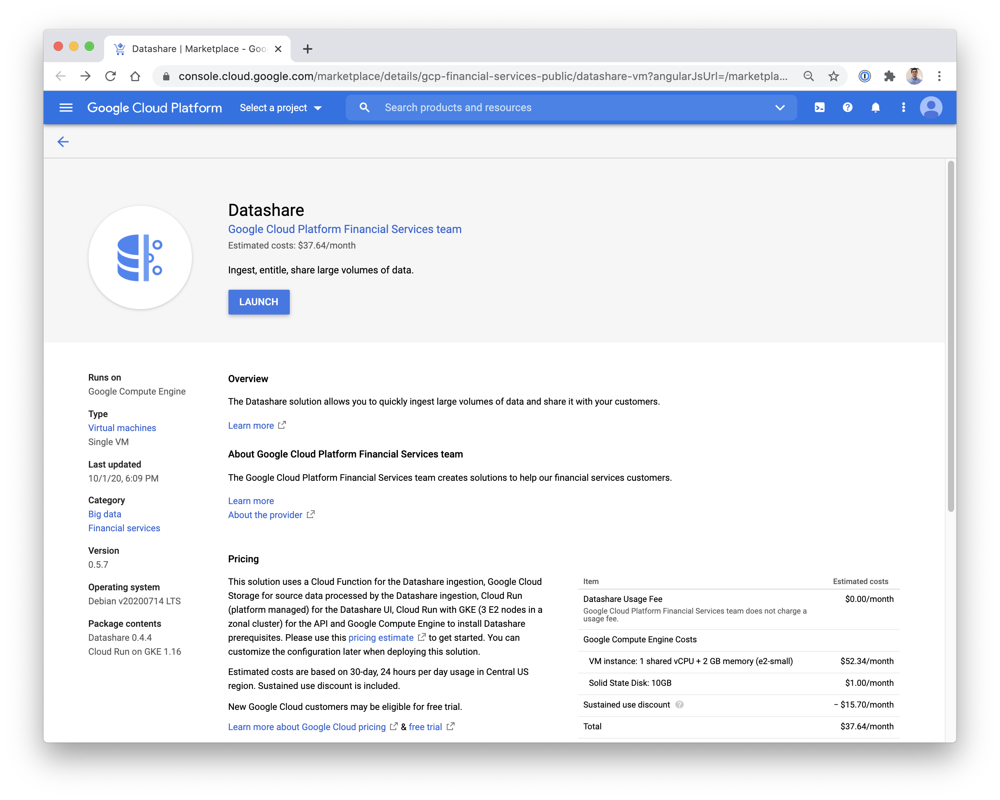

4. If prompted, select a project to deploy to.

    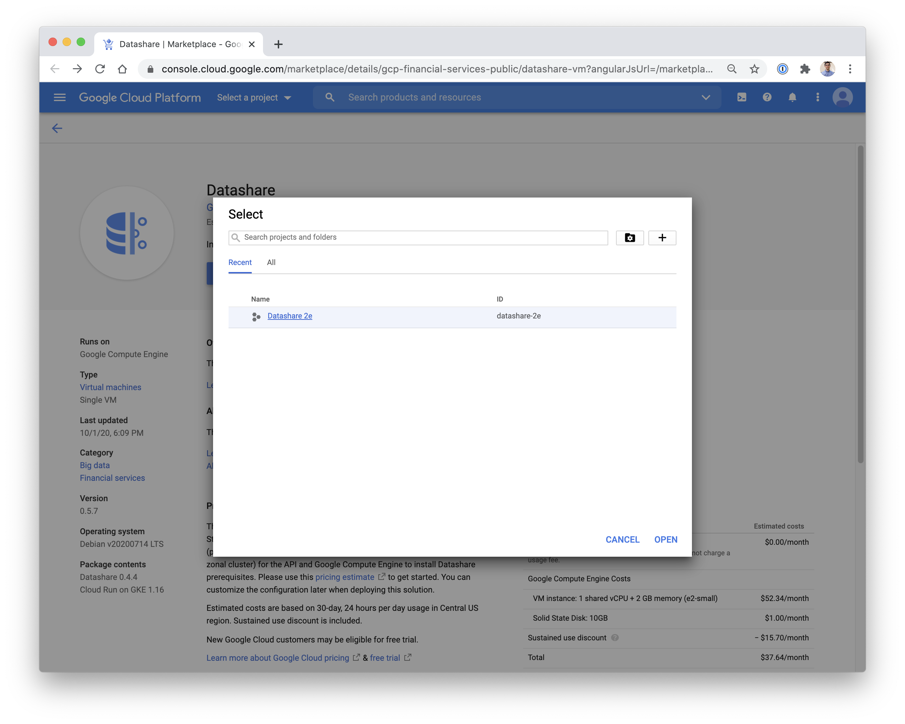

5. Populate the following fields:
- GCP Service Account: Populate this with the service account created in step 1. IE: datashare-deployment-mgr@[YOUR_PROJECT_ID].iam.gserviceaccount.com
- OAuth Client Id: Populate this with the OAuth Client Id created during the [credential setup](./CREDENTIAL_SETUP.md) step.
- Data Producers: Populate this with a comma delimited list of domains or accounts that should be Datashare admins.

    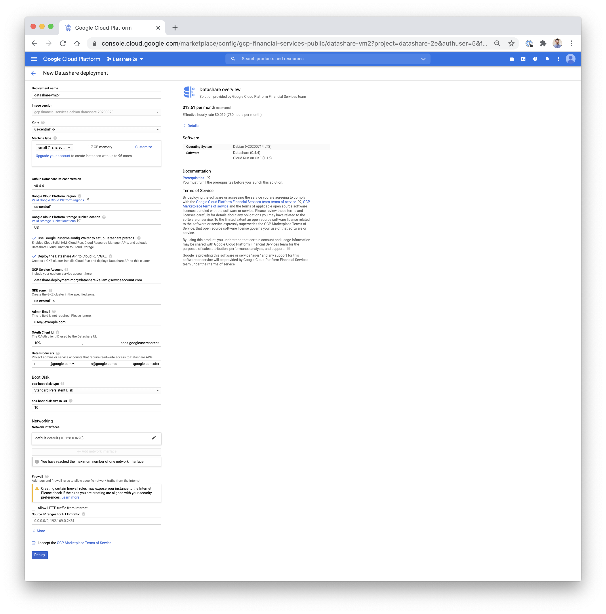

6. Click 'Deploy' to start the deployment.

7. Await the completion of the deployment, once completed, you'll see a green checkmark at the top.

    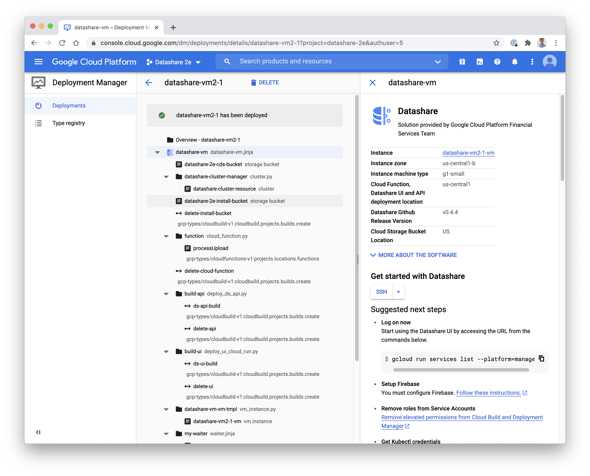

# Map the domains
1. Go to the [Cloud Run console](https://console.cloud.google.com/run).
2. Click 'MANAGE CUSTOM DOMAINS'.
3. Click '+ ADD MAPPING'.
4. Click 'Add Service domain mapping'.
5. Select the UI service, and map it to the UI domain.

    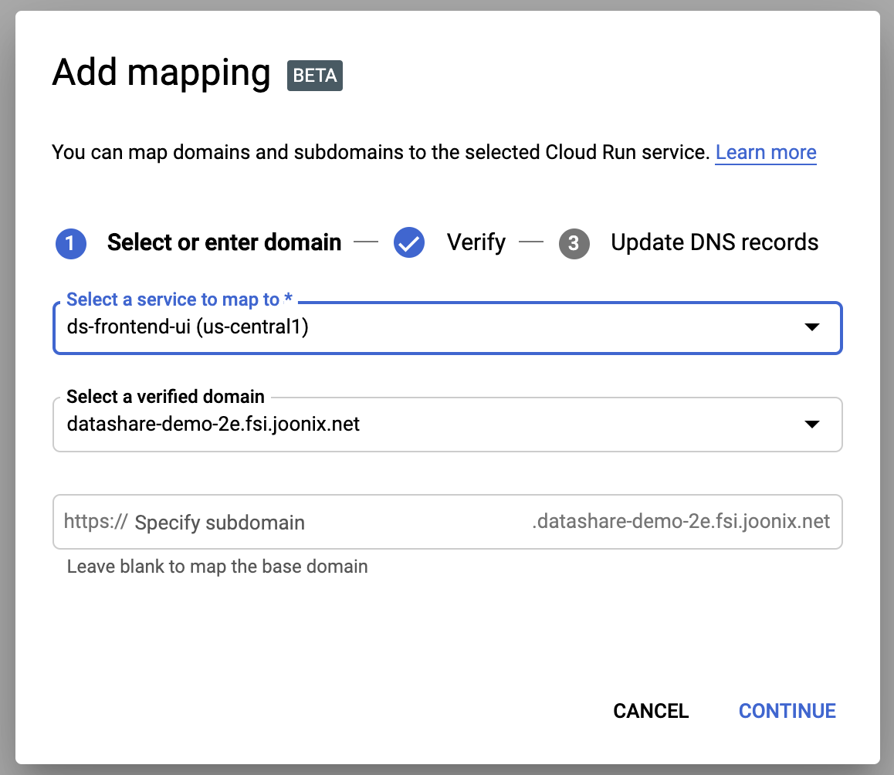

6. Click 'CONTINUE' and you'll be prompted with the A and AAAA record information to configure within your DNS setup.
7. If using GCP Cloud DNS, go to your zone record for the domain, and enter the corresponding values for the A and AAAA records.

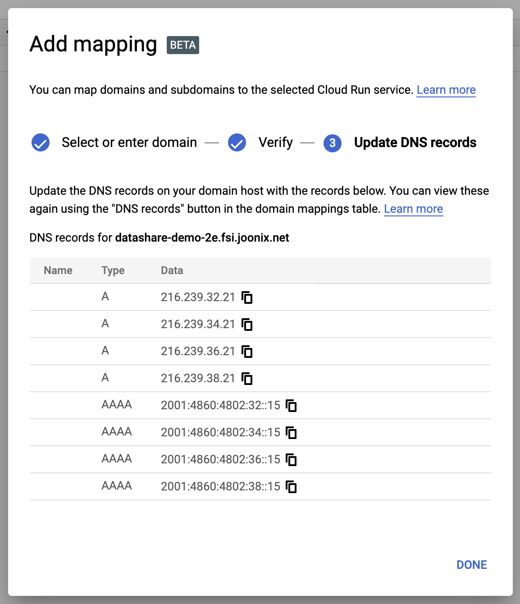

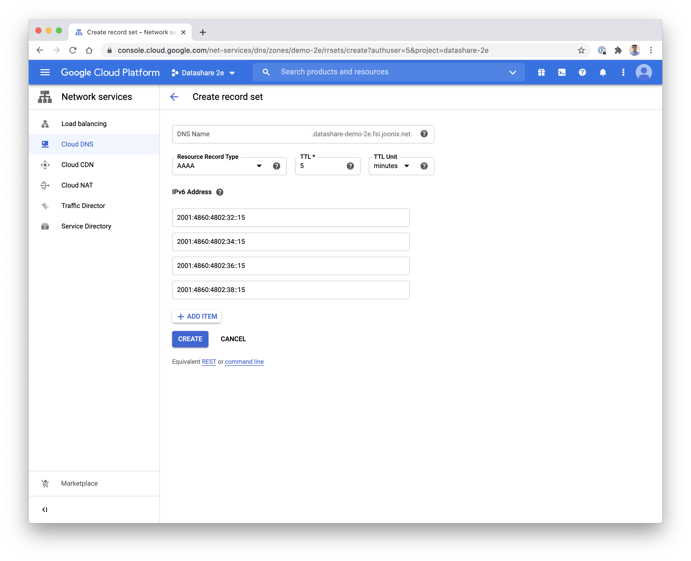

Once completed, your zone details should look like:

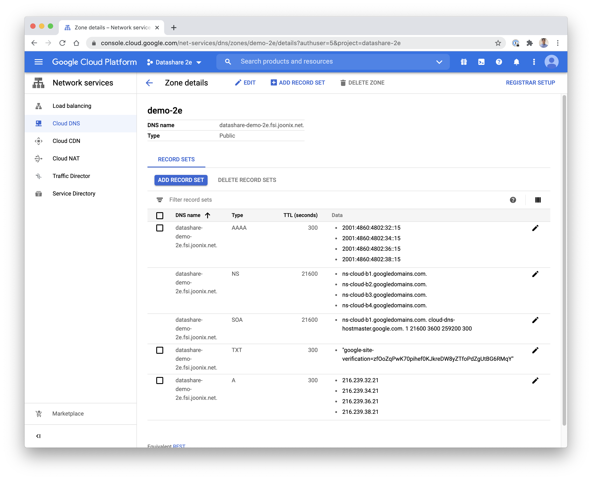

8. Select the API service, and map it to the API domain.
    
    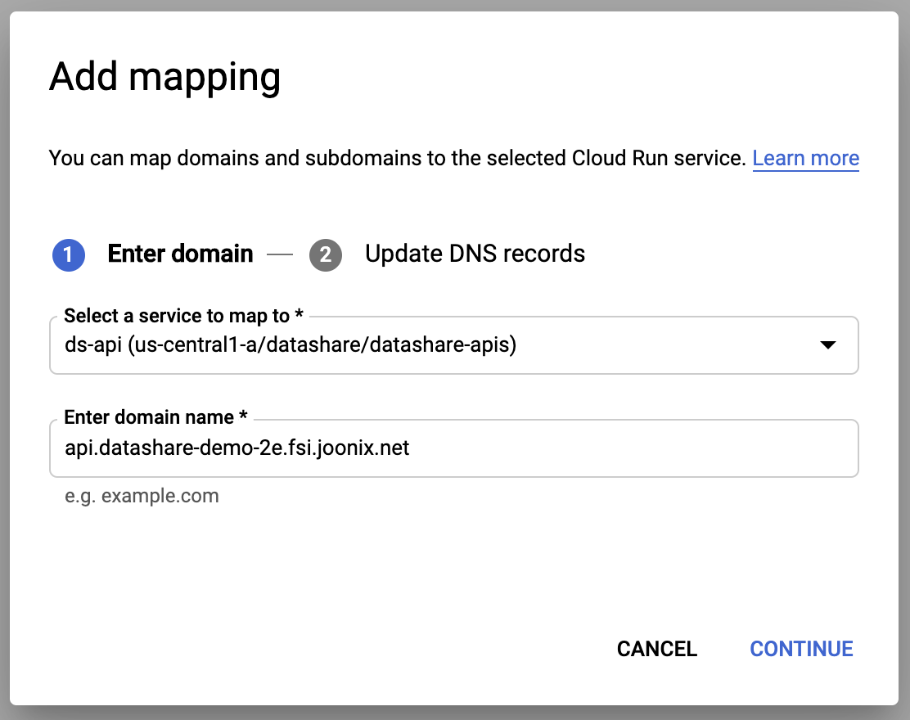

9. Click 'CONTINUE' and you'll be prompted with the A record information to configure within your DNS setup.

    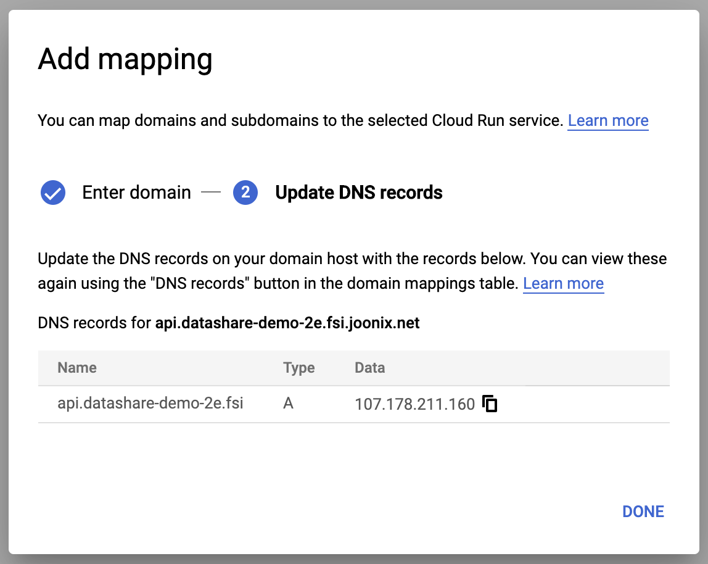

10. If using GCP Cloud DNS, go to your zone record for the domain, and enter the corresponding values for the A and AAAA records.

    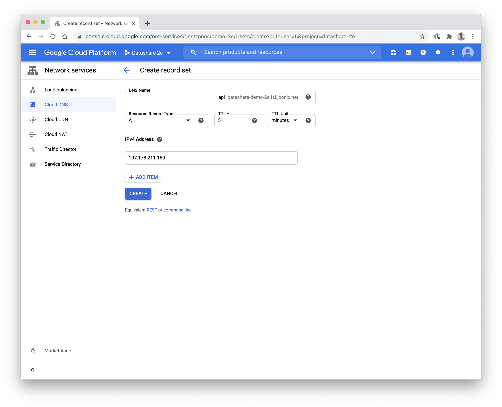

Once completed, your zone details should look like:

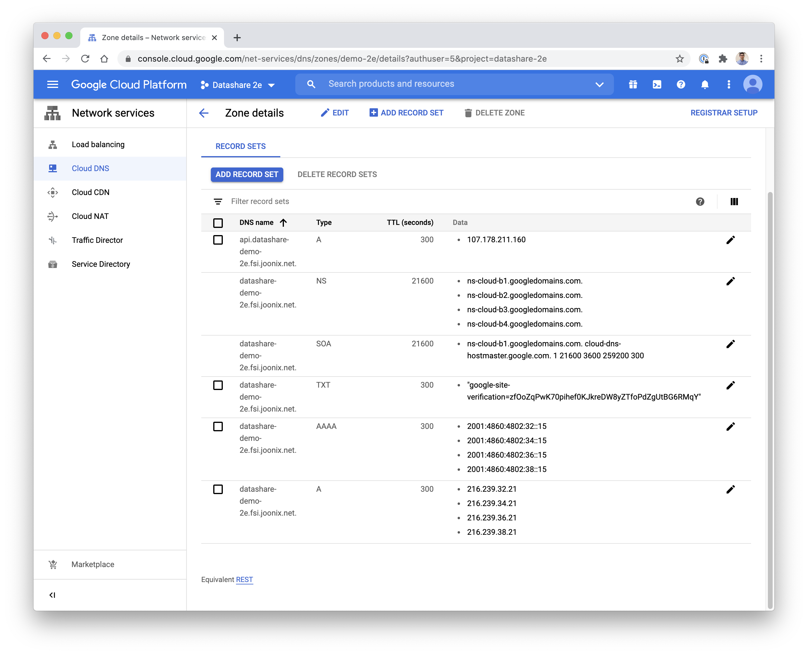