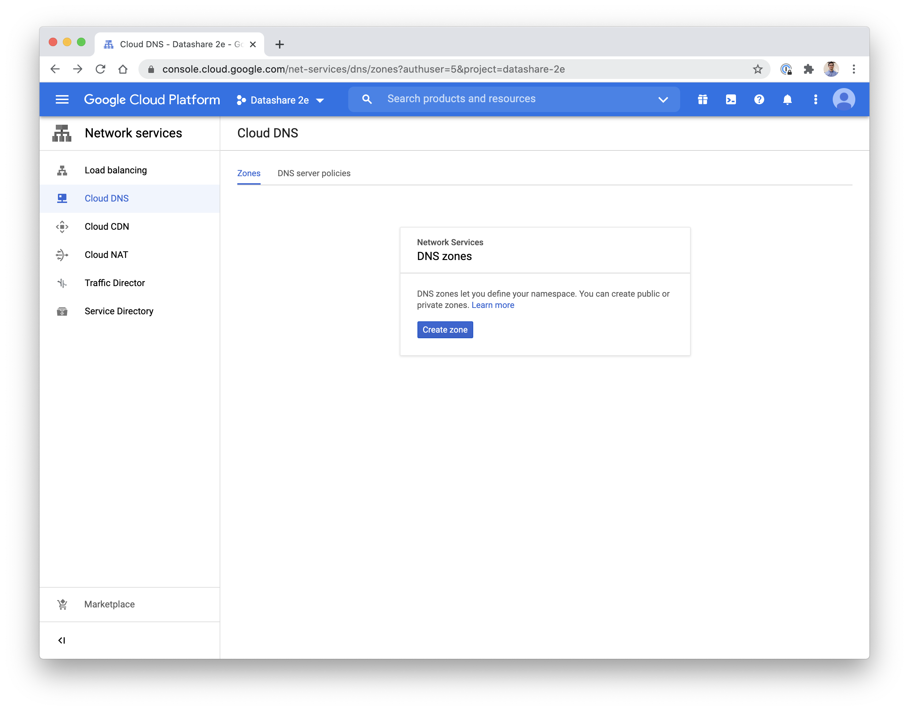
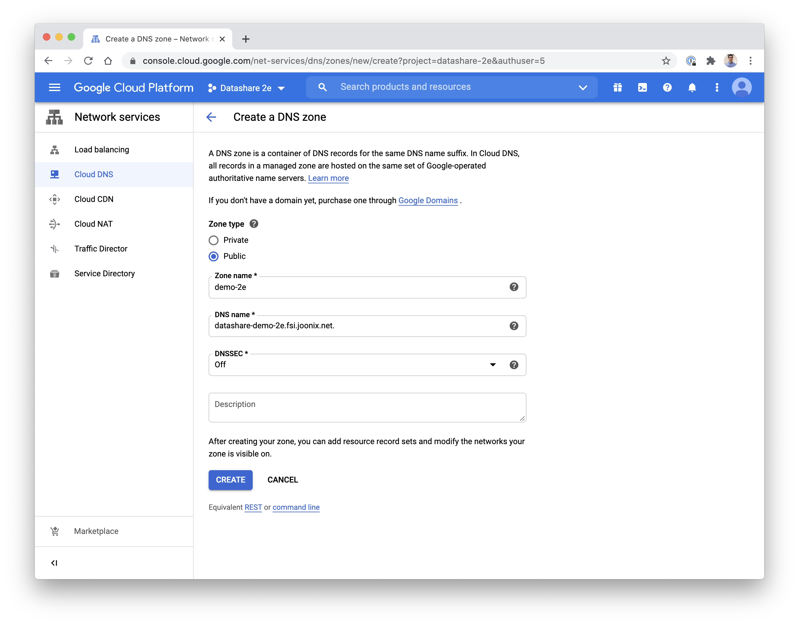
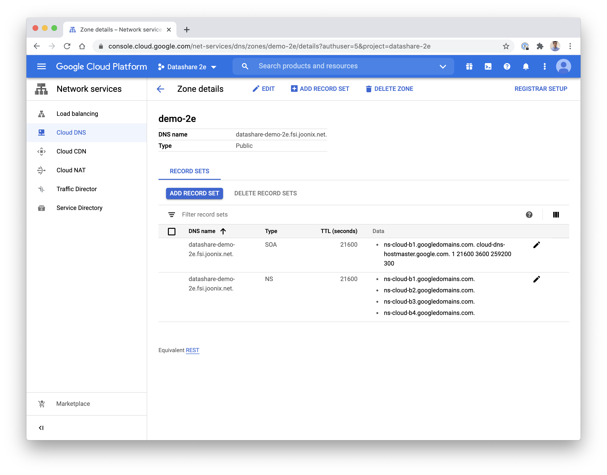
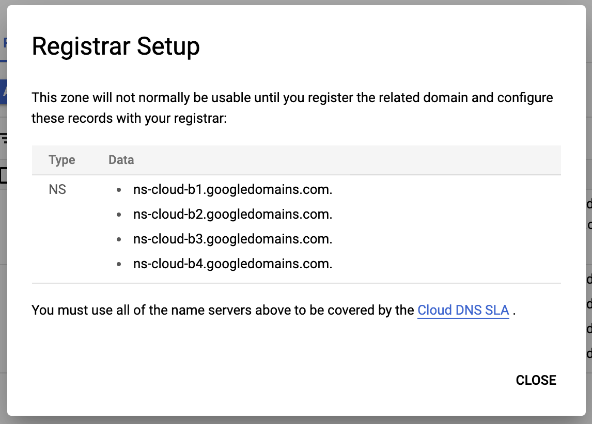
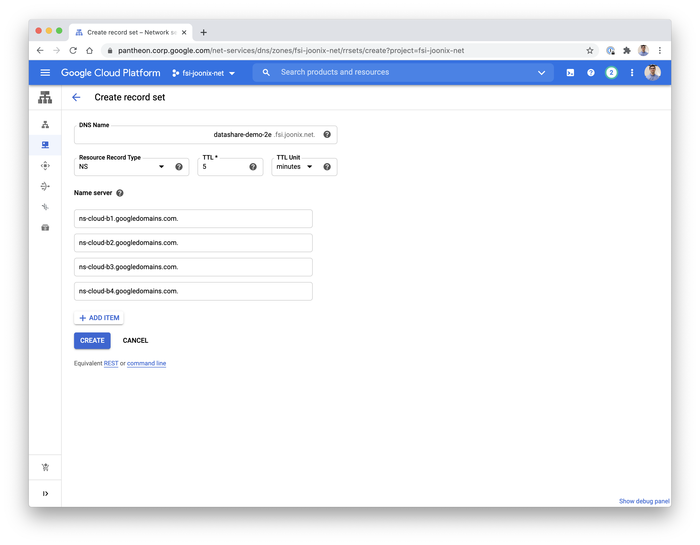
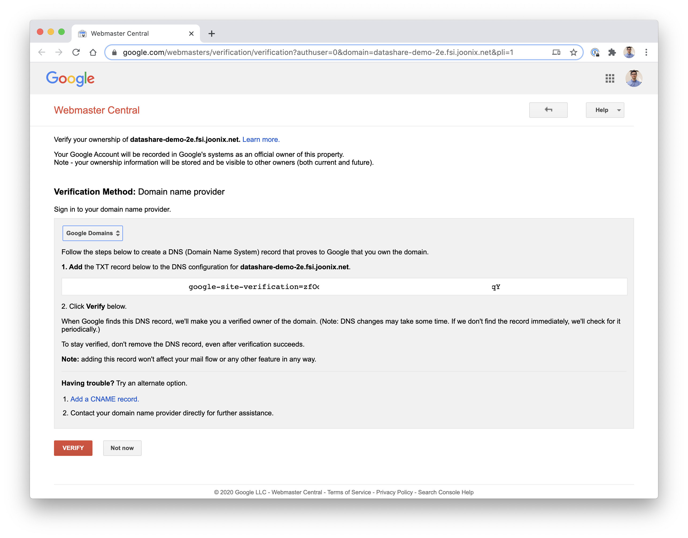
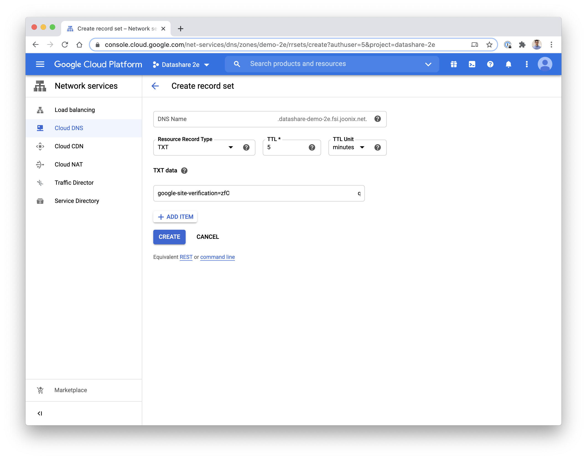
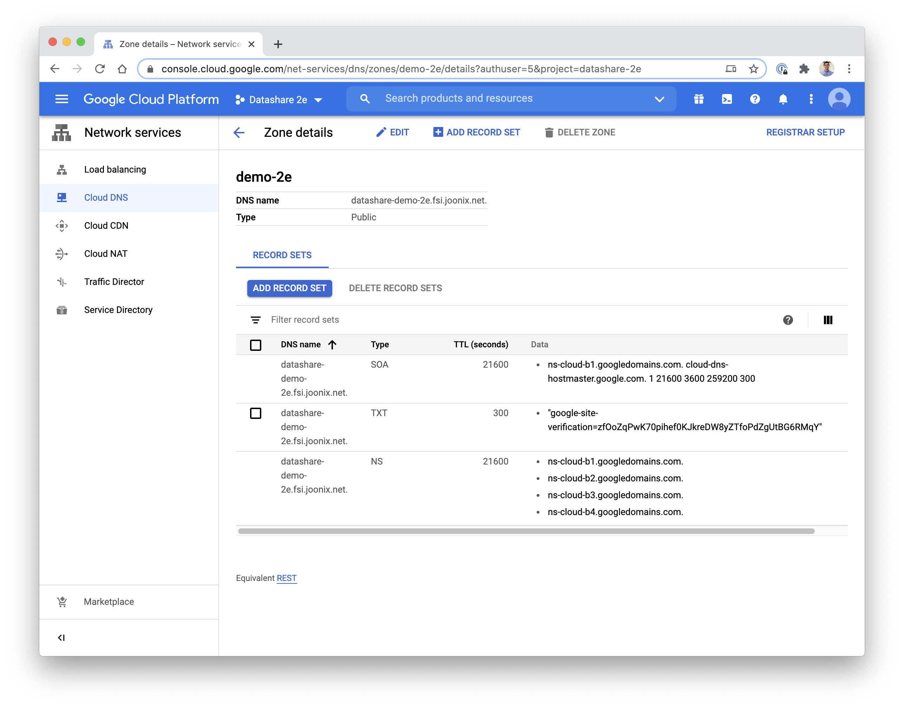
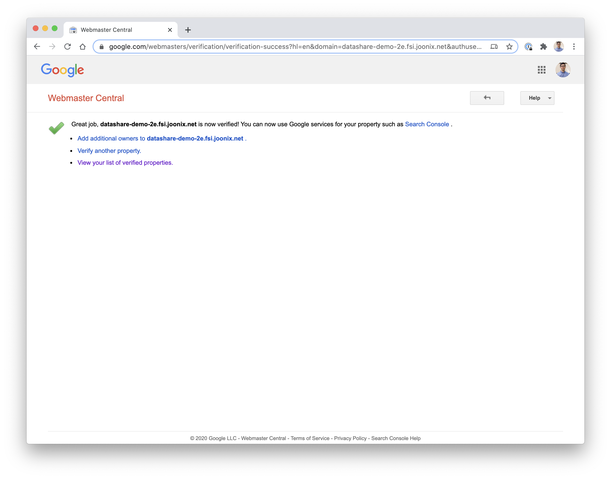

[Back to Datashare](./README.md)

# Overview
Datashare requires two domains, one for the UI, and one for the API layer. We recommend configuring as such:
- https://datashare.your-domain.com/
- https://api.datashare.your-domain.com/

# Pre-requisites
You must have access to administer DNS for the domains that you will use.

# Setting up domain using Cloud DNS
1. Go to [Cloud DNS](https://console.cloud.google.com/net-services/dns/zones)

    

2. Click 'Create zone', and enter the domain details

    

3. Take note of the information provided by the 'Registrar Setup' button.
    
    

    

4. You'll need to enter the NS details in the configuration wherever you maintain the DNS for your top-level domain. For this example we already use a different GCP project to administer the top-level domain, so we'll enter the NS details within our existing top level zone.

    

# Verifying your domain using the gcloud CLI
Create a DOMAIN environment variable based off the custom subdomain:

```
export DOMAIN=datashare-demo-2e.fsi.joonix.net
```

Verify domain ownership the first time you use that domain in the Google Cloud project:

```
gcloud domains list-user-verified
```

If your ownership of the domain needs to be verified, open the Webmaster Central verification page:

```
gcloud domains verify $DOMAIN
```



Go back to the zone details for your new domain, and click 'ADD RECORD SET', and enter the value for the TXT record, and click 'CREATE'.





Wait at least 5 minutes for the TXT record to propagate. To check to see if the value has propagated, run the command:

```
dig $DOMAIN TXT
```

Once the TXT record has propagated, you'll see the it in the result:

```
; <<>> DiG 9.10.6 <<>> datashare-demo-2e.fsi.joonix.net TXT
;; global options: +cmd
;; Got answer:
;; ->>HEADER<<- opcode: QUERY, status: NOERROR, id: 39707
;; flags: qr rd ra; QUERY: 1, ANSWER: 1, AUTHORITY: 0, ADDITIONAL: 1

;; OPT PSEUDOSECTION:
; EDNS: version: 0, flags:; udp: 512
;; QUESTION SECTION:
;datashare-demo-2e.fsi.joonix.net. IN	TXT

;; ANSWER SECTION:
datashare-demo-2e.fsi.joonix.net. 300 IN TXT	"google-site-verification=zfOoxxxxxxxxxxxxxxxxxxxxxxxxxxxxxqY"

;; Query time: 314 msec
;; SERVER: 10.0.0.1#53(10.0.0.1)
;; WHEN: Tue Oct 06 11:59:36 EDT 2020
;; MSG SIZE  rcvd: 142
```

Once the dig command returns the TXT record, then proceed to click the 'VERIFY' button on the 'Webmaster Central' domain verification page.



To view a list of your verified domains, see the [verification](https://www.google.com/webmasters/verification/home) page on Webmaster Central.

# Next
[Setup OAuth credential](./CREDENTIAL_SETUP.md)
