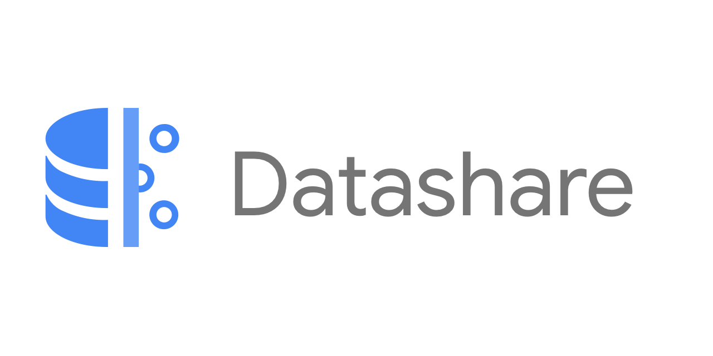
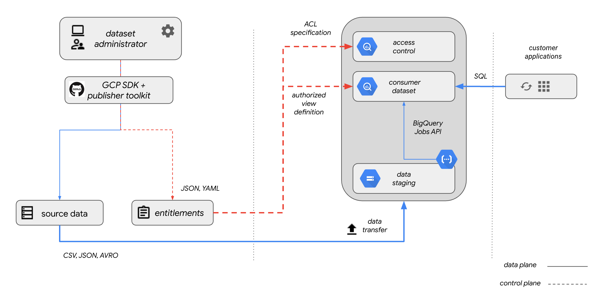

# ```Datashare Toolkit```

<p align="center">
  
</p>

## _DIY commercial datasets on Google Cloud Platform_

_This is not an officially supported Google product._

The ```Datashare Toolkit``` is a solution for data publishers to easily manage datasets residing within [BigQuery](https://cloud.google.com/bigquery/). The toolkit includes functionality to ingest and entitle data, relieving consumers from much of the toil involved in onboarding datasets from a variety of providers. Publishers upload data files to a storage bucket and allocate permissioned datasets for their consumers to use with BigQuery [authorized views](https://cloud.google.com/bigquery/docs/authorized-views).

While these tools are used for data management and entitlement, they follow a bring-your-own-license (BYOL) for entitling publisher data. Hence, publishers should already have licensing arrangements for those consumers withing to access their data within GCP, and the consumers can furnish the GCP account ID's corresponding to their entitled user principals. These account IDs are required for the creation of the authorized views.

The toolkit is open-source. Some supporting infrastructure, such as [storage buckets](https://cloud.google.com/storage/), serverless functions, and BigQuery datasets, must be maintained within GCP by publishers as a prerequisite. As a consumer, when the GCP accounts are added to the publisher entitlements, the published can be queried directly within BigQuery, ready to integrate into your analytics workflow, machine learning model, or runtime application. Publishers are responsible for managing the limited support infrastructure necessary. While consumers are billed for BigQuery compute and networking, publishers incur costs only on the storage of their data in BigQuery and Cloud Storage.

## Key Features
- Publisher UI for creating data sharing policies, managing user accounts, creating views
- Ingestion performed by a [Google Cloud Function](https://cloud.google.com/functions/)
- [GCP Marketplace integration](./frontend/user-guide/MARKETPLACE_INTEGRATION.md) for selling your data
- [Multicast client](./client/README.md)

## Getting started with Datashare
If you plan to use GCP Marketplace integration, the production project that you install and manage Datashare from must follow the required naming convention (punctuation and spaces not allowed): ```[yourcompanyname]-public```.

1. [Setup the Datashare API Manager Service Account](./DATASHARE_API_MGR_SETUP.md)
2. [Setup your domain](./DOMAIN_SETUP.md)
3. [Setup OAuth credential](./CREDENTIAL_SETUP.md)
4. [Deploy Datashare](./DEPLOY.md)
5. [Initialize Schema](./frontend/user-guide/ADMIN.md#initialize_schema)

Then get started, see the [User Guide](./frontend/README.md) for usage information.

## Updating Datashare
- [Perform Datashare version upgrade](./UPGRADE.md) - Update the API and UI software versions.
- [Update Data Producers](./UPDATE_DATA_PRODUCERS.md) - Modify the administrators for the Datashare UI.
- [Updating API Gateway Configuration](./api/UPDATE_API_GATEWAY_CONFIG.md) - Modify the API Gateway configuration to apply the latest defined security policies.

## Requirements

### Publishers

- A GCP account with billing enabled
- A Google Cloud Storage bucket to store staged data

### Consumers

- A valid Google Account or Google Group [email address](https://cloud.google.com/iam/docs/overview#google_account) (which includes Gsuite and Gmail email addresses). \
  **Note**: Consumers can create a Google account with an existing email address [here](https://support.google.com/accounts/answer/27441)
- Entitlements granted by the publisher to your specific licensed datasets

## Architecture



## Disclaimers

_This is not an officially supported Google product._

Datashare is under active development. Interfaces and functionality may change at any time.

## License

This repository  is licensed under the Apache 2 license (see [LICENSE](LICENSE.txt)).

Contributions are welcome. See [CONTRIBUTING](CONTRIBUTING.md) for more information.
