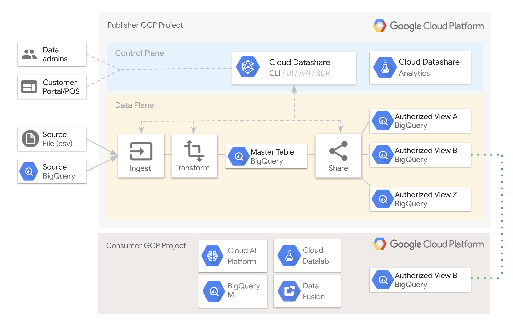

# ```Datashare Toolkit```
## _DIY commercial datasets on Google Cloud Platform_

_This is not an officially supported Google product._

The ```Datashare Toolkit``` is a solution for data publishers to easily manage datasets residing within [BigQuery](https://cloud.google.com/bigquery/). The toolkit includes functionality to ingest and entitle data, relieving consumers from much of the toil involved in onboarding datasets from a variety of providers. Publishers upload data files to a storage bucket and allocate permissioned datasets for their consumers to use with BigQuery [authorized views](https://cloud.google.com/bigquery/docs/authorized-views). 

While these tools are used for data management and entitlement, they follow a bring-your-own-license (BYOL) for entitling publisher data. Hence, publishers should already have licensing arrangements for those consumers withing to access their data within GCP, and the consumers can furnish the GCP account ID's corresponding to their entitled user principals. These account IDs are required for the creation of the authorized views.

The toolkit is open-source. Some supporting infrastructure, such as [storage buckets](https://cloud.google.com/storage/), serverless functions, and BigQuery datasets, must be maintained within GCP by publishers as a prerequisite. As a consumer, when the GCP accounts are added to the publisher entitlements, the published can be queried directly within BigQuery, ready to integrate into your analytics workflow, machine learning model, or runtime application. Publishers are responsible for managing the limited support infrastructure necessary. While consumers are billed for BigQuery compute and networking, publishers incur costs only on the storage of their data in BigQuery and Cloud Storage.

For publisher projects that do not have the Cloud Functions API enabled at the time of running [deploy.sh](ingestion/bin/deploy.sh), the API will be enabled on the project's behalf.

## Requirements

### Publishers

- A GCP account with billing enabled
- A Google Cloud Storage bucket to store staged data
- Several BigQuery datasets to store entitled data and authorized views
- A Cloud Function to ingest the inbound data
- Ability to run command-line applications (like Cloud Shell) for entitlements

### Consumers

- A GCP account with billing enabled
- Entitlements granted by the publisher to your specific licensed datasets

## Principles

Datashare aims to embody certain key principles. Among these are:

- _Promote efficient storage of common datasets_

A common (anti-)pattern with permissioned datasets, especially those delivered in bulk, is that when a data publisher releases a dataset, consumers replicate the physical dataset to their infrastructure, maintaining their own copy of the data and incurring their own storage and processing costs, which are above and beyond the cost of licensing access to the data.

Datashare uses BigQuery's underlying infrastructure for maintaining sufficient copies of the data as needed to still ensure high-availability. Most commercial data distribution models today scale storage linearly for each consumer. With Datashare, consumers use the GCP tooling with which they are already familiar and access permissioned datasets seamlessly - reducing unnecessary dataset storage overall.

- _Reduce ingestion friction for publishers and consumers_

In many of today's typical scenarios, for each published dataset, a consumer must also ingest and normalize the data into their own specific environment. This adds additional toil to the data onboarding workflow and extends the duration that conumers must wait before the data can be usable. Datashare aims to limit this friction to as few steps as possible, relying on convention and automation to execute an end-to-end data pipeline.

- _Make it easy for data publishers to grant permissioned access for existing GCP consumers of their datasets_

Commercial data publishing models rely on entitlements to grant access permission to licensed consuners. For large data publishers, their electronic entitlements solution may be entirely bespoke. DS provides a simple solution for controlling access to data by using GCP's native access control mechanism combined with BigQuery authorized views and Publisher-defined groupings.

- _Favor instrumenting the solution's configuration via convention_

Derive configuration options from runtime context where possible, and aspire to keep configuration-specific assets to a minimum.

## Architecture



## Publishing data to GCP clients using these tools

The toolkit currently supports batch mode ingestion of data files into BigQuery tables and the creation of downstream authorized views as a subset of the uploaded data, to which individual or groups of GCP users can be entitled access.

Ingestion is performed by a [Google Cloud Function](https://cloud.google.com/functions/) that executes BigQuery jobs configured by a combination of convention (how source data files are named) and static configuration (schema definitions, transformation logic, and entitlement generation).

The function is triggered off mutations to a specified Cloud Storage Bucket.

Entitlements are configured in a separate workflow, but generally reference tables created during the ingestion stage. Entitlements must be regenerated each time access control lists or authorized views change.

## Roadmap

The [roadmap](roadmap) section details currently planned features of Datashare. We'd love to hear your feedback!

## Ingestion and transformation

The [ingestion](ingestion) page has details on the toolkit's embedded ingestion and transformation features.

## Disclaimers

_This is not an officially supported Google product._

Datashare is under active development. Interfaces and functionality may change at any time.

## License

This repository  is licensed under the Apache 2 license (see [LICENSE](LICENSE.txt)).

Contributions are welcome. See [CONTRIBUTING](CONTRIBUTING.md) for more information.
