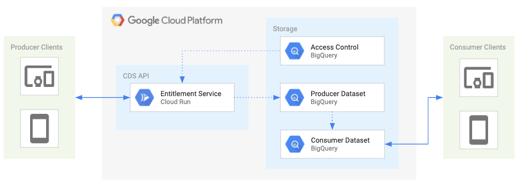

# DS API

* [Overview](#overview)
  * [Architecture](#architecture)
  * [Configuration](#configuration)
  * [Documentation (OpenAPI Spec)](#documentation)
* [Getting Started](#getting-started)
  * [Enable APIs](#enable-apis)
  * [Service Account](#service-account)
  * [Examples](#examples)
* [Deploy to Cloud Run with Deployment Manager](#deploy-to-cloud-run-with-deployment-manager)
  * [Prerequisites](#prerequisites)
  * [Deploy to Cloud Run](#deploy-to-cloud-run)
* [Deployment](#deployment)
  * [Deploy Cloud Run](#deploy-cloud-run)
  * [Deploy Kubernetes](#deploy-kubernetes)
  * [Deploy App Engine](#deploy-app-engine)
* [Development](#development)
* [Testing](#testing)
* [Contributing](#contributing)
* [License](#license)
* [Authors](#authors)
* [Notes](#notes)


# Overview

The DS API allows data producers the ability to programmatically enforce access control or Entitlements on their organization's Dataset(s) in Google Cloud Platform (GCP). The DS Policies are access control configurations that are constructed by the data producers with relationships between who can access what specific data assets. The policies enable data producers fine-grained control of their datasets down to row level fields or attributes for one or many data Account Consumer(s).

The DS API also enables data producers unique Fulfillments operations on their datasets. These fulfillments can be one-time Spot Request(s) for consumption of data for non GCP data consumers.


## Architecture

### Entitlement Services



### Fulfillment Services


## Configuration

There are configuration settings for Entitlements and Fulfillment services. Currently, the Entitlements configuration is via the UI and Filfillment is configured [here](SPOT_SERVICE_README.md#create-configuration)


### Documentation
_OpenAPI Specification_

The DS API service(s) utilize the open standard for API documentation, [OpenAPI Specification](https://github.com/OAI/OpenAPI-Specification) (OAS) for documenting the API's resources, parameters, responses, etc. The OAS definitions and paths are rendered via [swagger-jsdoc](https://www.npmjs.com/package/swagger-jsdoc) in the route comments of [index](v1alpha/index.js)

You can access the OAS directly via:

    http://{HOSTNAME}/{API_VERSION}/docs/openapi_spec

You can also access an instance of Swagger UI to render the OAS docs:

    http://{HOSTNAME}/{API_VERSION}/docs


## Getting Started

These instructions will setup an instance of the DS API Service in your GCP project.

### Setup GCloud
* Install the [Google Cloud SDK](https://cloud.google.com/sdk/install) on your local machine.
or
* If you already have gcloud installed, then update it.
```
gcloud components update
```

Set `gcloud` connect to your current project.

    gcloud config set project YOUR_PROJECT_NAME

### Enable APIs

These are the GCP project APIs that require the DS API service(s) access.

```
gcloud services enable bigquery-json.googleapis.com
gcloud services enable iam.googleapis.com
```

### Service Account

DS API service(s) are a trusted application that makes authorized API calls to your GCP project service(s). The application requires a [GCP service account](https://cloud.google.com/iam/docs/service-accounts) with the appropriate permissions enabled. These permissions have been aggregated into a custom role that is associated to a service account. The custom role and associated permissions are defined in [here](./config/cds-api-mgr-role-definition.yaml)

#### Setup Service Account

Set your **PROJECT\_ID** if you have not already:

    export PROJECT_ID=`gcloud config list --format 'value(core.project)'`; echo $PROJECT_ID

Set the **SERVICE\_ACCOUNT\_NAME** environment variable(s):

    export SERVICE_ACCOUNT_NAME=cds-api-mgr;

Set the **SERVICE\_ACCOUNT\_DESC** environment variable(s):

    export SERVICE_ACCOUNT_DESC="DS API Manager";

Create the custom DS API service-account:

    gcloud iam service-accounts create ${SERVICE_ACCOUNT_NAME} --display-name "${SERVICE_ACCOUNT_DESC}";

Set the **CUSTOM\_ROLE\_NAME** environment variable(s):

    export CUSTOM_ROLE_NAME=custom.cds.api.mgr;

*Note* We could use the the following roles, but it's better to follow the principle of least privilege. \
_The permissions for the custom role are defined in [config/cds-api-mgr-role-definition.yaml](config/cds-api-mgr-role-definition.yaml)_

Create custom DS API role:

    gcloud iam roles create ${CUSTOM_ROLE_NAME} --project ${PROJECT_ID} --file config/cds-api-mgr-role-definition.yaml

*Note* If the custom role already exists, just update the stage:

    gcloud iam roles update ${CUSTOM_ROLE_NAME} --project ${PROJECT_ID} --stage BETA

Grant the new GCP service role to service account:

    gcloud projects add-iam-policy-binding ${PROJECT_ID} \
      --member serviceAccount:${SERVICE_ACCOUNT_NAME}@${PROJECT_ID}.iam.gserviceaccount.com \
      --role="projects/${PROJECT_ID}/roles/${CUSTOM_ROLE_NAME}"

#### Configure Service Account Secret

Create service account credentials and download them:

    gcloud iam service-accounts keys create ${SERVICE_ACCOUNT_NAME}.json \
      --iam-account ${SERVICE_ACCOUNT_NAME}@${PROJECT_ID}.iam.gserviceaccount.com

Set the **GOOGLE_APPLICATION_CREDENTIALS** environment variable(s):

    export GOOGLE_APPLICATION_CREDENTIALS="${SERVICE_ACCOUNT_NAME}.json"

## Deploy to Cloud Run with Deployment Manager
You can deploy the API service via the Deployment Manager.  
The Deployment Manager script will create a Cloud Build package that performs the following actions:
* clones the datashare-tookit repository
* create a service account
* create a custom role
* assign the service account to the custom role
* create a container image in Container Registry
* deploy the Datashare API to Cloud Run

**NOTE: If you delete the Deployment Manager template, it will NOT delete any of the resources that it creates (SA, custom role, container, Cloud Run deployment)**

### Prerequisites
* Enable the following APIs
  * With the following link
    * [Enable the Cloud Build, Deployment Manager, IAM, Cloud Run APIs](https://console.cloud.google.com/flows/enableapi?apiid=cloudbuild.googleapis.com,deploymentmanager.googleapis.com,iam.googleapis.com,run.googleapis.com)
  * Or enabled them with the following gcloud commands. 
    ```
    gcloud services enable cloudbuild.googleapis.com
    gcloud services enable deploymentmanager.googleapis.com
    gcloud services enable iam.googleapis.com
    gcloud services enable run.googleapis.com
    ```

* Add the following roles to the Cloud Build Service Account (**id@cloudbuild.gserviceaccount.com**)
  * Role Administrator
  * Security Admin
  * Service Account Admin
  * Cloud Run Admin
  * Cloud Run Service Agent

### Deploy to Cloud Run
By default it deploys to us-central1 region. Execute the following command from the `datashare-toolkit/api` directory. 
```
gcloud deployment-manager deployments create ds-api --config deploy_ds_api.yaml
```

You can update the region in the `deploy_ds_api.yaml` file. 
```
properties:
    region: us-central1
```

## Deployment
You can deploy the API service via various methods below based off developer preference and/or environment. These are the options available:

  * [Google Cloud Run](https://cloud.google.com/run/) via [gcloud](https://cloud.google.com/sdk/)
  * [Google Kubernetes Engine](https://cloud.google.com/kubernetes-engine/) via [Skaffold](https://github.com/GoogleContainerTools/skaffold)
  * [Google Cloud App Engine](https://cloud.google.com/appengine/) via [Deployment Manager](https://cloud.google.com/deployment-manager/) and gcloud - TODO

[Deploy Cloud Run](#deploy-cloud-run) is the _preferred_ method to quickly host the DS API Service content and generate a unique URL for consumption.

There are some environment variables that need to be set for all build and deployment options.

Export the GCP Project ID as *PROJECT_ID* environment variable:

    export PROJECT_ID=`gcloud config list --format 'value(core.project)'`; echo $PROJECT_ID

Export the image/build *TAG* environment variable:

    export TAG=dev;

Change directories into the current working API version:

    cd v1alpha

### Deploy Cloud Run

Deploy with Cloud Run allows stateless HTTP containers on a fully managed environment or GKE cluster. [Cloud Build](https://cloud.google.com/run/docs/quickstarts/build-and-deploy#containerizing) packages the Docker image into your Google Container repository.
_Cloud Run and Cloud Build APIs will need to be enabled in your GCP project._

Build with Cloud Build and TAG:
**Note**: Cloud Build needs to run from parent directory for build context and the [shared](../shared) directory

    cd ../../
    gcloud builds submit --config api/v1alpha/cloudbuild.yaml --substitutions=TAG_NAME=${TAG}

Deploy with Cloud Run Beta:
_Note_ - There are a few environment variables that need to be set before the application starts (see below). [gcloud run deploy](https://cloud.google.com/sdk/gcloud/reference/run/deploy#--set-env-vars) provides details for how they are set.

    gcloud run deploy cds-api \
      --image gcr.io/${PROJECT_ID}/cds-api:${TAG} \
      --region=us-central1 \
      --allow-unauthenticated \
      --platform managed \
      --service-account ${SERVICE_ACCOUNT_NAME}@${PROJECT_ID}.iam.gserviceaccount.com

Spot service environment:

    gcloud run deploy cds-api \
      --image gcr.io/${PROJECT_ID}/cds-api:${TAG} \
      --region=us-central1 \
      --allow-unauthenticated \
      --platform managed \
      --service-account ${SERVICE_ACCOUNT_NAME}@${PROJECT_ID}.iam.gserviceaccount.com \
      --set-env-vars=SPOT_SERVICE_CONFIG_BUCKET_NAME=${BUCKET_NAME} \
      --set-env-vars=SPOT_SERVICE_CONFIG_DESTINATION_PROJECT_ID=${PROJECT_ID}

Open the app URL in your browser. You can return the FQDN via:

    gcloud run services describe cds-api --platform managed --format="value(status.url)"

#### Confirm your API is running

You can access the OAS directly from a browser by entering the following URI:

```
http://{HOSTNAME}/{API_VERSION}/docs/openapi_spec
```

You can also access an instance of Swagger UI to render the OAS docs:

```
http://{HOSTNAME}/{API_VERSION}/docs
```

### Deploy Kubernetes
These instructions are to build and deploy in a k8s environment via Skaffold.

Create a kubernetes secret with the appropriate service account key file from above:\
_Note_ Change the file path to the appropriate destination. Secrets management for multiple k8s clusters is outside the scope of this example.

    kubectl create secret generic cds-api-creds --from-file=key.json=${GOOGLE_APPLICATION_CREDENTIALS}

Modify the ConfigMap with the appropriate DS API environment variables:

    vi kubernetes-manifests/cds-api/configmaps.yaml

Set the default GCR project repository:

    skaffold config set default-repo gcr.io/${PROJECT_ID}

Run `skaffold` with the dev parameter to deploy locally:

    skaffold dev

Build the image with the `skaffold run -t <TAG>` command:

    skaffold run -t $TAG

### Deploy App Engine

TBD

## Delete Deployment
TODO - should we provide steps or a script to delete all the assets after they have been deployed?

## Development

Navigate to the API version directory (*v1alpha*, *v1*, etc.).

Install Node 12.6

    nvm install 12.6

Install the Node modules

    npm install

Start the service.\
_Note_ - There are a few environment variables that need to be set before the application starts (see below). [Nodemon](https://nodemon.io/) is leveraged to read file changes and reload automatically.

    export GOOGLE_APPLICATION_CREDENTIALS=${GOOGLE_APPLICATION_CREDENTIALS};

Spot service environment:

    export SPOT_SERVICE_CONFIG_BUCKET_NAME=${BUCKET_NAME};
    export SPOT_SERVICE_CONFIG_DESTINATION_PROJECT_ID=${PROJECT_ID};

    npm run dev


## Testing

The test frameworks include [Chai](https://www.chaijs.com/) and [Supertest](https://github.com/visionmedia/supertest)

Execute the tests:

    npm test


## Contributing

Please read [CONTRIBUTING](../CONTRIBUTING.md) for details on our code of conduct, and the process for submitting pull requests to us.


## License

This project is licensed under the Apache License - see the [LICENSE](../LICENSE.txt) file for details


## Authors

* **Mark Servidio** - *Initial work*
* **Chris Page** - *Initial work*
