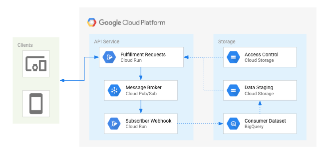
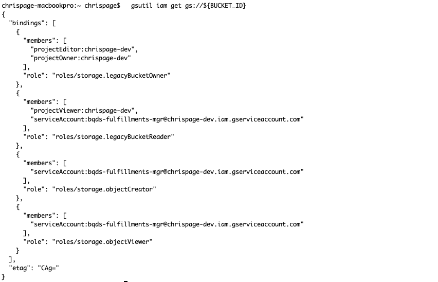

# BQDS Spot Fulfillment - API Service

* [Overview](#overview)
  * [Architecture](#architecture)
  * [Configuration](#configuration)
  * [Documentation (OpenAPI Spec)](#documentation)
* [Getting Started](#getting-started)
  * [Create Storage Bucket](#create-storage-bucket)
  * [Create Configuration](#create-configuration)
  * [Enable APIs](#enable-apis)
  * [Service Account](#service-account)
  * [Create Pub/Sub Topic](#create-pubsub-topic)
  * [Create Pub/Sub Subscription](#create-pubsub-subscription)
  * [Examples](#examples)
* [Development](#development)
* [Testing](#testing)
* [Deployment](#deployment)
  * [Deploy Cloud Run](#deploy-cloud-run)
  * [Deploy App Engine](#deploy-app-engine)
  * [Deploy Kubernetes](#deploy-kubernetes)
* [Contributing](#contributing)
* [License](#license)
* [Authors](#authors)
* [Notes](#notes)


# Overview

This documentation provides the details for the BQDS Spot Fulfillment API Service. The Spot fulfillment API provides data producers the ability to expose a limited subset of their datasets programatically. Data producers can configure explicit query parameters for data consumers to discover and execute queries against larger consumer datasets. The sub-datasets are extracted for short-term storage in buckets with signed urls for distribution to the data consumers.


## Architecture



## Configuration
The BQDS Spot Fulfillment API service configuration overview and definition is [here](docs/CONFIGURATION.md)


### Documentation
_OpenAPI Specification_

The BQDS Spot Fulfillment API service utilizes the open standard for API documentation, [OpenAPI Specification](https://github.com/OAI/OpenAPI-Specification) (OAS) for documenting the API's resources, parameters, responses, etc. The OAS definitions and paths are rendered via [swagger-jsdoc](https://www.npmjs.com/package/swagger-jsdoc) in the route comments of [index](v1alpha/index.js)

You can access the OAS directly via:

    http://{HOSTNAME}/{API_VERSION}/docs/openapi_spec

You can also access an instance of Swagger UI to render the OAS docs:

    http://{HOSTNAME}/{API_VERSION}/docs


## Getting Started

These instructions will setup an instance of the BQDS API Service in your GCP project.

### Create Storage Bucket

Create a storage bucket to persist the API Configuration. This does not have to be the same storage bucket for the initial dataset injestion.

Set your **BUCKET_NAME** environment variable:

    export BUCKET_NAME=chrispage-dev-bqds-test

Set your **BUCKET_REGION** environment variable:

    export BUCKET_REGION=us-east4

Create the new storage bucket:

    gsutil mb -l ${BUCKET_REGION} gs://${BUCKET_NAME}/

### Create Configuration

The BQDS Spot fulfillment API configuration definitions are defined [above](#configuration). You can view an example in the MLB examples config [here](../examples/mlb/config/api/config.json). Make the appopriate modifications and then copy to your storage bucket.

Copy configuration to the storage bucket:

    gsutil cp config.json gs://${BUCKET_NAME}/bqds/api/config.json


### Enable APIs

These are the GCP project APIs that require the BQDS Spot fulfillment API access.

```
bigquery-json.googleapis.com
iam.googleapis.com
pubsub.googleapis.com
```

### Service Account

BQDS Spot Fulfillment API service is a trusted application that makes authorized API calls to your GCP project service(s). The application requires a [GCP service account](https://cloud.google.com/iam/docs/service-accounts) with the appropriate permissions enabled. These permissions have been aggregated into a custom role that is associated to a service account. The custom role and associated permissions are defined in [here](config/bqds-fulfillments-mgr-role-definition.yaml)

#### Setup Service Account

Set your **PROJECT\_ID** if you have not already:

    export PROJECT_ID=`gcloud config list --format 'value(core.project)'`; echo $PROJECT_ID

Set the **SERVICE\_ACCOUNT\_NAME** environment variable(s):

    export SERVICE_ACCOUNT_NAME=bqds-spot-fulfillments-mgr;

Set the **SERVICE\_ACCOUNT\_DESC** environment variable(s):

    export SERVICE_ACCOUNT_DESC="BQDS Spot Fulfillments Manager";

Create the custom BQDS API service-account:

    gcloud iam service-accounts create ${SERVICE_ACCOUNT_NAME} --display-name "${SERVICE_ACCOUNT_DESC}";

Set the **CUSTOM\_ROLE\_NAME** environment variable(s):

    export CUSTOM_ROLE_NAME=custom.bqds.spot.fulfillments.mgr;

*Note* We could use the the following roles, but it's better to follow the principle of least privilege. \
_The permissions for the custom role are defined in [config/bqds-fulfillments-mgr-role-definition.yaml](config/bqds-fulfillments-mgr-role-definition.yaml)_
```
--role="roles/viewer"
--role="roles/bigquery.dataEditor"
--role="roles/bigquery.jobUser"
--role="roles/pubsub.subscriber"
# This role is only required if deploying the API service to GCP Cloud Run
--role="roles/serverless.serviceAgent";
```
Create custom BQDS API role:

    gcloud iam roles create ${CUSTOM_ROLE_NAME} --project ${PROJECT_ID} --file config/bqds-fulfillments-mgr-role-definition.yaml

*Note* If the custom role already exists, just update the stage:

    gcloud iam roles update ${CUSTOM_ROLE_NAME} --project ${PROJECT_ID} --stage BETA

Grant the new GCP service role to service account:

    gcloud projects add-iam-policy-binding ${PROJECT_ID} \
      --member serviceAccount:${SERVICE_ACCOUNT_NAME}@${PROJECT_ID}.iam.gserviceaccount.com \
      --role="projects/${PROJECT_ID}/roles/${CUSTOM_ROLE_NAME}"

#### Setup Bucket ACLs:

Set the **BUCKET_NAME** environment variable(s):\
_Note_ **objectCreator** is required for the destination GCS Bucket for authorization to persist the spot fulfillment data. You will need to run these commands for both the source and destination GCS Bucket if they are different.

    export BUCKET_NAME=chrispage-dev-bqds-test

Set the Bucket ACL for the service account:

    gsutil iam ch serviceAccount:${SERVICE_ACCOUNT_NAME}@${PROJECT_ID}.iam.gserviceaccount.com:objectViewer \
      gs://${BUCKET_NAME};
    gsutil iam ch serviceAccount:${SERVICE_ACCOUNT_NAME}@${PROJECT_ID}.iam.gserviceaccount.com:objectCreator \
      gs://${BUCKET_NAME};
    gsutil iam ch serviceAccount:${SERVICE_ACCOUNT_NAME}@${PROJECT_ID}.iam.gserviceaccount.com:legacyBucketReader \
      gs://${BUCKET_NAME};

View the Bucket IAM permissions:

    gsutil iam get gs://${BUCKET_NAME}



#### Configure Service Account Secret

Create service account credentials and download them:

    gcloud iam service-accounts keys create ${SERVICE_ACCOUNT_NAME}.json \
      --iam-account ${SERVICE_ACCOUNT_NAME}@${PROJECT_ID}.iam.gserviceaccount.com

Set the **GOOGLE_APPLICATION_CREDENTIALS** environment variable(s):

    export GOOGLE_APPLICATION_CREDENTIALS="${SERVICE_ACCOUNT_NAME}.json"

### Create Pub/Sub Topic

A Pub/Sub Topic with the appropriate service account permissions is required for the BQDS API Service.


Set your **TOPIC\_NAME** if you have not already:

    export TOPIC_NAME=bqds-spot-fulfillments;

Create the Topic:

    gcloud pubsub topics create ${TOPIC_NAME}

Set the permissions for the service account:

    gcloud beta pubsub topics add-iam-policy-binding ${TOPIC_NAME} --member=serviceAccount:${SERVICE_ACCOUNT_NAME}@${PROJECT_ID}.iam.gserviceaccount.com --role='roles/editor'

### Create Pub/Sub Subscription:

A Pub/Sub Subscription is utilzed for the Subscriber (push) and Worker (pull) to process fulfillment messages from BQDS API Service.
_Note_ The Worker subscription is only for debuging purposes, so is not required.

Set your **PUSH\_SUBSCRIPTION\_NAME** if you have not already:

    export PUSH_SUBSCRIPTION_NAME=bqds-spot-fulfillments-subscriber;

Create the Subscription:
_Note_ The **--push-endpoint** will be based off your BQDS service Cloud run or GKE DNS name:

    gcloud beta pubsub subscriptions create ${PUSH_SUBSCRIPTION_NAME} --topic ${TOPIC_NAME} --push-endpoint=https://bqds-spot-fulfillment-api-6t26dsokuq-uc.a.run.app/v1alpha/fulfillmentSubscriber

Set your **PULL\_SUBSCRIPTION\_NAME** if you have not already:

    export PULL_SUBSCRIPTION_NAME=bqds-spot-fulfillments-worker;

Create the Subscription:

    gcloud beta pubsub subscriptions create ${PULL_SUBSCRIPTION_NAME} --topic ${TOPIC_NAME}

Set the IAM policy for the Subscription:

    gcloud beta pubsub subscriptions add-iam-policy-binding ${PULL_SUBSCRIPTION_NAME} --member=serviceAccount:${SERVICE_ACCOUNT_NAME}@${PROJECT_ID}.iam.gserviceaccount.com --role='roles/pubsub.subscriber'

List the subscriptions for the topic:

    gcloud beta pubsub topics list-subscriptions ${TOPIC_NAME}


### Examples

After you have completed the [Getting Started](#getting-started) prerequisites, you can now load the BQDS API eample configuration file. Navigate to the [examples](../examples) directory and modify the MLB api [config.json](../examples/mlb/config/api/config.json) accordingly. \
_Note_ - Change the *projectId*, *datasetId*, and *tableId* to your GCP project and coresponding dataset


## Development

Navigate to the API version directory (*v1alpha*, *v1*, etc.).

Install Node 12.6

    nvm install 12.6

Install the Node modules

    npm install

Start the service.\
_Note_ - There are a few environment variables that need to be set before the application starts (see below). [Nodemon](https://nodemon.io/) is leveraged to read file changes and reload automatically.

    export GOOGLE_APPLICATION_CREDENTIALS=${GOOGLE_APPLICATION_CREDENTIALS};
    export FULFILLMENT_CONFIG_BUCKET_NAME=${BUCKET_NAME};
    export FULFILLMENT_CONFIG_DESTINATION_PROJECT_ID=${PROJECT_ID};
    export FULFILLMENT_CONFIG_PUBSUB_TOPIC_NAME=${TOPIC_NAME};
    export FULFILLMENT_CONFIG_PUBSUB_SUBSCRIPTION_PROJECT_ID=${PROJECT_ID};
    export FULFILLMENT_CONFIG_PUBSUB_SUBSCRIPTION_NAME=${PULL_SUBSCRIPTION_NAME};

    npm run dev


## Testing

The test frameworks include [Chai](https://www.chaijs.com/) and [Supertest](https://github.com/visionmedia/supertest)

Execute the tests:

    npm test


## Deployment
You can deploy the API service via various methods below based off developer preference and/or environment. These are the options available:

  * [Google Cloud Run](https://cloud.google.com/run/) via [gcloud](https://cloud.google.com/sdk/)
  * [Google Cloud App Engine](https://cloud.google.com/appengine/) via [Deployment Manager](https://cloud.google.com/deployment-manager/) and gcloud - TODO
  * [Google Kubernetes Engine](https://cloud.google.com/kubernetes-engine/) via [Skaffold](https://github.com/GoogleContainerTools/skaffold) - TODO

[Deploy Cloud Run](#deploy-cloud-run) is the _preferred_ method to quickly host the BQDS Spot Fulfillment API Service content and generate a unique URL for consumption.

There are some environment variables that need to be set for all build and deployment options.

Export the GCP Project ID as *PROJECT_ID* environment variable:

    export PROJECT_ID=`gcloud config list --format 'value(core.project)'`; echo $PROJECT_ID

Export the image/build *TAG* environment variable:

    export TAG=dev;

Change directories into the current working API version:

    cd v1alpha

### Deploy Cloud Run

Deploy with Cloud Run allows stateless HTTP containers on a fully managed environment or GKE cluster. [Cloud Build](https://cloud.google.com/run/docs/quickstarts/build-and-deploy#containerizing) packages the Docker image into your Google Container repository.
_Cloud Run and Cloud Build APIs will need to be enabled in your GCP project._

Build with Cloud Build and TAG:

    gcloud builds submit --tag gcr.io/${PROJECT_ID}/bqds-spot-fulfillment-api:${TAG}

Deploy with Cloud Run Beta:
_Note_ - There are a few environment variables that need to be set before the application starts (see below). [gcloud run deploy](https://cloud.google.com/sdk/gcloud/reference/beta/run/deploy#--set-env-vars) provides details for how they are set.

    gcloud beta run deploy bqds-spot-fulfillment-api \
      --image gcr.io/${PROJECT_ID}/bqds-spot-fulfillment-api:${TAG} \
      --region=us-central1 \
      --allow-unauthenticated \
      --service-account ${SERVICE_ACCOUNT_NAME}@${PROJECT_ID}.iam.gserviceaccount.com \
      --set-env-vars=FULFILLMENT_CONFIG_BUCKET_NAME=${BUCKET_NAME} \
      --set-env-vars=FULFILLMENT_CONFIG_DESTINATION_PROJECT_ID=${PROJECT_ID} \
      --set-env-vars=FULFILLMENT_CONFIG_PUBSUB_TOPIC_NAME=${TOPIC_NAME} \
      --set-env-vars=FULFILLMENT_CONFIG_PUBSUB_SUBSCRIPTION_PROJECT_ID=${PROJECT_ID} \
      --set-env-vars=FULFILLMENT_CONFIG_PUBSUB_SUBSCRIPTION_NAME=${PULL_SUBSCRIPTION_NAME}

Open the app URL in your browser. You can return the FQDN via:

    gcloud beta run services describe bqds-spot-fulfillment-api --format="value(status.domain)"

### Deploy App Engine

TBD

### Deploy Kubernetes
These instructions are to build and deploy in a k8s environment via Skaffold.

Create a kubernetes secret with the appropriate service account key file from above:\
_Note_ Change the file path to the appropriate destination. Secrets management for multiple k8s clusters is outside the scope of this example.

    kubectl create secret generic bqds-spot-fulfillment-api-creds --from-file=key.json=${GOOGLE_APPLICATION_CREDENTIALS}

Modify the ConfigMap with the appropriate Spot Fulfillment environment variables:

    vi kubernetes-manifests/bqds-spot-fulfillment-api/configmaps.yaml

Set the default GCR project repository:

    skaffold config set default-repo gcr.io/${PROJECT_ID}

Run `skaffold` with the dev parameter to deploy locally:

    skaffold dev

Build the image with the `skaffold run -t <TAG>` command:

    skaffold run -t $TAG


## Contributing

Please read [CONTRIBUTING](../CONTRIBUTING.md) for details on our code of conduct, and the process for submitting pull requests to us.


## License

This project is licensed under the Apache License - see the [LICENSE](../LICENSE.txt) file for details


## Authors

* **Mark Servidio** - *Initial work*
* **Chris Page** - *Initial work*
