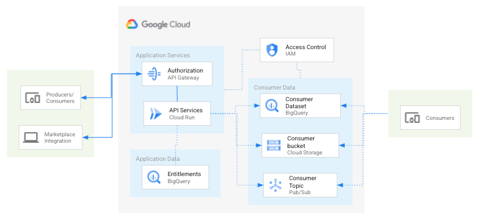

# Datashare API

* [Overview](#overview)
  * [Architecture](#architecture)
  * [Configuration](#configuration)
  * [Documentation (OpenAPI Spec)](#documentation)
* [Getting Started](#getting-started)
  * [Enable APIs](#enable-apis)
  * [Service Account](#service-account)
  * [Examples](#examples)
* [Deploy to Cloud Run with Deployment Manager](#deploy-to-cloud-run-with-deployment-manager)
  * [Prerequisites](#prerequisites)
  * [Deploy to Cloud Run](#deploy-to-cloud-run)
* [Deployment](#deployment)
  * [Deploy Cloud Run](#deploy-cloud-run)
    * [Deploy Cloud Run Anthos](#deploy-cloud-run-anthos)
    * [Deploy Cloud Run Managed](#deploy-cloud-run-managed)
  * [Deploy Kubernetes](#deploy-kubernetes)
  * [Deploy App Engine](#deploy-app-engine)
* [Security](#security)
  * [Encryption](#encryption)
  * [Authentication](#authentication)
  * [Authorization](#authorization)
* [Development](#development)
* [Testing](#testing)
* [Troubleshooting](#troubleshooting)
* [Contributing](#contributing)
* [License](#license)
* [Authors](#authors)
* [Notes](#notes)


# Overview

The DS API allows data producers the ability to programmatically enforce access control or Entitlements on their organization's Dataset(s) in Google Cloud Platform (GCP). The DS Policies are access control configurations that are constructed by the data producers with relationships between who can access what specific data assets. The policies enable data producers fine-grained control of their datasets down to row level fields or attributes for one or many data Account Consumer(s).

The DS API also enables data producers unique Fulfillments operations on their datasets. These fulfillments can be one-time Spot Request(s) for consumption of data for non GCP data consumers.


## Architecture

### Entitlement Services



### Fulfillment Services


## Configuration

There are configuration settings for Entitlements and Fulfillment services. Currently, the Entitlements configuration is via the UI and Filfillment is configured [here](SPOT_SERVICE_README.md#create-configuration)


### Documentation
_OpenAPI Specification_

The DS API service(s) utilize the open standard for API documentation, [OpenAPI Specification](https://github.com/OAI/OpenAPI-Specification) (OAS) for documenting the API's resources, parameters, responses, etc. The OAS definitions and paths are rendered via [swagger-jsdoc](https://www.npmjs.com/package/swagger-jsdoc) in the route comments of [index](v1alpha/index.js)

You can access the OAS directly via:

    http://{HOSTNAME}/{API_VERSION}/docs/openapi_spec

You can also access an instance of Swagger UI to render the OAS docs:

    http://{HOSTNAME}/{API_VERSION}/docs


## Getting Started

These instructions will setup an instance of the DS API Service in your GCP project.

### Setup GCloud
* Install the [Google Cloud SDK](https://cloud.google.com/sdk/install) on your local machine.
or
* If you already have gcloud installed, then update it.
```
gcloud components update
```

Set `gcloud` connect to your current project.

    gcloud config set project YOUR_PROJECT_NAME

### Enable APIs

These are the GCP project APIs that require the DS API service(s) access.

```
gcloud services enable bigquery-json.googleapis.com
gcloud services enable iam.googleapis.com
```

### Service Account

DS API service(s) are a trusted application that makes authorized API calls to your GCP project service(s). The application requires a [GCP service account](https://cloud.google.com/iam/docs/service-accounts) with the appropriate permissions enabled. These permissions have been aggregated into a custom role that is associated to a service account. The custom role and associated permissions are defined in [here](./config/ds-api-mgr-role-definition.yaml)

#### Setup Service Account

Set your **PROJECT\_ID** if you have not already:

    export PROJECT_ID=`gcloud config list --format 'value(core.project)'`; echo $PROJECT_ID

Set the **SERVICE\_ACCOUNT\_NAME** environment variable(s):

    export SERVICE_ACCOUNT_NAME=ds-api-mgr;

Set the **SERVICE\_ACCOUNT\_DESC** environment variable(s):

    export SERVICE_ACCOUNT_DESC="DS API Manager";

Create the custom DS API service-account:

    gcloud iam service-accounts create ${SERVICE_ACCOUNT_NAME} --display-name "${SERVICE_ACCOUNT_DESC}";

Set the **CUSTOM\_ROLE\_NAME** environment variable(s):

    export CUSTOM_ROLE_NAME=custom.ds.api.mgr;

**Note**: We could use the the following roles, but it's better to follow the principle of least privilege. \
_The permissions for the custom role are defined in [config/ds-api-mgr-role-definition.yaml](config/ds-api-mgr-role-definition.yaml)_

Create custom DS API role:

    gcloud iam roles create ${CUSTOM_ROLE_NAME} --project ${PROJECT_ID} --file config/ds-api-mgr-role-definition.yaml

Grant the new GCP service role to service account:

    gcloud projects add-iam-policy-binding ${PROJECT_ID} \
      --member serviceAccount:${SERVICE_ACCOUNT_NAME}@${PROJECT_ID}.iam.gserviceaccount.com \
      --role="projects/${PROJECT_ID}/roles/${CUSTOM_ROLE_NAME}"

#### Configure Service Account Secret

Create service account credentials and download them:

    gcloud iam service-accounts keys create ${SERVICE_ACCOUNT_NAME}.json \
      --iam-account ${SERVICE_ACCOUNT_NAME}@${PROJECT_ID}.iam.gserviceaccount.com

Set the **GOOGLE_APPLICATION_CREDENTIALS** environment variable(s):

    export GOOGLE_APPLICATION_CREDENTIALS="${SERVICE_ACCOUNT_NAME}.json"

## Deploy to Cloud Run with Deployment Manager
You can deploy the API service via the Deployment Manager.
The Deployment Manager script will create a Cloud Build package that performs the following actions:
* clones the datashare-tookit repository
* create a service account
* create a custom role
* assign the service account to the custom role
* create a container image in Container Registry
* deploy the Datashare API to Cloud Run

**NOTE: If you delete the Deployment Manager template, it will NOT delete any of the resources that it creates (SA, custom role, container, Cloud Run deployment)**

### Prerequisites
* Enable the following APIs
  * With the following link
    * [Enable the Cloud Build, Deployment Manager, IAM, Cloud Run APIs](https://console.cloud.google.com/flows/enableapi?apiid=cloudbuild.googleapis.com,deploymentmanager.googleapis.com,iam.googleapis.com,run.googleapis.com)
  * Or enabled them with the following gcloud commands.
    ```
    gcloud services enable cloudbuild.googleapis.com
    gcloud services enable deploymentmanager.googleapis.com
    gcloud services enable iam.googleapis.com
    gcloud services enable run.googleapis.com
    ```

* Add the following roles to the Cloud Build Service Account (**id@cloudbuild.gserviceaccount.com**)
  * Role Administrator
  * Security Admin
  * Service Account Admin
  * Cloud Run Admin
  * Cloud Run Service Agent

### Deploy to Cloud Run
By default it deploys to us-central1 region. Execute the following command from the `datashare-toolkit/api` directory.
```
gcloud deployment-manager deployments create ds-api --config deploy_ds_api.yaml
```

You can update the region in the `deploy_ds_api.yaml` file.
```
properties:
    region: us-central1
```

## Deployment
You can deploy the API service via various methods below based off developer preference and/or environment. These are the options available:

  * [Google Cloud Run](https://cloud.google.com/run/) via [gcloud](https://cloud.google.com/sdk/)
  * [Google Kubernetes Engine](https://cloud.google.com/kubernetes-engine/) via [Skaffold](https://github.com/GoogleContainerTools/skaffold)
  * [Google Cloud App Engine](https://cloud.google.com/appengine/) via [Deployment Manager](https://cloud.google.com/deployment-manager/) and gcloud - TODO

[Deploy Cloud Run](#deploy-cloud-run) on [Anthos](https://cloud.google.com/run/docs/choosing-a-platform#cloud-run-for-anthos) is the _required_ method to enabled fine-grained authorization with [Istio](http://istio.io/). [Managed](https://cloud.google.com/run/docs/choosing-a-platform#cloud-run-fully-managed)is the _preferred_ method to quickly host the DS API Service content and generate a unique URL for consumption.

There are some environment variables that need to be set for all build and deployment options.

Export the GCP Project ID as *PROJECT_ID* environment variable:

    export PROJECT_ID=`gcloud config list --format 'value(core.project)'`; echo $PROJECT_ID

Export the image/build *TAG* environment variable:

    export TAG=dev;

Change directories into the current working API version:

    cd v1alpha

### Cloud Run Prerequisites

Deploy with Cloud Run allows stateless HTTP containers on a fully [managed](https://cloud.google.com/run/docs/choosing-a-platform#cloud-run-fully-managed) environment or [Anthos](https://cloud.google.com/run/docs/choosing-a-platform#cloud-run-for-anthos) GKE cluster. If you do not have a pre-built image, [Cloud Build](https://cloud.google.com/run/docs/quickstarts/build-and-deploy#containerizing) packages the Docker image into your Google Container repository.
_Cloud Run and Cloud Build APIs will need to be enabled in your GCP project._

Build with Cloud Build and TAG:

**Note**: Cloud Build needs to run from parent directory for build context and the [shared](../shared) directory

    cd ../../
    gcloud builds submit --config api/v1alpha/cloudbuild.yaml --substitutions=TAG_NAME=${TAG}

[Enable the APIs](https://console.cloud.google.com/flows/enableapi?apiid=cloudapis.googleapis.com,container.googleapis.com,run.googleapis.com) before beginning

### Deploy Cloud Run Anthos
Deploy with Cloud Run (Anthos) requires the following GKE [setup](https://cloud.google.com/run/docs/gke/setup) configuration items to be completed before deploying.
**Note**  The default Knative serving domain is *example.com* and will be changed via [here](https://cloud.google.com/run/docs/gke/default-domain) before HTTPS and autoTLS is enabled via the [Encryption](#encryption) section

* Create a GKE cluster with Cloud Run enabled
* Install additional Istio components required for Istio authorization
* Configure GKE Workload identity for the service
* Deploy the service
* Change the default Knative serving domain
* Map custom domain to the service

#### Create a GKE Cluster with Cloud Run enabled

Define an environment variables and gcloud tool default for the Compute Engine zone that you want to use for this tutorial:

    REGION=us-central1
    ZONE=us-central1-a
    gcloud config set compute/zone $ZONE

You can change the [zone](https://cloud.google.com/compute/docs/regions-zones)

Create a GKE cluster with the Cloud Run add-on:

    CLUSTER=datashare

    gcloud container clusters create $CLUSTER \
        --addons HorizontalPodAutoscaling,HttpLoadBalancing,CloudRun \
        --release-channel stable \
        --workload-pool=${PROJECT_ID}.svc.id.goog \
        --enable-ip-alias \
        --enable-stackdriver-kubernetes \
        --machine-type n2-standard-2 \
        --max-surge-upgrade 2 \
        --enable-autoscaling \
        --max-nodes 8 \
        --min-nodes 4

This tutorial requires GKE version 1.15.11-gke.9 and later, 1.16.8-gke.7 and later, or 1.17.4-gke.5 and later.
The **e2-standard-2** [compute machine type](https://cloud.google.com/compute/docs/machine-types#e2_standard_machine_types) requires the least amount of compute resources to run the service.

#### Installing the Istio sidecar injector webhook
Istio authorization relies on the [Istio sidecar proxy](https://archive.istio.io/v1.4/docs/ops/deployment/architecture/). You use the [Istio sidecar injector webhook](https://archive.istio.io/v1.4/docs/setup/additional-setup/sidecar-injection/) to add the sidecar proxy to your Cloud Run for Anthos services.

Add your user as a cluster admin so that you can install extra Istio components:

    kubectl create clusterrolebinding cluster-admin-binding \
        --clusterrole cluster-admin \
        --user $(gcloud config get-value core/account)

Inspect your GKE cluster to find the version of Istio used by the Cloud Run add-on:

    ISTIO_PACKAGE=$(kubectl -n gke-system get deployments istio-pilot \
    -o jsonpath="{.spec.template.spec.containers[0].image}" | \
    cut -d':' -f2)

    ISTIO_VERSION=$(echo $ISTIO_PACKAGE | cut -d'-' -f1)

Download and extract Istio:

    gsutil -m cp gs://istio-release/releases/${ISTIO_VERSION}/istio-${ISTIO_VERSION}-linux.tar.gz - | tar zx

Ensure that you have helm installed, otherwise install it:

    brew install helm

Use Helm's local template rendering to create a Kubernetes manifest that installs the Istio sidecar injector webhook.

    helm template \
      --namespace gke-system \
      --set global.proxy.excludeIPRanges=169.254.169.254/32 \
      --set global.hub=gcr.io/gke-release/asm \
      --set global.tag=$ISTIO_PACKAGE \
      --set pilot.enabled=false \
      --set security.enabled=true \
      --set sidecarInjectorWebhook.enabled=true \
      --set sidecarInjectorWebhook.rewriteAppHTTPProbe=true \
      --values istio-${ISTIO_VERSION}/install/kubernetes/helm/istio/values-istio-minimal.yaml \
      istio-${ISTIO_VERSION}/install/kubernetes/helm/istio \
      > istio-${ISTIO_VERSION}-sidecar-injector-webhook.yaml

This command sets the pilot.enabled flag to false to create a manifest file that contains only the objects required to add the Istio sidecar injector webhook to your cluster. Applying this manifest file doesn't disable the existing Istio Pilot component.

Apply the Istio sidecar injector webhook manifest:

    kubectl apply -f istio-${ISTIO_VERSION}-sidecar-injector-webhook.yaml

**Note**: When using the Cloud Run add-on for GKE, upgrades to the components installed by the add-on are managed as part of the GKE master upgrade process. These upgrades don't include extra components installed manually, such as the Istio sidecar injector webhook. Repeat the steps in this section to upgrade the Istio sidecar injector webhook when GKE upgrades the version of Cloud Run in your cluster.

Wait for the sidecar injector to be ready:

    kubectl rollout status deploy istio-sidecar-injector -n gke-system

#### Workload Identity
In the new  GKE cluster, the DS API requires credentials from the [service account](#service-account) created above. Google recommends [Workload Identity](https://cloud.google.com/kubernetes-engine/docs/how-to/workload-identity) for applications in GKE to communicate with GCP services. With Workload Identity, you configure a Kubernetes service account (KSA) (KSA) to act as a Google service account (GSA). Any workload running as the KSA automatically authenticates as the GSA when accessing Google Cloud APIs.


Create a **NAMESPACE** environment variable called **datashare-apis**:

    export NAMESPACE=datashare-apis

Create the **NAMESPACE** in the GKE cluster:

    kubectl create namespace $NAMESPACE

Set the **KSA_NAME** environment variable: \
**Note**: We are setting this thhe same as **SERVICE_ACCOUNT_NAME** for simplicity, but it can be changed

    export KSA_NAME=$SERVICE_ACCOUNT_NAME

Create the new KSA:

    kubectl create serviceaccount $KSA_NAME -n $NAMESPACE;

Bind the `iam.workloadIdentityUser` role for the KSA to GSA:

    gcloud iam service-accounts add-iam-policy-binding \
      --role roles/iam.workloadIdentityUser \
      --member "serviceAccount:${PROJECT_ID}.svc.id.goog[${NAMESPACE}/${KSA_NAME}]" ${SERVICE_ACCOUNT_NAME}@${PROJECT_ID}.iam.gserviceaccount.com

Complete the binding between the KSA and GSA:

    kubectl annotate serviceaccount $KSA_NAME -n $NAMESPACE iam.gke.io/gcp-service-account=${SERVICE_ACCOUNT_NAME}@${PROJECT_ID}.iam.gserviceaccount.com

You can check the binding via:

    kubectl get serviceaccount $KSA_NAME -n $NAMESPACE -o yaml


#### Deploy the service

Label the **namespace** with `istio-injection=enabled` so that the Istio sidecar proxy is injected to all pods in the namespace by default:

    kubectl label namespace $NAMESPACE istio-injection=enabled

Deploy ths DS API service to Cloud Run for Anthos in the **NAMESPACE**:

    gcloud run deploy ds-api \
        --cluster $CLUSTER \
        --cluster-location $ZONE \
        --min-instances 1 \
        --namespace $NAMESPACE \
        --image gcr.io/${PROJECT_ID}/ds-api:${TAG} \
        --platform gke \
        --service-account ${SERVICE_ACCOUNT_NAME}

This command creates a [Knative Serving service](https://github.com/knative/serving/blob/master/docs/spec/overview.md) object.
The `--min-instances 1` option prevents timing conflicts between the Istio and Knative Serving sidecars, when scaling up from zero pods.

Check the status of the deployment: \
**Note**: You will see status of *Running* for the DS API pod

    kubectl get gw,deploy,po,svc -n $NAMESPACE

You can also run the `glcoud run services describe` command to see the status:

    gcloud run services describe ds-api \
        --cluster $CLUSTER \
        --cluster-location $ZONE \
        --namespace $NAMESPACE \
        --platform gke

Cloud Run for Anthos exposes services on the external IP address of the [Istio ingress gateway](https://archive.istio.io/v1.4/docs/concepts/traffic-management/#gateways). Retrieve the external IP address and store it in an environment variable:

    GATEWAY_IP=`kubectl -n gke-system get svc istio-ingress -o jsonpath='{.status.loadBalancer.ingress[0].ip}'`; echo $GATEWAY_IP

Verify the DS API is running based off the active version url: \
**Note**: The service external fqdn will be `'<service>.<namespace>.<domain>'` and **example.com** is the default knative domain.

    curl -i -H "Host: ds-api.datashare-apis.example.com" ${GATEWAY_IP}/v1alpha

You should also be able to verify the DS API can communicate with GCP services:

    curl -i -H "Host: ds-api.datashare-apis.example.com" ${GATEWAY_IP}/v1alpha/projects/${PROJECT_ID}/datasets


#### Change the default Knative serving domain
Change the default Knative serving domain from **example.com** to test out the service from a public wildcard DNS site [here](https://cloud.google.com/run/docs/gke/default-domain#choose_an_alternative_for_wildcard_dns)
**Note**: This configuration should be removed in production

Create a **GATEWAY_IP_DOMAIN** environment variable based off the **GATEWAY_IP** above and [xip.io](xip.io) wildcard DNS:

    export GATEWAY_IP_DOMAIN="$GATEWAY_IP.xip.io"; echo $GATEWAY_IP_DOMAIN

Apply the knative serving config patch:

    kubectl patch configmap config-domain --namespace knative-serving --patch \
      '{"data": {"example.com": null, "'"$GATEWAY_IP_DOMAIN"'": ""}}'

Create a **XIP_FQDN** for the full service FQDN with the **GATEWAY_IP_DOMAIN**:
**Note**: The service external fqdn will be `'<service>.<namespace>.<domain>'` and **xip.io** is the custom knative domain.

    export XIP_FQDN="ds-api.${NAMESPACE}.${GATEWAY_IP_DOMAIN}"; echo $XIP_FQDN

Verify the DS API is running based off the active version url:

    curl -i http://${XIP_FQDN}/v1alpha

You should also be able to verify the DS API can communicate with GCP services:

    curl -i http://${XIP_FQDN}/v1alpha/projects/${PROJECT_ID}/datasets


#### Domain mapping
To use a custom domain for a service, you map your service to the custom domain, then update your DNS records. You can map a service to a domain, such as *abc.com* or to a subdomain, such as *subdomain.abc.com*. You must already own the TLD or sub-domain to use this feature.\
**Note**: For internal Googlers, you can create custom domains via go/create-test-org

Create a **DOMAIN** environment variable based off the custom subdomain:

    export DOMAIN=fsi.joonix.net

Verify domain ownership the first time you use that domain in the Google Cloud project:

    gcloud domains list-user-verified

If your ownership of the domain needs to be verified, open the Webmaster Central verification page:

    gcloud domains verify $DOMAIN

Create a **FQDN** environment variable based off service name and subdomain above:

    export FQDN=ds-api.$DOMAIN

Map your service to the custom FQDN:

    gcloud run domain-mappings create --service ds-api \
        --domain $FQDN \
        --cluster $CLUSTER \
        --cluster-location $ZONE \
        --namespace $NAMESPACE \
        --platform gke

Reserve the IP address attached to the Load Balancer for the Istio ingress gateway service as a static IP: \
**Note**: Create a **REGION** environment variable based off the appropriate **ZONE** variable above:

    gcloud compute addresses create ds-api-static-ip --addresses $GATEWAY_IP --region $REGION

Add the appropriate A record to the DNS entry in your domain registrar based off the entry of this command: \
**Note**: These `gcloud` commands will only work if the DNS zone is managed in Cloud DNS [here](https://cloud.google.com/dns/docs/records#gcloud)

Export **DNS_ZONE_NAME** environment variable

    export DNS_ZONE_NAME=fsi-joonix-net

Create a new DNS record transaction:

    gcloud dns record-sets transaction start --zone=$DNS_ZONE_NAME

Add the *A* record to the FQDN in the transaction:

    gcloud dns record-sets transaction add $GATEWAY_IP \
        --name=$FQDN \
        --ttl="30" \
        --type="A" \
        --zone=$DNS_ZONE_NAME

Execute the DNS record transaction: \
**Note**: It may take a minute or two for the DNS resolvers to propogate the new DNS record

    gcloud dns record-sets transaction execute --zone=$DNS_ZONE_NAME

Very the new record propagated to the local DNS resolvers:

    dig +short $FQDN

You should also be able to verify the DS API can communicate with GCP services:

    curl -i http://${FQDN}/v1alpha/projects/${PROJECT_ID}/datasets


### Deploy Cloud Run Managed
Deploy with Cloud Run (Managed): \
**Note**: There are a few environment variables that need to be set before the application starts (see below). [gcloud run deploy](https://cloud.google.com/sdk/gcloud/reference/run/deploy#--set-env-vars) provides details for how they are set.\
The GCP project's Cloud IAM policy, *constraints/iam.allowedPolicyMemberDomains* or *Domain Restricted Sharing* must be disabled to allow unauthenticated requests to reach Cloud Run services with the `--allow-unauthenticated` parameter. This policy is currently the default setting as described [here](https://cloud.google.com/resource-manager/docs/organization-policy/org-policy-constraints).

    gcloud run deploy ds-api \
        --image gcr.io/${PROJECT_ID}/ds-api:${TAG} \
        --region=us-central1 \
        --allow-unauthenticated \
        --platform managed \
        --service-account ${SERVICE_ACCOUNT_NAME}@${PROJECT_ID}.iam.gserviceaccount.com

Spot service environment:

    gcloud run deploy ds-api \
        --image gcr.io/${PROJECT_ID}/ds-api:${TAG} \
        --region=us-central1 \
        --allow-unauthenticated \
        --platform managed \
        --service-account ${SERVICE_ACCOUNT_NAME}@${PROJECT_ID}.iam.gserviceaccount.com \
        --set-env-vars=SPOT_SERVICE_CONFIG_BUCKET_NAME=${BUCKET_NAME} \
        --set-env-vars=SPOT_SERVICE_CONFIG_DESTINATION_PROJECT_ID=${PROJECT_ID}

Open the app URL in your browser. You can return the FQDN via:

    gcloud run services describe ds-api --platform managed --format="value(status.url)"

#### Confirm your API is running

You can access the OAS directly from a browser by entering the following URI:

```
http://{HOSTNAME}/{API_VERSION}/docs/openapi_spec
```

You can also access an instance of Swagger UI to render the OAS docs:

```
http://{HOSTNAME}/{API_VERSION}/docs
```

### Deploy Kubernetes
These instructions are to build and deploy in a k8s environment via Skaffold.

Create a kubernetes secret with the appropriate service account key file from above:\
**Note**: Change the file path to the appropriate destination. Secrets management for multiple k8s clusters is outside the scope of this example.

    kubectl create secret generic ds-api-creds --from-file=key.json=${GOOGLE_APPLICATION_CREDENTIALS}

Modify the ConfigMap with the appropriate DS API environment variables:

    vi kubernetes-manifests/ds-api/configmaps.yaml

Set the default GCR project repository:

    skaffold config set default-repo gcr.io/${PROJECT_ID}

Run `skaffold` with the dev parameter to deploy locally:

    skaffold dev

Build the image with the `skaffold run -t <TAG>` command:

    skaffold run -t $TAG

### Deploy App Engine

TBD

## Delete Deployment
TODO - should we provide steps or a script to delete all the assets after they have been deployed?


## Security

The DS API runs as a trusted application that communicates to GCP services in a data producer's project. A [service account](#service-account) is required with the appropriate GCP service IAM controls enabled following a least privileged model. Communication between the client, DS API, and GCP services is encrypted in transit by default via TLS.

Clients of the DS API will include end-users (data producers/admins and data consumers) from the DS UI application and service accounts from [Google Cloud Marketplace](https://cloud.google.com/marketplace) integration and/or other trusted applications (e.g POS systems).

All clients and applications will be authenticated by the Identity Providers provided in the Istio [JWT Policies](https://archive.istio.io/v1.4/docs/reference/config/security/istio.authentication.v1alpha1/) configurations [here](istio-manifests/1.4/authn/). The only unauthented requests to the DS API will be for clients that required [CORS](https://www.w3.org/wiki/CORS) preflight fetch or *OPTIONS* requests e.g. [XMLHttpRequest (XHR)](https://www.w3.org/TR/XMLHttpRequest/). These requests will still have strict [Authorization](#authorization) rules enforced.

### Encryption

Encryption is enabled by default in Google Cloud for data [at-rest](https://cloud.google.com/security/encryption-at-rest) and in [transit](https://cloud.google.com/security/encryption-in-transit). Encryption from the client to the DS API leverages HTTPS via TLS and asymetric crytographic certificates. TLS is enabled by the Cloud Run GKE [auto-tls](https://cloud.google.com/run/docs/gke/auto-tls) feature and enforced by the Istio [Ingress Gateway](https://archive.istio.io/v1.4/docs/tasks/traffic-management/ingress/ingress-control/). TLS certificates are managed and rotated by [LetsEncrypt](https://letsencrypt.org/).

Verify you have completed the prereq steps above for [domain mapping](#domain-mapping) first

Turn on auto TLS certificates and HTTPS by updating the ConfigMap config-domainmapping:

    kubectl patch cm config-domainmapping -n knative-serving -p '{"data":{"autoTLS":"Enabled"}}'

Wait for a few minutes after the command succeeds, then make sure the certificates feature is working:

    kubectl get kcert -n $NAMESPACE

If the certificate is ready, you should see a message similar to this one:

    NAME              READY   REASON
    example.com       True

It may take from 20 seconds to 2 minutes for the Kcert to become ready. If you experience any issues, see the troubleshooting instructions for this feature

Verify that the DNS record has gone into effect by running the command: \
**Note**: You sould see HTTPS instead

    gcloud beta run domain-mappings describe \
        --domain $FQDN \
        --cluster $CLUSTER \
        --cluster-location $ZONE \
        --namespace $NAMESPACE \
        --platform gke

You should also be able to verify the DS API can communicate with GCP services via HTTPS:

    curl -i https://${FQDN}/v1alpha/projects/${PROJECT_ID}/datasets


### Authentication

Authentication is enforced by Istio JWT Policies at the Istio [Ingress Gateway](https://archive.istio.io/v1.4/docs/tasks/traffic-management/ingress/ingress-control/). There are three JWT origins for each supported Identity Provider: Google, Firebase, and Marketplace [here](istio-manifests/1.4/authn/default-jwt-policy.tmpl.yaml)

Ensure that you have gettext installed, otherwise install it:

    brew install gettext

Apply the authN policies: \
**Note**: `envsubst` will read the **PROJECT_ID** environment variable, substitute it in the template, then `kubectl` to apply the config:

    cat istio-manifests/1.4/authn/* | envsubst | kubectl apply -f -

Verify the DS API is not accessible: \
**Note**: The HTTP response code should be *401 Unauthorized*

    curl -i https://${FQDN}/v1alpha

Verify the DS API is accessible with a valid Bearer ID Token: \
**Note**: The HTTP response code should be *200 OK*

    curl -i -H "Authorization: Bearer $(gcloud auth print-identity-token)" https://${FQDN}/v1alpha

Verify the DS API preflight requests are accessible without a valid Bearer ID Token: \
**Note**: The HTTP response code should be *200 OK*

     curl -i -X OPTIONS -H "Origin: http://ds-ui.a.run.app" -H "Access-Control-Request-Method: POST" https://${FQDN}/v1alpha

**Note**: You can debug HTTP 401/403 Istio [AuthN/AuthZ Errors](#authnauthz-errors) below in the [Troubleshooting](#troubleshooting) section.

You now have [authentication](#authentication) enabled for all endpoints and methods in the DS API service. Next step is to enforce [authorization](#authorization) for the clients:

### Authorization

Authorization is enabled implicitly via Istio [Authorization Policy](https://archive.istio.io/v1.4/docs/concepts/security/#authorization-policy) and access to the workload or services are **denied by default** when a policy is enabled. The Authorization policies are dividied into separate roles based off the end-user or client defined in [Security](#security) above. \
**Note**: These can be refined if additional roles are required.

#### Data Producers:
Datashare project administrators or service accounts that require read-write access to all Datashare API services and methods. These users are authenticated via Google.
* read-write access to all `*`

#### Data Consumers:
Datashare end-user or data consumers that require read-write access to Account activate endpoints and read-only access to Products. These users are authenticated via Firebase (Identity Platform).
* read-write (GET, POST) access to `accounts:activate`
* read-only (GET) access to `products`

#### Marketplace Service Account:
Google Cloud Marketplace integration Service Account that is required for redirecting end-users to registration and sign-up pages in the UI. This service account authenticates via Google.
* read-write (POST) access to `accounts:register`
* read-write (POST) access to `procurements:myProducts`

#### Preflight Requests:
Unauthenticated clients (single page applications) and browsers that make CORS preflight requests require *OPTIONS* to all service endpoints:
* read-only (OPTIONS) access to `*`

#### Letsencrypt Requests:
Unauthenticated Letsencrypt CA servers that make ACME Challenges via [HTTP01](https://cert-manager.io/docs/configuration/acme/http01/) requests require *GET* to this specific endpoints (more details [here](https://cloud.google.com/run/docs/gke/troubleshooting#user_configuration_errors):
* read-only (GET) access to `/.well-known/acme-challenge/*`

Before you apply the AuthZ policies, export the **DATA_PRODUCERS** environment variable as a comma separated list of email addresses: e.g.
**Note**: You can wildcard an email address domain or explicity add them individually


    export DATA_PRODUCERS='"*@google.com"';
    export DATA_PRODUCERS="abc@xyz.com,my-trusted-app@my-gcp-project.iam.gserviceaccount.com"

Additionally, export the **OAUTH_CLIENT_ID** environment variable that you created for the UI.

    export OAUTH_CLIENT_ID="abc123..."

Apply the authZ policies: \
**Note**: `envsubst` will read the **PROJECT_ID**, **OAUTH_CLIENT_ID**, and **DATA_PRODUCERS** environment variable(s), substitute it in the template, then `kubectl` to apply the config:

    cat istio-manifests/1.4/authz/* | envsubst | kubectl apply -f -

 Verify the DS API is not accessible: \
**Note**: The HTTP response code should be *401 Unauthorized*

    curl -i https://${FQDN}/v1alpha

Verify the DS API is accessible with a valid Bearer ID Token: \
**Note**: The HTTP response code should be *200 OK*

    curl -i -H "Authorization: Bearer $(gcloud auth print-identity-token)" https://${FQDN}/v1alpha

Verify the DS API preflight requests are accessible without a valid Bearer ID Token: \
**Note**: The HTTP response code should be *200 OK*

    curl -i -X OPTIONS -H "Origin: http://ds-ui.a.run.app" -H "Access-Control-Request-Method: POST" https://${FQDN}/v1alpha

**Note**: You can debug HTTP 401/403 Istio [AuthN/AuthZ Errors](#authnauthz-errors) below in the [Troubleshooting](#troubleshooting) section.

You now have [authorization](#authorization) enabled for all endpoints and methods in the DS API service.

## Development

Navigate to the API version directory (*v1alpha*, *v1*, etc.).

Install Node 12.6

    nvm install 12.6

Install the Node modules

    npm install

Start the service.\
**Note**: There are a few environment variables that need to be set before the application starts (see below). [Nodemon](https://nodemon.io/) is leveraged to read file changes and reload automatically.

    export GOOGLE_APPLICATION_CREDENTIALS=${GOOGLE_APPLICATION_CREDENTIALS};

Spot service environment:

    export SPOT_SERVICE_CONFIG_BUCKET_NAME=${BUCKET_NAME};
    export SPOT_SERVICE_CONFIG_DESTINATION_PROJECT_ID=${PROJECT_ID};

    npm run dev


## Testing

The test frameworks include [Chai](https://www.chaijs.com/) and [Supertest](https://github.com/visionmedia/supertest)

Execute the tests:

    npm test


## Troubleshooting

These steps below help debug and triage issues with the DS API service.

### AuthN/AuthZ Errors

The DS API leverages Istio for AuthN/AuthZ in Cloud Run on GKE (Anthos). When an auth error occurs, Istio responds with standard HTTP 401/403 Unauthorized/Forbidden error codes which are AuthN/AuthZ errors respectively. Under the covers, Istio will leverage Envoy's JWT auth and filter components to implement the logic. The logging granularity or severity for Istio proxy sidecar containers is not fine enough to troubleshoot why the AuthN/AuthZ errors occur, so this guide will help:

In the DS API (ds-api) knative service pod, enable the **debug** logging severity via `kubectl` on the **istio-proxy** container logs: *http*, *filter*, and *jwt*

    kubectl exec $(kubectl get pods -l serving.knative.dev/service=ds-api -n $NAMESPACE -o jsonpath='{.items[0].metadata.name}') -n $NAMESPACE -c istio-proxy  -- curl -X POST "localhost:15000/logging?filter=debug" -s

    kubectl exec $(kubectl get pods -l serving.knative.dev/service=ds-api -n $NAMESPACE -o jsonpath='{.items[0].metadata.name}') -n $NAMESPACE -c istio-proxy  -- curl -X POST "localhost:15000/logging?http=debug" -s

    kubectl exec $(kubectl get pods -l serving.knative.dev/service=ds-api -n $NAMESPACE -o jsonpath='{.items[0].metadata.name}') -n $NAMESPACE -c istio-proxy  -- curl -X POST "localhost:15000/logging?jwt=debug" -s

You can them tail the logs via `kubectl` or apply the appropriate GCP console logging filters:

    kubectl logs -f $(kubectl get pods -l serving.knative.dev/service=ds-api -n $NAMESPACE -o jsonpath='{.items[0].metadata.name}') -n $NAMESPACE -c istio-proxy

Set the severity back to **warning** for the istio-proxy container:

    kubectl exec $(kubectl get pods -l serving.knative.dev/service=ds-api -n $NAMESPACE -o jsonpath='{.items[0].metadata.name}') -n $NAMESPACE -c istio-proxy  -- curl -X POST "localhost:15000/logging?filter=warning&http=warning&jwt=warning" -s

### "Could not refresh access token" Errors

If you see the following error in the Cloud Run API service logs, you most likely have not
set up the binding of the iam.workloadIdentityUser role for the KSA to GSA.

```
Could not refresh access token: A Not Found error was returned while attempting to retrieve an accesstoken for the Compute Engine built-in service account. This may be because the Compute Engine instance does not have any permission scopes specified: Could not refresh access token: Unsuccessful response status code. Request failed with status code 404
```

See the [Workload Identity](#workload-identity) section for more information.

## Contributing

Please read [CONTRIBUTING](../CONTRIBUTING.md) for details on our code of conduct, and the process for submitting pull requests to us.


## License

This project is licensed under the Apache License - see the [LICENSE](../LICENSE.txt) file for details


## Authors

* **Mark Servidio** - *Initial work*
* **Chris Page** - *Initial work*
