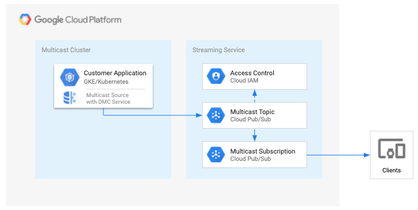

# Datashare - Multicast Client - Examples

* [Overview](#overview)
* [Setup](#setup)
  * [Enable APIs](#enable-apis)
  * [Service Account](#service-account)
  * [Create Pub/Sub Topic](#create-pubsub-topic)
  * [Create Pub/Sub Subscription](#create-pubsub-subscription)
  * [Setup Kubernetes](#setup-kubernetes)
* [Examples](#examples)
  * [Hello World](#hello-world)
  * [Replay Messages](#replay-messages)
  * [Troubleshooting](#troubleshooting)
* [License](#license)
* [Authors](#authors)

# Overview

This documentation provides examples for the Datashare Multicast Client (DMC). The [Setup](#setup) section will configure your environment for the [Examples](#examples) below.


## Setup

The DMC service configuration and setup documentation will configure your GCP project environment and a GKE cluster to run the demo [examples](#examples).


### Enable APIs

These are the GCP project APIs that require the DMC service authorization.

```
pubsub.googleapis.com
```

### Service Account

The DMC service is a trusted application that makes authorized API calls to your GCP project service(s). The application requires a [GCP service account](https://cloud.google.com/iam/docs/service-accounts) with the appropriate permissions enabled. These permissions have been aggregated into a custom role that is associated to a service account.

#### Setup Service Account

Set your **PROJECT\_ID** if you have not already:

    export PROJECT_ID=`gcloud config list --format 'value(core.project)'`; echo $PROJECT_ID

Set the **SERVICE\_ACCOUNT\_NAME** environment variable(s):

    export SERVICE_ACCOUNT_NAME=ds-multicast-client;

Set the **SERVICE\_ACCOUNT\_DESC** environment variable(s):

    export SERVICE_ACCOUNT_DESC="Datashare Multicast Client";

Create the custom Datashare API service-account:

    gcloud iam service-accounts create ${SERVICE_ACCOUNT_NAME} --display-name "${SERVICE_ACCOUNT_DESC}";

Grant the GCP service role to service account:

    gcloud projects add-iam-policy-binding ${PROJECT_ID} \
      --member serviceAccount:${SERVICE_ACCOUNT_NAME}@${PROJECT_ID}.iam.gserviceaccount.com \
      --role="roles/pubsub.admin"

#### Configure Service Account Secret

Create service account credentials and download them:

    gcloud iam service-accounts keys create ${SERVICE_ACCOUNT_NAME}.json \
      --iam-account ${SERVICE_ACCOUNT_NAME}@${PROJECT_ID}.iam.gserviceaccount.com

Set the **GOOGLE_APPLICATION_CREDENTIALS** environment variable(s):

    export GOOGLE_APPLICATION_CREDENTIALS="${SERVICE_ACCOUNT_NAME}.json"

### Create Pub/Sub Topic

A Pub/Sub Topic with the appropriate service account permissions is required for the DMC Service.


Set your **TOPIC\_NAME** if you have not already:

    export TOPIC_NAME=ds-multicast-demo-broadcast;

Create the Topic:

    gcloud pubsub topics create ${TOPIC_NAME}

Set the permissions for the service account:

    gcloud beta pubsub topics add-iam-policy-binding ${TOPIC_NAME} --member=serviceAccount:${SERVICE_ACCOUNT_NAME}@${PROJECT_ID}.iam.gserviceaccount.com --role='roles/editor'

### Create Pub/Sub Subscription:

A Pub/Sub Subscription is utilzed for the Worker (pull) to process multicast messages from the DMC service's Pub/Sub topic. This use-case would be for exposing the multicast Pub/Sub topic to a specific customer or end-user. You can create a separate service account(s) for consumption, but for this tutorial, we will use the same one created above.

Set your **PULL\_SUBSCRIPTION\_NAME** if you have not already:

    export PULL_SUBSCRIPTION_NAME=ds-multicast-demo-listener;

Create the Subscription:

    gcloud beta pubsub subscriptions create ${PULL_SUBSCRIPTION_NAME} --topic ${TOPIC_NAME}

Set the IAM policy for the Subscription:

    gcloud beta pubsub subscriptions add-iam-policy-binding ${PULL_SUBSCRIPTION_NAME} --member=serviceAccount:${SERVICE_ACCOUNT_NAME}@${PROJECT_ID}.iam.gserviceaccount.com --role='roles/pubsub.subscriber'

List the subscriptions for the topic:

    gcloud beta pubsub topics list-subscriptions ${TOPIC_NAME}

### Setup Kubernetes

These instructions are to setup a GKE cluster, a managed k8s environment,
via the **[gcloud SDK](https://cloud.google.com/sdk/)**

**Note**: You can also setup a GKE cluster via the GCP console.

Set your **CLUSTER\_NAME** environment variable:

    export CLUSTER_NAME=dmc-demo

Set your **ZONE** environment variable:

**Note**: If you specify a region name instead of zone name for the
**ZONE** environment variable, it will result in X nodes in each zone of
the region.

    export ZONE=us-central1-c

Create a GKE cluster via **gcloud** CLI and verify the instances are
created:

    gcloud container clusters create ${CLUSTER_NAME} \
      --zone ${ZONE} \
      --machine-type=n2-standard-8 \
      --num-nodes 1 \
      --cluster-version=1.15 \
      --no-enable-legacy-authorization;

Enable cluster-admin-binding clusterrolebinding in the cluster:

    kubectl create clusterrolebinding cluster-admin-binding \
      --clusterrole=cluster-admin \
      --user=$(gcloud config get-value core/account);

Create a kubernetes secret with the appropriate service account key file from above:

**Note**: Change the file path to the appropriate destination. Secrets management for multiple k8s clusters is outside the scope of this example.

    kubectl create secret generic dmc-service-creds --from-file=key.json=${GOOGLE_APPLICATION_CREDENTIALS}


# Examples

The examples are currently executed in a single-node, isolated Kubernetes (GKE) environment.

**Note**: Currently, GCP VPC networking does not support multicast layer 2 across instances so you will need to run the examples in an isolated environment.



The [**Hello World**](#hello-world) example will utilize two DMC services to simlulate the multicast to unicast flow. *gcloud* will be utilized as the consumer to subscribe and pull the messages from the Pub/Sub topic.

The [**Replay Messages**](#replay-messages) example will utilize [tcpreplay](https://tcpreplay.appneta.com/) to replay an existing pcap file to simlulate the multicast to unicast flow.

For both demos, the following three roles are defined below:

1) The *producer* will simulate sending multicast message(s) to a multicast receiver (publisher).\
2) The *publisher* will receive the multicast message(s) and send to a Pub/Sub topic.\
3) The *consumer* will consume the message(s) via Pub/Sub subsription via *gcloud*.

## Prerequites

### Kubernetes (GKE)

If using GKE, get the latest credentials for the cluster:

    gcloud container clusters get-credentials ${CLUSTER_NAME} --zone ${ZONE}

[**Skaffold**](https://skaffold.dev/docs/install/) >= v1.6.0 is also required to deploy the application to GKE:

    skaffold version


## Hello World

We will start one k8s deployment(s) for the Pub/Sub publisher and one k8s job for the multicast producer.

### Pub/Sub Publisher

Modify the DMC Publisher service *ConfigMap* with your appropriate GCP variables: **PROJECT_ID**, **TOPIC_NAME**

**Note**: The publisher requires ADC by mounting your GOOGLE_APPLICATION_CREDENTIALS k8s secret created above.

    vi kubernetes-manifests/dmc-publisher-service/configmaps.yaml


### Multicast Producer

Modify the DMC producer job image name *gcr.io/chrispage-dev/dmc:dev* accordingly:

    vi kubernetes-manifests/dmc-producer-job/job.yaml

Modify the DMC producer job *ConfigMap* with a unique **MESSAGE** variable:

**Note**: The **ADDRESS** variable is set to the service name of the publisher service so the sample message gets routed properly bwtween GKE nodes. e.g. *dmc-publisher-service:50000*. You can only broadcast a message to a multicast group, e.g. *239.0.0.1:50000*, in GKE if the producer is on the same node as the publisher.

    vi kubernetes-manifests/dmc-producer-job/configmaps.yaml

### Subscriber

Open another terminal and tun the following command(s) to pull the messages from the Pub/Sub subscription:

    while ((1)); do gcloud alpha pubsub subscriptions pull ${PULL_SUBSCRIPTION_NAME} --auto-ack; sleep 1; done

### Run the Demo:

Deploy the application and tail the logs:

    skaffold run -p hello-world -t dev --tail

**Note**: You can also deploy via `kubectl` directly too. You will need to wait for the services to start before viewing the logs:

    kubectl apply -f kubernetes-manifests/dmc-publisher-service

    kubectl get po,svc,deploy

    kubectl logs -f -l app=dmc-publisher-service

Send a sample message:

    kubectl apply -f kubernetes-manifests/dmc-producer-job

Check the logs of the publisher above and you should see `Message published to topic...`

**Note**: You may see multiple messages depending on if a multicast group is the destination and the number of pod replicas are running for the deployment.

You can *delete* the job artifacts and *apply* again to send another message(s):

    kubectl delete -f kubernetes-manifests/dmc-producer-job && kubectl apply -f kubernetes-manifests/dmc-producer-job

Cleanup:

    skaffold delete -p hello-world


## Replay Messages

For this example, we replay a multicast stream with [tcpdump](https://www.tcpdump.org/) using a public pcap file from [IEX Trading](https://iextrading.com/trading/market-data/). The [tcplreplay k8s job](kubernetes-manifests/tcpreplay-job) initiatlly downloads this [sample pcap](https://www.googleapis.com/download/storage/v1/b/iex/o/data%2Ffeeds%2F20180127%2F20180127_IEXTP1_DEEP1.0.pcap.gz?generation=1517101215560431&alt=media) files and unzips into a shared volume for the tcpreplay service. The *-D* option for tcpreplay replaces the destination multicast group address, the *-r* to replace the port number, and *-t* option will send the feed as fast as possible.
We will start one k8s deployment(s) for the Pub/Sub publisher and one k8s job for the tcpreplay multicast producer.


### Pub/Sub Publisher

Modify the DMC Publisher service *ConfigMap* with your appropriate GCP variables and at least 5MB read buffer (5242880): **PROJECT_ID**, **TOPIC_NAME**, **READ_BUFFER**

**Note**: The publisher requires ADC by mounting your GOOGLE_APPLICATION_CREDENTIALS k8s secret created above.

    vi kubernetes-manifests/dmc-publisher-service/configmaps.yaml

### Multicast Producer

Modify the tcpreplay job *ConfigMap* with the same **ADDRESS:PORT** variables as above for the publisher.

**Note**: *tcpreplay-edit* cannot lookup the IPv4/IPv6 for the service name of the publisher service, so the **ADDRESS** variable is set to the multicast group, e.g. *239.0.0.1:50000*. You can only broadcast a message to a multicast group in GKE if the producer is on the same node as the publisher. A Daemon Set or node affinity for one publisher service POD per node would theoretically solve the high-availability aspect for broadcasting.

    vi kubernetes-manifests/tcpreplay-job/configmaps.yaml

### Subscriber

Open another terminal and tun the following command(s) to pull the messages from the Pub/Sub subscription:

    while ((1)); do gcloud alpha pubsub subscriptions pull ${PULL_SUBSCRIPTION_NAME} --auto-ack; sleep 1; done

### Run the Demo:

Deploy the application and tail the logs:

    skaffold run -p replay-messages -t dev --tail

**Note**: You can also deploy via `kubectl` directly too. You will need to wait for the services to start before viewing the logs:

    kubectl apply -f kubernetes-manifests/dmc-publisher-service

    kubectl get po,svc,deploy

    kubectl logs -f -l app=dmc-publisher-service

Start the replay messages:

    kubectl apply -f kubernetes-manifests/tcpreplay-job

Check the logs of the publisher above and you should see `Message published to topic...` many times.

**Note**: You may see multiple messages depending on if a multicast group is the destination and the number of pod replicas are running for the deployment.

You can *delete* the job artifacts and *apply* again to send another message(s):

    kubectl delete -f kubernetes-manifests/tcpreplay-job && kubectl apply -f kubernetes-manifests/tcpreplay-job

Cleanup:

    skaffold delete -p replay-messages


## Troubleshooting

These are vairous troubleshooting steps that you may encounter during the demos.

### Services fail to start:

If you receive this error when checking the k8s pod, add the SA credential k8s secret in the setup [here](./README.md#setup-kubernetes):\
```MountVolume.SetUp failed for volume "google-cloud-key" : secret "dmc-service-creds" not found```

    kubectl describe `kubectl get pods --selector=app=dmc-publisher-service`

### Cannot connect to the GKE cluster:

If you cannot connect `kubectl` to the GKE cluster, verify the `kubectl` context and get new GKE credentials:

Verify you are using the correct k8s context:

    kubectl config get-contexts

Rectrive new credentials from GKE:

    gcloud container clusters get-credentials ${CLUSTER_NAME} --zone ${ZONE}


### Purge the Pub/Sub subscription

If you want to purge the Pub/Sub subscription, run the following command:

**Note**: This command is non-reversable!

    gcloud pubsub subscriptions seek ${PULL_SUBSCRIPTION_NAME} --time=$(date +%Y-%m-%dT%H:%M:%S)


### Network

You can leverage [netcat](http://netcat.sourceforge.net/) or the DMC broadcast command to test. e.g.

#### Netcat

Run through a for loop and send 5 UDP packets:

**Note**: Change the IP address/FQDN and port number accordingly

    for i in {0..5}; do echo "sending message $i"; echo "hello world: $i" | nc -u localhost 50001 -w1; done


### Docker Commands:

    docker run -it --rm --name listener gcr.io/chrispage-dev/dmc:dev multicast listen -a 239.0.0.1:9999 -i eth0 -r 2097152 -v

    docker run -it --rm --name producer -v "${PWD}":"${PWD}" williamofockham/tcpreplay:4.3.0 tcpreplay-edit -i eth0 -D 233.215.21.4/32:239.0.0.1/32 -r 10378:9999 -C -t ${PWD}/temp/data_feeds_20180127_20180127_IEXTP1_DEEP1.0.pcap

    docker run -it --rm --name publisher -e GOOGLE_APPLICATION_CREDENTIALS=/tmp/key.json -v ${GOOGLE_APPLICATION_CREDENTIALS}:/tmp/key.json gcr.io/chrispage-dev/dmc:dev multicast publish -p ${PROJECT_ID} -t ${TOPIC_NAME} -a 239.0.0.1:9999 -i eth0 -r 5242880

### tcpdump syntax:

    tcpdump -n -s0 -vv -X -e udp port 50000


# License

This project is licensed under the Apache License - see the [LICENSE](../LICENSE.txt) file for details


# Authors

* **Chris Page** - *Initial work*

----
* [Home](./README.md)
