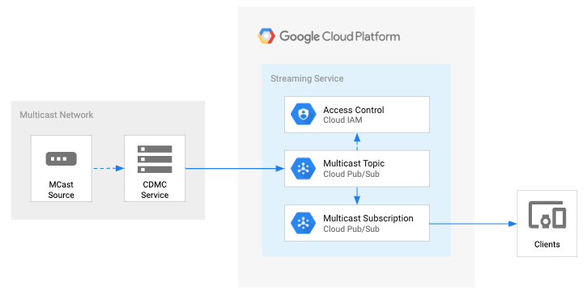
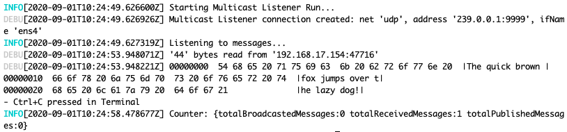

# Datashare - Multicast Client

* [Overview](#overview)
* [Architecture](#architecture)
* [Quick Start](#quick-start)
* [Examples](EXAMPLES.md)
* [Testing](#testing)
* [Contributing](#contributing)
* [License](#license)
* [Authors](#authors)
* [Acronyms](#acronyms)

# Overview

This documentation provides the details for the Datashare Multicast Client (DMC). The DMC service enables data providers the ability to subscribe to a multicast broadcast group and publish those messages (unicast) onto a Google Cloud Platform (GCP) Pub/Sub Topic securely. GCP Pub/Sub is a fully-managed real-time messaging service that allows you to send and receive messages between independent applications. The GCP IAM security controls enable data producers the ability to authorize specific consumers of the multicast Pub/Sub topic subscriptions.

**Note**: Translating Pub/Sub messages to multicast is currently out of scope.

# Architecture

## Quick Start

The quick start option installs the DMC service executable on your local machine so you can test the functionality locally.

**Note**: You will need to complete the [Examples/#setup](EXAMPLES.md#setup) to publish multicast messages to a GCP Pub/Sub topic.

First, verify you have [golang](https://golang.org/) >= 1.14 installed on your machine via `go version`.

    $ go version
    go version go1.14.1 darwin/amd64

Next, clone or download this project, open a terminal and download the dependencies via `go mod download`:

    go mod download

Build the DMC service executable:

    GO111MODULE=on go build -o bin/dmc ./cmd/dmc

After successful build, list the DMC service multicast options from the `-h help` command:

    ./bin/dmc multicast -h

Run the `listen` command to subscribe to a specific multicast group **address** and interface name **ifName**. The verbose `-v` flag will print out debug messages to STDOUT:

    ./bin/dmc multicast listen -a 239.0.0.1:9999 -i ens4 -v

Open another terminal/tab and run the `broadcast` command to broadcast a test message to the same multicast group **address** and interface name **ifName**.

    ./bin/dmc multicast broadcast -a 239.0.0.1:9999 -i ens4 -m "The quick brown fox jumps over the lazy dog!"

You should see output in the listener command above. Success!

## Examples

There are more comprehensive and end-to-end demos [here](EXAMPLES.md) These include comprehensive

## Testing

Unit testing is TBD

### ToDo

* Add GCP cloud build for DMC service
* ~~Add k8s example (GCP currently does not support mulitcast)~~
* Add Pub/Sub to multicast feature

## Contributing

Please read [CONTRIBUTING](../CONTRIBUTING.md) for details on our code of conduct, and the process for submitting pull requests to us.

## License

This project is licensed under the Apache License - see the [LICENSE](../LICENSE.txt) file for details

## Authors

* **Chris Page** - *Initial work*

## Acronyms

This section lista all the relevant acronyms for Datashare Multicast Client.

| **Acronym**   | **Definition**  | **Description** |
|:-------------:|:---------------:|:----------------|
| DS | Datashare | The name of the this tool kit that enables data producers to expose data on GCP to consumers |
| DMC | Datashare Multicast Client | The name of the DS multicast client and application binary |

----
* [Home](./README.md)
