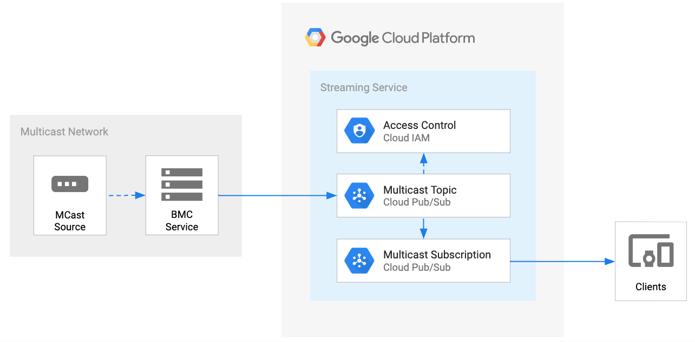

# Cloud Datashare - Multicast Client

* [Overview](#overview)
  * [Architecture](#architecture)
* [Getting Started](#getting-started)
  * [Enable APIs](#enable-apis)
  * [Service Account](#service-account)
  * [Create Pub/Sub Topic](#create-pubsub-topic)
  * [Create Pub/Sub Subscription](#create-pubsub-subscription)
* [Examples](#examples)
  * [Hello World](#hello-world)
  * [Replay Messages](#replay-messages)
* [Development](#development)
* [Testing](#testing)
* [Deployment](#deployment)
* [Contributing](#contributing)
* [License](#license)
* [Authors](#authors)
* [Notes](#notes)


# Overview

This documentation provides the details for the Cloud Datashare Multicast Client (CDMC). The CDMC service enables data providers the abilitiy to subscribe to a multicast broadcast group and publish those messages (unicast) onto a Google Cloud Platform (GCP) Pub/Sub Topic securely. GCP Pub/Sub is a fully-managed real-time messaging service that allows you to send and receive messages between independent applications. The GCP IAM security controls enable data producers the ability to authorize specific consumers of the multicast Pub/Sub topic subscriptions.

_Note_ Translating Pub/Sub messages to multicast is currently out of scope.


## Architecture



## Getting Started

These instructions will setup an instance of the CDMC service in your GCP project.

### Enable APIs

These are the GCP project APIs that require the CDMC service authorization.

```
pubsub.googleapis.com
```

### Service Account

The CDMC service is a trusted application that makes authorized API calls to your GCP project service(s). The application requires a [GCP service account](https://cloud.google.com/iam/docs/service-accounts) with the appropriate permissions enabled. These permissions have been aggregated into a custom role that is associated to a service account.

#### Setup Service Account

Set your **PROJECT\_ID** if you have not already:

    export PROJECT_ID=`gcloud config list --format 'value(core.project)'`; echo $PROJECT_ID

Set the **SERVICE\_ACCOUNT\_NAME** environment variable(s):

    export SERVICE_ACCOUNT_NAME=cds-multicast-client;

Set the **SERVICE\_ACCOUNT\_DESC** environment variable(s):

    export SERVICE_ACCOUNT_DESC="Cloud Datashare Multicast Client";

Create the custom Cloud Datashare API service-account:

    gcloud iam service-accounts create ${SERVICE_ACCOUNT_NAME} --display-name "${SERVICE_ACCOUNT_DESC}";

Grant the GCP service role to service account:

    gcloud projects add-iam-policy-binding ${PROJECT_ID} \
      --member serviceAccount:${SERVICE_ACCOUNT_NAME}@${PROJECT_ID}.iam.gserviceaccount.com \
      --role="roles/pubsub.admin"

#### Configure Service Account Secret

Create service account credentials and download them:

    gcloud iam service-accounts keys create ${SERVICE_ACCOUNT_NAME}.json \
      --iam-account ${SERVICE_ACCOUNT_NAME}@${PROJECT_ID}.iam.gserviceaccount.com

Set the **GOOGLE_APPLICATION_CREDENTIALS** environment variable(s):

    export GOOGLE_APPLICATION_CREDENTIALS="${SERVICE_ACCOUNT_NAME}.json"

### Create Pub/Sub Topic

A Pub/Sub Topic with the appropriate service account permissions is required for the CDMC Service.


Set your **TOPIC\_NAME** if you have not already:

    export TOPIC_NAME=cds-multicast-demo-broadcast;

Create the Topic:

    gcloud pubsub topics create ${TOPIC_NAME}

Set the permissions for the service account:

    gcloud beta pubsub topics add-iam-policy-binding ${TOPIC_NAME} --member=serviceAccount:${SERVICE_ACCOUNT_NAME}@${PROJECT_ID}.iam.gserviceaccount.com --role='roles/editor'

### Create Pub/Sub Subscription:
A Pub/Sub Subscription is utilzed for the Worker (pull) to process multicast messages from the CDMC service's Pub/Sub topic. This use-case would be for exposing the multicast Pub/Sub topic to a specific customer or end-user. You can create a separate service account(s) for consumption, but for this tutorial, we will use the same one created above.

Set your **PULL\_SUBSCRIPTION\_NAME** if you have not already:

    export PULL_SUBSCRIPTION_NAME=cds-multicast-demo-listener;

Create the Subscription:

    gcloud beta pubsub subscriptions create ${PULL_SUBSCRIPTION_NAME} --topic ${TOPIC_NAME}

Set the IAM policy for the Subscription:

    gcloud beta pubsub subscriptions add-iam-policy-binding ${PULL_SUBSCRIPTION_NAME} --member=serviceAccount:${SERVICE_ACCOUNT_NAME}@${PROJECT_ID}.iam.gserviceaccount.com --role='roles/pubsub.subscriber'

List the subscriptions for the topic:

    gcloud beta pubsub topics list-subscriptions ${TOPIC_NAME}


## Examples
The examples are currently executed in an isolated Docker environment. Verify Docker is running and server is > 19.03 version.

    docker version

_Note_ GCP networking does not support multicast layer 2 today


### Hello World
The *Hello World* example will utilize the CDMC service to simlulate multicast message(s) (producer), receive the multicast message(s) to a Pub/Sub topic (publisher), and consume the message(s) via Pub/Sub subsription with *gcloud* (subscriber). We will start two Docker containers; one for the Pub/Sub publisher and one for the multicast producer.

#### Pub/Sub Publisher
Open a terminal and run the following command. Specify the GOOGLE_APPLICATION_CREDENTIALS, PROJECT_ID, TOPIC_NAME, multicast address and interface name. The publisher requires ADC by mounting your GOOGLE_APPLICATION_CREDENTIALS json file created above. This is only for demo purposes.
_Note_ For localhost, *lo0*, you would use the reserved 224.0.0/24 subnet block

    docker run -it --rm --name publisher -e GOOGLE_APPLICATION_CREDENTIALS=/tmp/key.json -v ${PWD}/${GOOGLE_APPLICATION_CREDENTIALS}:/tmp/key.json gcr.io/chrispage-dev/cdmc:dev multicast publish -p ${PROJECT_ID} -t ${TOPIC_NAME} -a 239.0.0.1:9999 -i eth0 -v

You should see `Listening and Publishing messages...`

#### Multicast Producer
Open another terminal and run the following command(s). You can specify the message body with the *-m* flag. You need to keep the multicast group address the same as above.

    docker run -it --rm --name producer gcr.io/chrispage-dev/cdmc:dev multicast broadcast -a 239.0.0.1:9999 -i eth0 -v -m "sample message"

You should see `Completed` in this terminal and the same message payload in the Publisher terminal above.

#### Subscriber
Open another terminal and tun the following command(s) to pull the messages from the Pub/Sub subscription:

    while ((1)); do gcloud alpha pubsub subscriptions pull ${PULL_SUBSCRIPTION_NAME} --auto-ack; done


### Replay messages
The *replay messages* example will utilize [tcpreplay](https://tcpreplay.appneta.com/) to replay an existing pcap file to simlulate multicast message(s) (producer), receive the multicast message(s) to a Pub/Sub topic (publisher), and consume the message(s) via Pub/Sub subsription with *gcloud* (subscriber). We will start two Docker containers; one for the multicast producer and one for the Pub/Sub publisher.
_Note_ This was tested on a 8CPU and 30GB mem virtual machine. Docker for Mac did not have enough resources.

#### Pub/Sub Publisher
Open a terminal and run the following command(s). First, we will initially try the `listen` subcommand before `publish` to verify the tcpreplay works. Specify a multicast address, *eth0* interface name, and custom interface read buffer (1MB).

    docker run -it --rm --name listener gcr.io/chrispage-dev/cdmc:dev multicast listen -a 239.0.0.1:9999 -i eth0 -r 1048576

You should see `Listening to messages...`

#### Multicast Producer
Open another terminal and run the following command(s). You can capture a multicast stream with [tcpdump](https://www.tcpdump.org/) or use a public data set. For this example, we will use the from (https://iextrading.com/trading/market-data/). Download one of the [Sample pcap](https://www.googleapis.com/download/storage/v1/b/iex/o/data%2Ffeeds%2F20180127%2F20180127_IEXTP1_DEEP1.0.pcap.gz?generation=1517101215560431&alt=media) files and unzip. You will need to change the *-D* option to replace the destination multicast group address, the *-r* to replace the port number, and the pcap file location, */temp/data_feeds_20180127_20180127_IEXTP1_DEEP1.0.pcap* if using a different pcap file. The *-t* option will send the feed as fast as possible.
_Note_ You can loop `tcpreplay` with the *-l <# of loops>* option

    docker run -it --rm --name producer -v "${PWD}":"${PWD}" williamofockham/tcpreplay:4.3.0 tcpreplay-edit -i eth0 -D 233.215.21.4/32:239.0.0.1/32 -r 10378:9999 -C -t ${PWD}/temp/data_feeds_20180127_20180127_IEXTP1_DEEP1.0.pcap

You will see messages running through the producer and publisher terminals.

You can debug via tcpdump:

    tcpdump -n -s0 -vv -X -e udp port 9999

#### Pub/Sub Publisher (con't)
Now that you verified the above works, you can change the publisher command from `listen` to `publish` with appropriate parameters.\
Open a terminal and run the following command. Specify the GOOGLE_APPLICATION_CREDENTIALS, PROJECT_ID, TOPIC_NAME, multicast address and interface name. The publisher requires ADC by mounting your GOOGLE_APPLICATION_CREDENTIALS json file created above (This is only for demo purposes). Raise the buffer to 5MB.
_Note_ For localhost, *lo0*, you would use the reserved 224.0.0/24 subnet block

    docker run -it --rm --name publisher -e GOOGLE_APPLICATION_CREDENTIALS=/tmp/key.json -v ${PWD}/${GOOGLE_APPLICATION_CREDENTIALS}:/tmp/key.json gcr.io/chrispage-dev/cdmc:dev multicast publish -p ${PROJECT_ID} -t ${TOPIC_NAME} -a 239.0.0.1:9999 -i eth0 -r 5242880

You should see `Listening and Publishing messages...`

#### Multicast Producer (con't)
Re-run the same producer command above. You will see messages running through the producer and publisher terminals.

#### Subscriber
Open another terminal and tun the following command to pull the messages from the Pub/Sub subscription:

    while ((1)); do gcloud alpha pubsub subscriptions pull ${PULL_SUBSCRIPTION_NAME} --auto-ack; done


## Development
Verify you have [golang](https://golang.org/) >= 1.13 installed on your machine.

Open a terminal into the [cmd/cdmc/](./cmd/cdmc/) directory and pull the dependencies:

    go get -d -v

Run the main.go command:

    go run main.go -h

If you want to purge the Pub/Sub subscription, run the following command:\
_Note_ This is non-reversable!

    gcloud pubsub subscriptions seek ${PULL_SUBSCRIPTION_NAME} --time=$(date +%Y-%m-%dT%H:%M:%S)


## Testing
TBD


## Deployment
Verify you have Docker running to build the image.\
_Note_ GCP cloud build will be added in the future

You can build the Docker image from the parent directory [client](./)
_Note_ Change your project name appropriately:

    docker build -t gcr.io/chrispage-dev/cdmc:dev .


## ToDo
* Add GCP cloud build for CDMC service
* Add k8s example
* Add Pub/Sub to multicast feature


## Contributing

Please read [CONTRIBUTING](../CONTRIBUTING.md) for details on our code of conduct, and the process for submitting pull requests to us.


## License

This project is licensed under the Apache License - see the [LICENSE](../LICENSE.txt) file for details


## Authors

* **Chris Page** - *Initial work*
