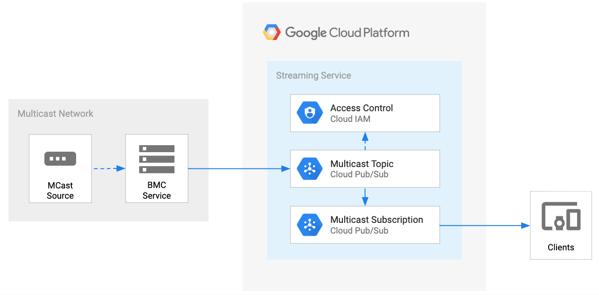

# BQDS - Multicast Client

* [Overview](#overview)
  * [Architecture](#architecture)
* [Getting Started](#getting-started)
  * [Enable APIs](#enable-apis)
  * [Service Account](#service-account)
  * [Create Pub/Sub Topic](#create-pubsub-topic)
  * [Create Pub/Sub Subscription](#create-pubsub-subscription)
  * [Examples](#examples)
* [Development](#development)
* [Testing](#testing)
* [Deployment](#deployment)
* [Contributing](#contributing)
* [License](#license)
* [Authors](#authors)
* [Notes](#notes)


# Overview

This documentation provides the details for the BQDS Multicast Client (BMC). BMC provides data producers the ability to subscribe to a multicast broadcast group and publish those messages (unicast) to a specific GCP PubSub Topic.

_Note_ Going the opposite direction (PubSub -> multicast group) is currently out of scope.


## Architecture



## Getting Started

These instructions will setup an instance of the BMC service in your GCP project.

### Enable APIs

These are the GCP project APIs that require the BMC service authorization.

```
pubsub.googleapis.com
```

### Service Account

The BMC service is a trusted application that makes authorized API calls to your GCP project service(s). The application requires a [GCP service account](https://cloud.google.com/iam/docs/service-accounts) with the appropriate permissions enabled. These permissions have been aggregated into a custom role that is associated to a service account.

#### Setup Service Account

Set your **PROJECT\_ID** if you have not already:

    export PROJECT_ID=`gcloud config list --format 'value(core.project)'`; echo $PROJECT_ID

Set the **SERVICE\_ACCOUNT\_NAME** environment variable(s):

    export SERVICE_ACCOUNT_NAME=bqds-multicast-client;

Set the **SERVICE\_ACCOUNT\_DESC** environment variable(s):

    export SERVICE_ACCOUNT_DESC="BQDS Multicast Client";

Create the custom BQDS API service-account:

    gcloud iam service-accounts create ${SERVICE_ACCOUNT_NAME} --display-name "${SERVICE_ACCOUNT_DESC}";

Grant the GCP service role to service account:

    gcloud projects add-iam-policy-binding ${PROJECT_ID} \
      --member serviceAccount:${SERVICE_ACCOUNT_NAME}@${PROJECT_ID}.iam.gserviceaccount.com \
      --role="roles/pubsub.admin"

#### Configure Service Account Secret

Create service account credentials and download them:

    gcloud iam service-accounts keys create ${SERVICE_ACCOUNT_NAME}.json \
      --iam-account ${SERVICE_ACCOUNT_NAME}@${PROJECT_ID}.iam.gserviceaccount.com

Set the **GOOGLE_APPLICATION_CREDENTIALS** environment variable(s):

    export GOOGLE_APPLICATION_CREDENTIALS="${SERVICE_ACCOUNT_NAME}.json"

### Create Pub/Sub Topic

A Pub/Sub Topic with the appropriate service account permissions is required for the BMC Service.


Set your **TOPIC\_NAME** if you have not already:

    export TOPIC_NAME=bqds-multicast-demo-broadcast;

Create the Topic:

    gcloud pubsub topics create ${TOPIC_NAME}

Set the permissions for the service account:

    gcloud beta pubsub topics add-iam-policy-binding ${TOPIC_NAME} --member=serviceAccount:${SERVICE_ACCOUNT_NAME}@${PROJECT_ID}.iam.gserviceaccount.com --role='roles/editor'

### Create Pub/Sub Subscription:
A Pub/Sub Subscription is utilzed for the Worker (pull) to process multicast messages from BMC Service. This use-case would be for exposing the PubSub topic to a specific customer or end-user. You can create a separate service account for consumption, but for this tutorial, we will use the same one created above.

Set your **PULL\_SUBSCRIPTION\_NAME** if you have not already:

    export PULL_SUBSCRIPTION_NAME=bqds-multicast-demo-listener;

Create the Subscription:

    gcloud beta pubsub subscriptions create ${PULL_SUBSCRIPTION_NAME} --topic ${TOPIC_NAME}

Set the IAM policy for the Subscription:

    gcloud beta pubsub subscriptions add-iam-policy-binding ${PULL_SUBSCRIPTION_NAME} --member=serviceAccount:${SERVICE_ACCOUNT_NAME}@${PROJECT_ID}.iam.gserviceaccount.com --role='roles/pubsub.subscriber'

List the subscriptions for the topic:

    gcloud beta pubsub topics list-subscriptions ${TOPIC_NAME}


### Examples
Open a terminal into the [cmd/bmc/](./cmd/bmc/) directory and build the service executable:

    go get && go build

#### Multicast Client Service
Run the following command and specify the PROJECT_ID, TOPIC_NAME, multicast address and interface name:
_Note_ For localhost, *lo0*, you would use the reserved 224.0.0/24 subnet block

    ./bmc multicast publish -p ${PROJECT_ID} -t ${TOPIC_NAME} -a 239.0.0.1:9999 -i en0 -v

#### Multicast Publisher
Open another terminal and send some test messages. You can either use the *broadcast* command or *nc*

    ./bmc multicast broadcast -a 239.0.0.1:9999 -i lo0 -m "I'm a test message." -v

or

    echo "this is a test message" | nc -w 1 -u 239.0.0.1 9999

#### Pubsub Subscriber
Open another terminal and pull the messages from the PubSub subscription

    while ((1)); do gcloud alpha pubsub subscriptions pull ${PULL_SUBSCRIPTION_NAME} --auto-ack; done


## Development
TBD


## Testing
TBD


## Deployment
TBD


## Contributing

Please read [CONTRIBUTING](../CONTRIBUTING.md) for details on our code of conduct, and the process for submitting pull requests to us.


## License

This project is licensed under the Apache License - see the [LICENSE](../LICENSE.txt) file for details


## Authors

* **Chris Page** - *Initial work*
