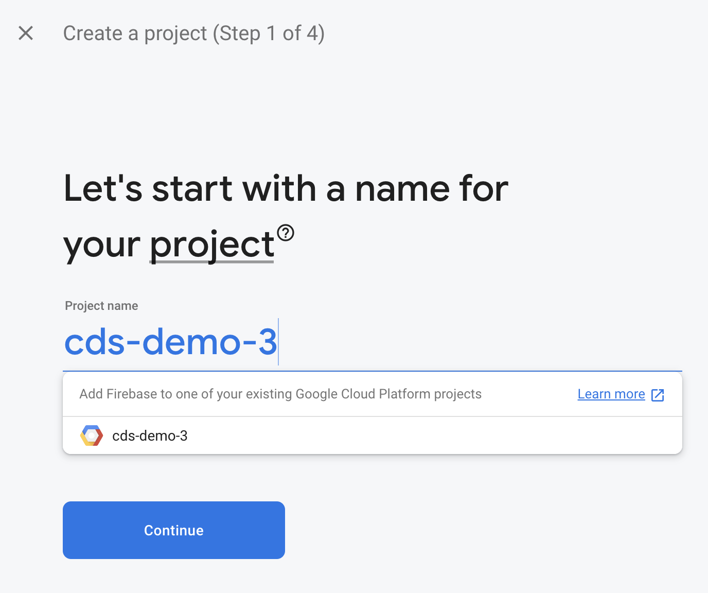
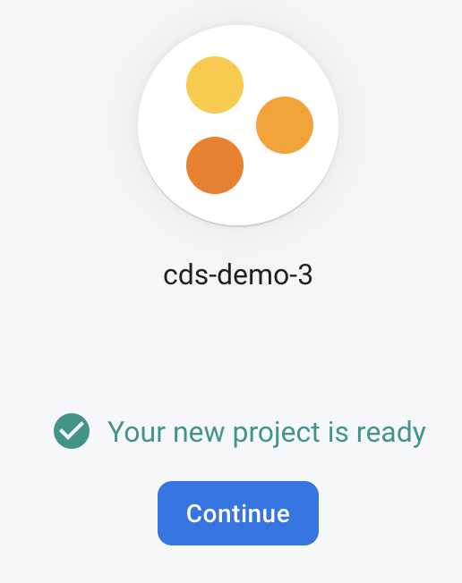
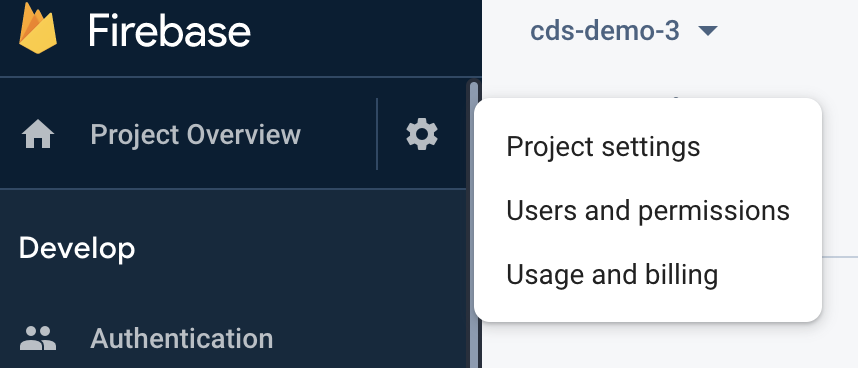
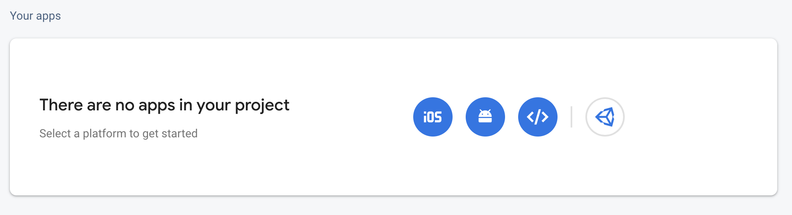
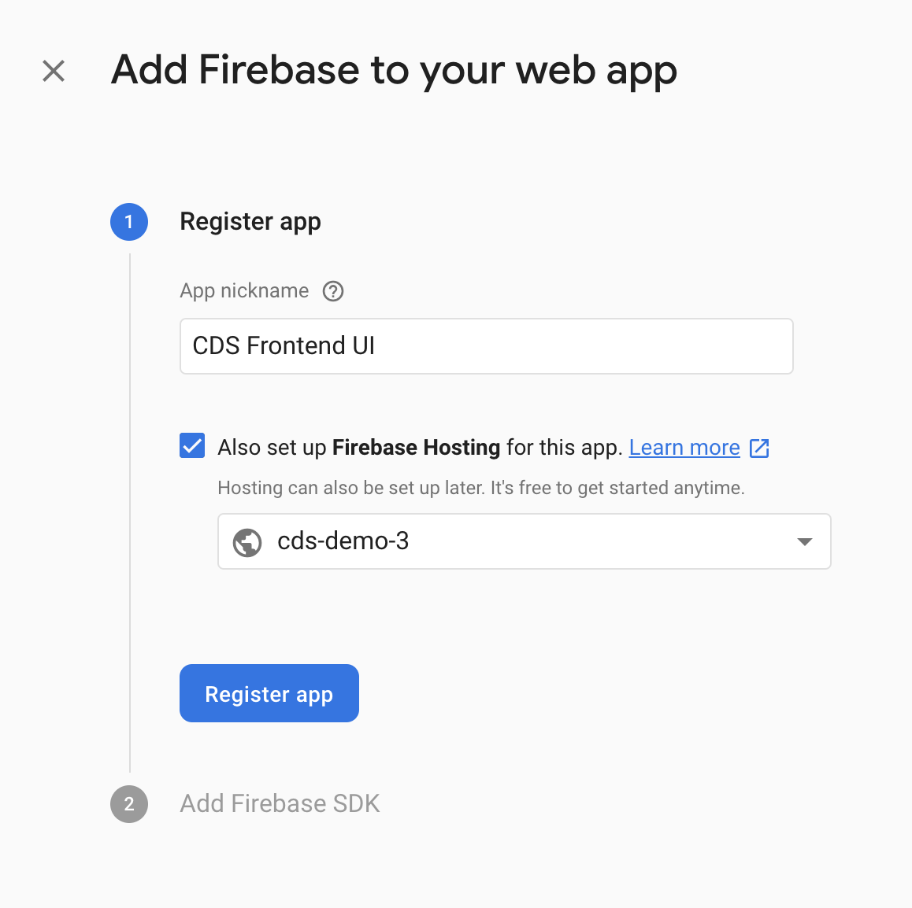
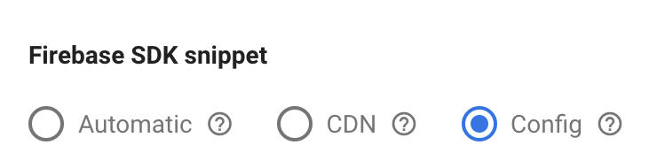
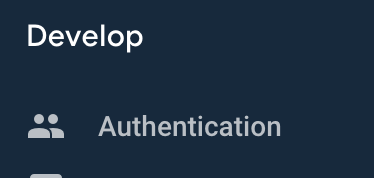
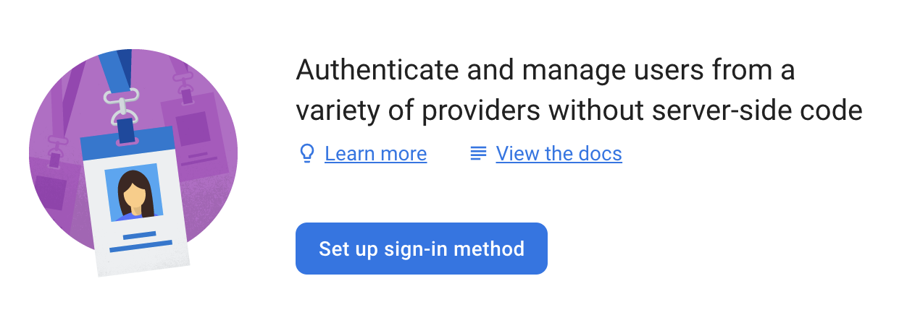
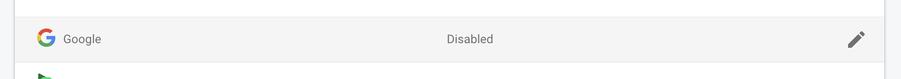
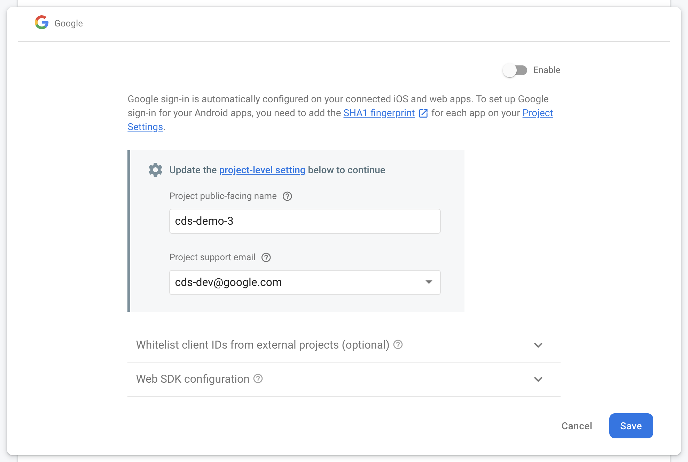

# DS Frontend UI
This documentation provides details for how to develop, build, and deploy new versions of the DS Frontend UI. There are a few different deployment options for you to choose based on developer pererence and/or environment.

* [Prerequisites](#prereqs)
  * [Setup Backend API](#setup_backend)
* [Develop](#develop)
  * [Setup Node](#setup_node)
* [Deployment](#deployment)
  * [Deploy Prerequisites](#deploy_prereqs)
    * [New Firebase Setup](#new_firebase)
    * [Enable Authentication](#authentication)
    * [Install Firebase CLI](#firebase_cli)
  * [Deploy Cloud Run Managed](#deploy_cloud_run_managed)
  * [Deploy Cloud Run with Deployment Manager](#deploy_cloud_run_deployment_manager)
  * [Deploy Firebase](#deploy_firebase)


## <a name="prereqs">Prerequisites</a>
These are the prerequisites for the DS Frontend UI


### <a name="setup_backend">Setup Backend API</a>
DS API setup is a dependency for the Frontend UI if you do not plan to use mock data or do not have an existing DS API endpoint URL.

[DS API Documentation](https://github.com/GoogleCloudPlatform/datashare-toolkit/tree/master/api)

## <a name="develop">Develop</a>
You can develop the locally for now. [NodeJS](https://nodejs.org/en/)


### <a name="setup_node">Setup Node</a>
These instructions are to run the application Node modules in a stand-alone [NPM](https://www.npmjs.com/) environment that is not optimized for production. This can be locally on your laptop or via cloud VM environment _Node ~= 12.6 is required._

Verify Node ~= 12.6 is installed:

    node --version

Project setup:

    npm install

You can choose to use mock API data or point to a DS Admin REST API endpoint in the applicaiton settings page. The *VUE_APP_APICLIENT* environment variable will dynamically load between the two options.

Using API client data that is mocked:

    npm run serve

or Using API client data from an endpoint URL:

    VUE_APP_APICLIENT=server npm run serve

Point your browser to http://localhost:8080 and update your DS Frontend `API Base URL` in the UI settings [page](http://localhost:8080/settings)

   http://localhost:8080


## <a name="deployment">Deployment</a>
Once you've deployed the [DS API](https://github.com/GoogleCloudPlatform/datashare-toolkit/tree/master/api), you should only then proceed to setup the UI. You can deploy the Frontend content via various methods below based off developer preference and/or environment. These are the examples we provide, though you may use other hosting options:

  * [Google Cloud Run](https://cloud.google.com/run/) via [gcloud](https://cloud.google.com/sdk/)
  * [Firebase Hosting](https://firebase.google.com/docs/hosting) via [firebase cli](https://firebase.google.com/docs/cli)

[Deploy Cloud Run Managed](#deploy-cloud-run-managed) is the _preferred_ method to quickly host the DS Frontend content and generate a unique URL for consumption.

There are some Firebase configuration and environment variables that need to be set for all build and deployment options.

### <a name="deploy_prereqs">Deploy Prerequisites</a>
The DS Frontend is currently configured for Firebase authentication. A new Firebase project and Firebase application credentials are required for deployment.

There are some environment variables that need to be set for all build and deployment options.

Export the GCP Project ID as *PROJECT_ID* environment variable:

    export PROJECT_ID=`gcloud config list --format 'value(core.project)'`; echo $PROJECT_ID

Export the image/build *TAG* environment variable:

    export TAG=dev;


#### <a name="new_firebase">New Firebase Setup</a>
If you already have Firebase setup for your existing GCP project, skip this step.

1. Go to https://console.firebase.google.com/
2. Click "Add project"


3. For the project name type in or select the existing project name for your GCP project, continue.



4. Confirm your billing plan.
5. Continue through the prompts, you may choose to use Google Analytics.

The Firebase project will begin to provision, this should take less than a minute.



6. Go to "Project settings"



7. Scroll down to the "Your apps" section and click "Add app" or the web app icon </>.



8. Enter in the app information and "Continue to console".



9. In the "Firebase SDK snippet" panel, select "Config".



Copy the values for apiKey, authDomain, projectId, storageBucket, appId, and measurementId overwriting the existing values for each respective attribute within the /src/api/mock/data/settings.json configuration file.

#### <a name="authentication">Enable Authentication</a>
1. Select "Authentication" on the left navigation menu for the Firebase console.



2. Select "Set up sign-in method".



3. Click the edit button on the Google row.



4. Setup the Google Auth, be sure to toggle the "Enabled" button and click "Save".




#### <a name="firebase_cli">Install Firebase CLI</a>
If you have not already installed the Firebase CLI, follow the instructions in the [Firebase CLI reference](https://firebase.google.com/docs/cli) document to do so.

Ensure that your CLI is working by running the following command:

```
firebase projects:list
```

### <a name="deploy_cloud_run_managed">Deploy Cloud Run Managed</a>
Deploy with Cloud Run allows stateless HTTP containers on a fully managed environment or GKE cluster. [Cloud Build](https://cloud.google.com/run/docs/quickstarts/build-and-deploy#containerizing) packages the Docker image into your Google Container repository.
_Cloud Run and Cloud Build APIs will need to be enabled in your GCP project._

Build with Cloud Build and TAG:

    gcloud builds submit --config cloudbuild.yaml --substitutions=TAG_NAME=${TAG}

Deploy with Cloud Run: \
**Note**: There are a few environment variables that need to be set before the application starts (see below). [gcloud run deploy](https://cloud.google.com/sdk/gcloud/reference/run/deploy#--set-env-vars) provides details for how they are set. \
The GCP project's Cloud IAM policy, *constraints/iam.allowedPolicyMemberDomains* or *Domain Restricted Sharing* must be disabled to allow unauthenticated requests to reach Cloud Run services with the `--allow-unauthenticated` parameter. This policy is currently the default setting as described [here](https://cloud.google.com/resource-manager/docs/organization-policy/org-policy-constraints).

    gcloud run deploy ds-frontend-ui \
      --image gcr.io/${PROJECT_ID}/ds-frontend-ui:${TAG} \
      --region=us-central1 \
      --allow-unauthenticated \
      --platform managed \
      --set-env-vars=FIREBASE_API_KEY=${FIREBASE_API_KEY}

Open the app URL in your browser. You can return the FQDN via:

    gcloud run services describe ds-frontend-ui --platform managed --format="value(status.url)"

### <a name="deploy_cloud_run_deployment_manager">Deploy Cloud Run with Deployment Manager</a>
Use Deployment Manager to deploy the Datashare UI with Cloud Run.
_Cloud Run and Cloud Build APIs will need to be enabled in your GCP project._

Deployment Manager will use Cloud Build to:
* build the Docker container and save it to Google Container Registry
* deploy the container to Cloud Run

```
gcloud deployment-manager deployments create ds-ui --config deploy_ui_cloud_run.yaml
```

**Note: If you delete the Deployment Manager template, the resources that it creates will NOT be deleted (container, Cloud Run deployment). You must delete these manually.**
### <a name="deploy_cloud_run_deployment_manager_config">Configuration</a>

Configure the deployment by updating the properties listed in `deploy_ui_cloud_run.yaml`.

You must include your Firebase API Key before you deploy the Datashare UI.

```
  properties:
    firebaseApiKey: YOUR_FIREBASE_WEBAPI_KEY
    containerTag: dev
    region: us-central1
    timeout: 600s
```

### <a name="deploy_firebase">Deploy Firebase</a>
Navigate to the frontend directory and modify the .firebaserc file with the Firebase projectId and save changes.

```
cd ~/Git/datashare-toolkit/frontend
vi .firebaserc

{
  "projects": {
    "default": "cds-demo-3"
  }
}
```

Now, you are ready to deploy the application. Run the following commands:

```
firebase use cds-demo-3
npm run deploy
```

Upon successful completion of the Firebase deployment you should see output as follows:

```
 DONE  Build complete. The dist directory is ready to be deployed.
 INFO  Check out deployment instructions at https://cli.vuejs.org/guide/deployment.html


=== Deploying to 'cds-demo-3'...

i  deploying hosting
i  hosting[cds-demo-3]: beginning deploy...
i  hosting[cds-demo-3]: found 3 files in public
✔  hosting[cds-demo-3]: file upload complete
i  hosting[cds-demo-3]: finalizing version...
✔  hosting[cds-demo-3]: version finalized
i  hosting[cds-demo-3]: releasing new version...
✔  hosting[cds-demo-3]: release complete

✔  Deploy complete!

Project Console: https://console.firebase.google.com/project/cds-demo-3/overview
Hosting URL: https://cds-demo-3.web.app

```

Navigate to the Hosting URL and on the top right click the right most button to sign-in using Google authentication. Lastly, to initialize the 'Datashare' dataset within BigQuery, navigate to the Admin page and click the "Initialize Schema" button.
