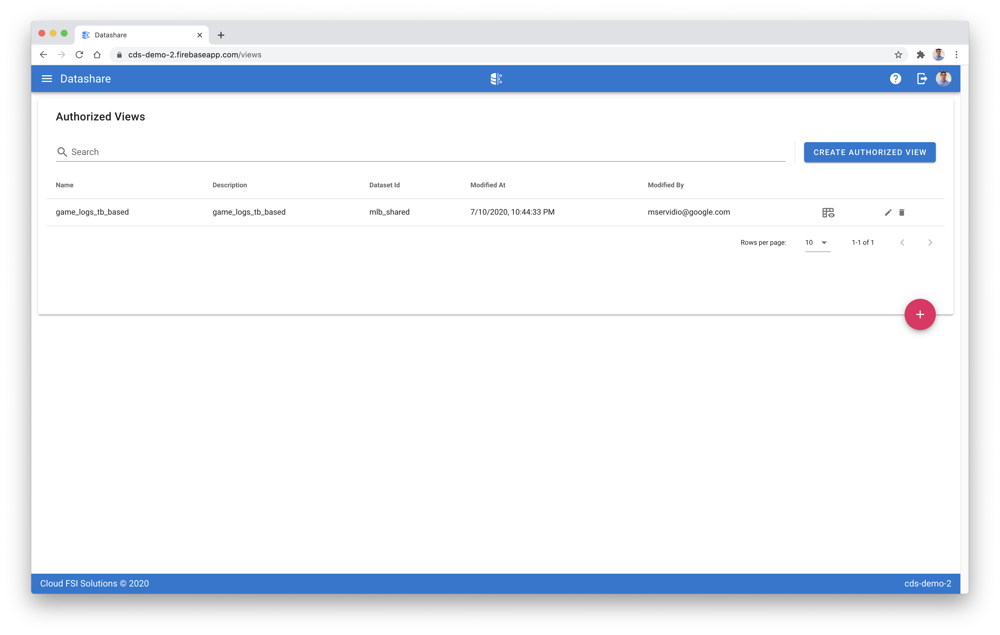

[Datashare User Guide](./README.md)

# Authorized Views
* [Viewing Authorized Views](#viewing_authorized_views)
* [Creating a View](#creating_a_view)
* [Editing a View](#editing_a_view)
* [Deleting a View](#deleting_a_view)

  

## <a name="viewing_authorized_views">Viewing Authorized Views</a>
## <a name="creating_a_view">Creating a View</a>
## <a name="editing_a_view">Editing a View</a>
## <a name="deleting_a_view">Deleting a View</a>