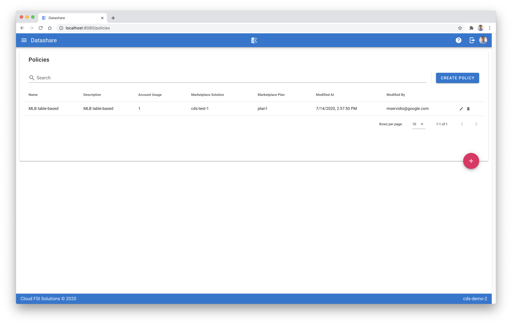

[Datashare User Guide](./README.md)

# Policies
* [Viewing Policies](#viewing_policies)
* [Creating a Policy](#creating_a_policy)
* [Editing a Policy](#editing_a_policy)
* [Deleting a Policy](#deleting_a_policy)
* [Integrating with Marketplace](#integrating_with_marketplace)

  

## <a name="viewing_policies">Viewing Policies</a>

## <a name="creating_a_policy">Creating a Policy</a>

## <a name="editing_a_policy">Editing a Policy</a>

## <a name="deleting_a_policy">Deleting a Policy</a>

## <a name="integrating_with_marketplace">Integrating with Marketplace</a>