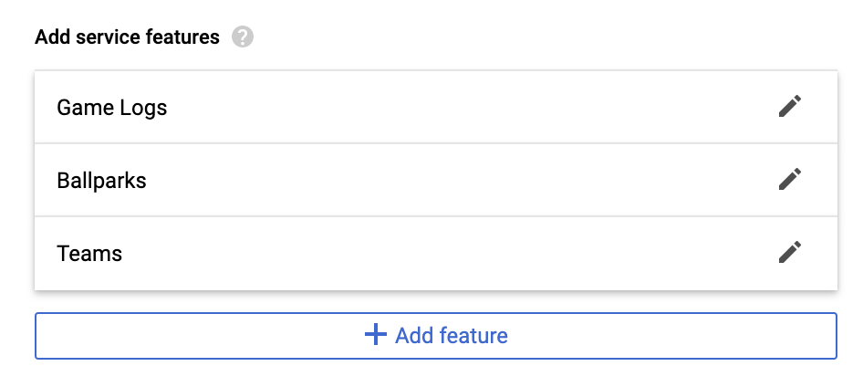
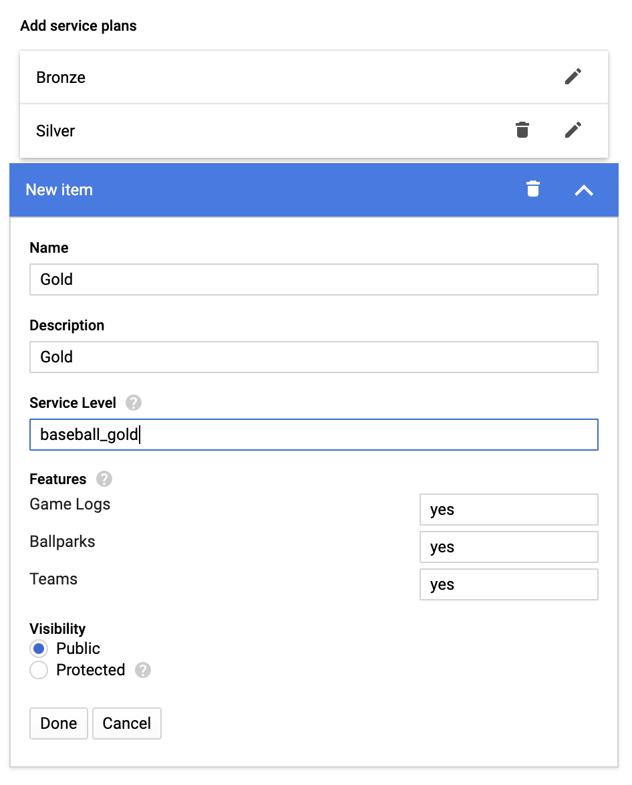

[Datashare User Guide](./README.md)

# Policies
* [Viewing Policies](#viewing_policies)
* [Creating a Policy](#creating_a_policy)
* [Editing a Policy](#editing_a_policy)
* [Deleting a Policy](#deleting_a_policy)
* [Integrating with Marketplace](#integrating_with_marketplace)

<p align="center">
  
</p>

## <a name="viewing_policies">Viewing Policies</a>
The policies UI shows a listing of all of the Policies managed by Datashare. A policy consists of datasets and tables, row level access tags (if applicable), and GCP Marketplace integration. Take caution whenever making changes to policies as they will potential impact one or many customers.

## <a name="creating_a_policy">Creating a Policy</a>
1. Click the 'CREATE POLICY' button on the top right.
2. Enter a policy name and description.
3. Choose whether you want to use Dataset-based or Table-base Access.
    * Dataset-based Access: Grants access at the more granular table or view level. Choose this option if you want any future tables/views added to the policy to automatically be granted to existing users entitled to the given policy.
    * Table-based Access: Grants access at the Dataset (grouping of tables/views) level. Choose this one if you want full control over which tables/views are included in the policy.
4. Select the list of Datasets or Tables depending on if you're using Dataset-based or Table-based access.
5. Enter the list of Row Access Tags. Row access tags are simple string filters that are used by tables/views associated with the policy in order to filter rows for users*.
6. Click 'SAVE'. Details on the 'Marketplace' section will be covered in the [Integrating with Marketplace](#integrating_with_marketplace) section.

\* Row Access Tags currently only work for users, they do not work with groups.

## <a name="editing_a_policy">Editing a Policy</a>
1. Click on the pencil icon in the rightmost column.
2. Make the necessary modifications. Ensure caution as an edit to an existing policy will impact all users entitled to it.
4. Click 'Save'.

## <a name="deleting_a_policy">Deleting a Policy</a>
Ensure caution when deleting any policy. If you have GCP Marketplace integration set up, this can break any solution or user associations for purchased solutions that you are selling through marketplace.

1. Click the trash image on the rightmost side.
2. Click 'DELETE' to confirm the deletion.

## <a name="integrating_with_marketplace">Integrating with Marketplace</a>
In order to integrate Datashare with the GCP Marketplace, you must first sign up to become a [Google Cloud Marketplace vendor](https://cloud.google.com/marketplace/docs/partners). Once you have been approved as a partner you may then list your data solutions within Marketplace.

In order to create a data solution in GCP Marketplace and sell it, follow the instructions below:

1. Go to [Partner Portal](https://console.cloud.google.com/partner/solutions).
2. On the top navigation menu, cick '+ ADD SOLUTION'.
3. Enter a solution name, select solution type of 'Managed service' and pricing type 'Billed by Google'.
4. Go to edit for 'SOLUTION METADATA' and fill in the required information and click 'Save'.
    * If you do not yet want to make your solution public in the GCP Marketplace, ensure the 'Hide solution from end users' checkbox is checked.
5. Go to edit for 'SOLUTION DETAILS' and fill in the required information and click 'Save'.
6. Go to edit for 'PLANS & FEATURES'. For more information on this section see [Plans & Features](#plans_and_features).
    * For the Signup URL, use the following: ```https://[YOUR_DATASHARE_DOMAIN]/v1alpha/projects/[YOUR_GCP_PROJECT]/accounts:register```
    * Leave the Account Recovery URL empty.
    * Leave SSO Login disabled.
    * For the Dashboard URL, use the following: ```https://[YOUR_DATASHARE_DOMAIN]/myDashboard```
    * Add your [service features](#service_features). Service features can be included in multiple plans.
    * Configure your [service plans](#service_plans). Service plans can encompass multiple features.
7. (TODO: This is incomplete) Complete the billing on-boarding spreadsheet here - TBD. The billing setup process will take up to two weeks to complete. Reach out to the GCP Marketing Partner team for more information.
8. Go to the Datashare 'Policies' UI. In the examples below we defined three service plans. To support three service plans defined in the GCP Marketplace Solution, we will need to [create](#creating_a_policy) three separate Datashare policies.
9. Within each policy, scroll down to the 'Marketplace' section and enter in the 'Solution Id' and the 'Plan Id' (Service Level) that you defined in the services and plans section of partner portal. The 'Solution Id' was generated when you created a solution name in step 3. If you're unsure of what it is, load the [solutions](https://console.cloud.google.com/partner/solutions) page to check.

### Marketplace Concepts
#### <a name="plans_and_features">Plans & Features</a>
Marketplace has the concept of plans and features. Plans are the sellable item which include one or more features.


##### <a name="service_features">Service Features</a>
A service feature can be included in multiple plans. When selling data through Marketplace, an example of a feature could be different types of data included in the same purchase. For example using baseball data, you may sell access to multiple views containing historical data for: game logs, ballparks, and team. You could define each as a feature, so we set up features for:

* Game Logs
* Ballparks
* Teams



##### <a name="service_plans">Service Plans</a>
A service plan is a grouping of features that can be sold. Using the baseball data example above, you may decide to sell three different plans (tiers). For example:

* Bronze
* Silver
* Gold

When defining a plan, you will need to create a unique 'Service Level' identifier which will be used as the 'Plan Id' within the Datashare policy. This is how datashare will associate to a plan purchase.



Once you've finished configuring plans, you can review the matrix that was generated for 'Features & pricing'.


This is similiar to the view that your potential customers will see when they're shopping the GCP Marketplace and are viewing your solution.