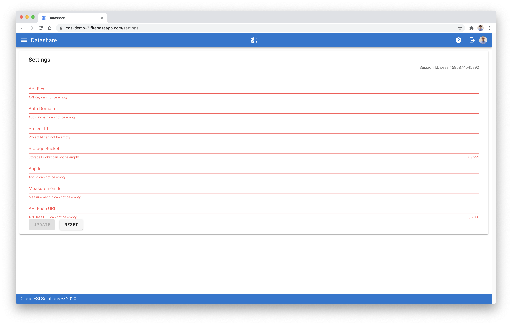
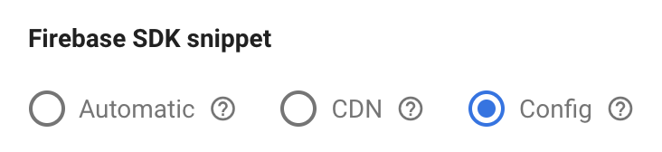

[Datashare User Guide](./README.md)

# Settings

  

The settings on the configuration page should tie out with the Firebase SDK Snippet Config details found on the Firebase Project settings page for the respective Firebase project.

