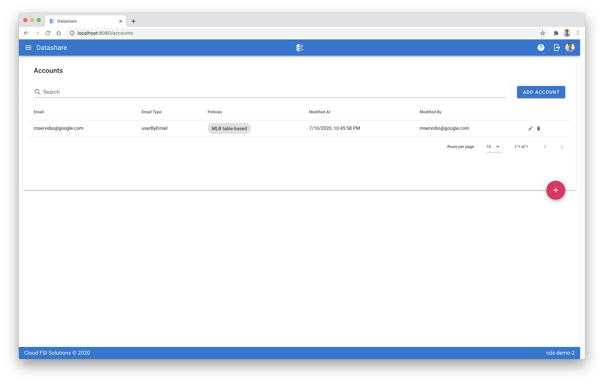

[Datashare User Guide](./../README.md)

# Accounts
* [Viewing Accounts](#viewing_accounts)
* [Creating an Account](#creating_an_account)
* [Editing an Account](#editing_an_account)
* [Deleting an Account](#deleting_an_account)
* [Resetting an Account](#resetting_an_account)

  

## <a name="viewing_accounts">Viewing Accounts</a>
The accounts UI shows a listing of all of the Accounts managed by Datashare. Within a record you can also see the policies that are granted to each account.

## <a name="creating_an_account">Creating an Account</a>
1. Click the 'ADD ACCOUNT' button on the top right.
2. Select the account type - user or group.
3. Enter a valid\* Google Account or Google Apps account.
4. Check any policies that you want the account to have access to.
5. Click 'SAVE'.

\* Note that a user can only be added where the email address and domain is associated with an active Google Account or Google Apps account. If you add any other type of account, it will cause the Datashare permissions to fail.

## <a name="editing_an_account">Editing an Account</a>
1. Click the pencil icon in the rightmost column. The email type and email cannot be modified after creation. The only attribute within an account that can be modified after creation are the associated policies.
2. Modify policies.
3. Click 'SAVE'.

## <a name="deleting_an_account">Deleting an Account</a>
Ensure caution when deleting any account. If you have GCP Marketplace integration set up, this can break any user associations for purchased solutions that you are selling through marketplace.

1. Click the trash image on the rightmost side.
2. Click 'DELETE' to confirm the deletion.

## <a name="resetting_an_account">Resetting an Account (Marketplace Integration only)</a>
Resetting an Account cancels all Entitlements that an account is provisioned to through the GCP Marketplace. You may only perform a reset on an account if a user has registered and activated their account via the GCP Marketplace on a Datashare related solution purchase. For more information see the Cloud Commerce Procurement API documentation for [Method: providers.accounts.reset](https://cloud.google.com/marketplace/docs/partners/commerce-procurement-api/reference/rest/v1/providers.accounts/reset).