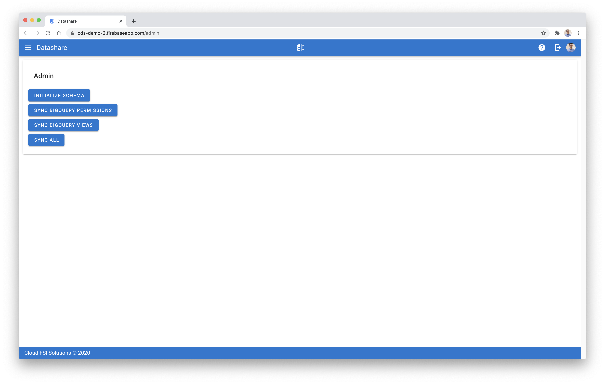

[Datashare User Guide](./../README.md)

# Admin
* [Initialize Schema](#initialize_schema)
* [Sync BigQuery Permissions](#sync_bq_permissions)
* [Sync BigQuery Views](#sync_bq_views)
* [Sync All](#sync_all)

  

## <a name="initialize_schema">Initialize Schema</a>
The initialize schema button will create the required BigQuery objects that store the metadata required by Datashare to operate.

## <a name="sync_bq_permissions">Sync BigQuery Permissions</a>
In the event that BigQuery permissions fall out of sync with Datashare, IE: a user is manually provided access to a Dataset through the BigQuery console, you can easily re-sync permissions for BigQuery Data Views by clicking on the 'Sync BigQuery Permissions' button.

Note that for any datasets or tables managed by Datashare, all BigQuery Data Viewer role accounts are maintained by Datashare.

## <a name="sync_bq_views">Sync BigQuery Views</a>
In the event that BigQuery views fall out of sync with Datashare, IE: a  user manually edits a view in the BigQuery console, you can easily re-sync the view by clicking on the 'Sync BigQuery Views' button.

## <a name="sync_all">Sync All</a>
Sync all will perform both [Sync BigQuery Permissions](#sync_bq_permissions) and [Sync BigQuery Views](#sync_bq_views).