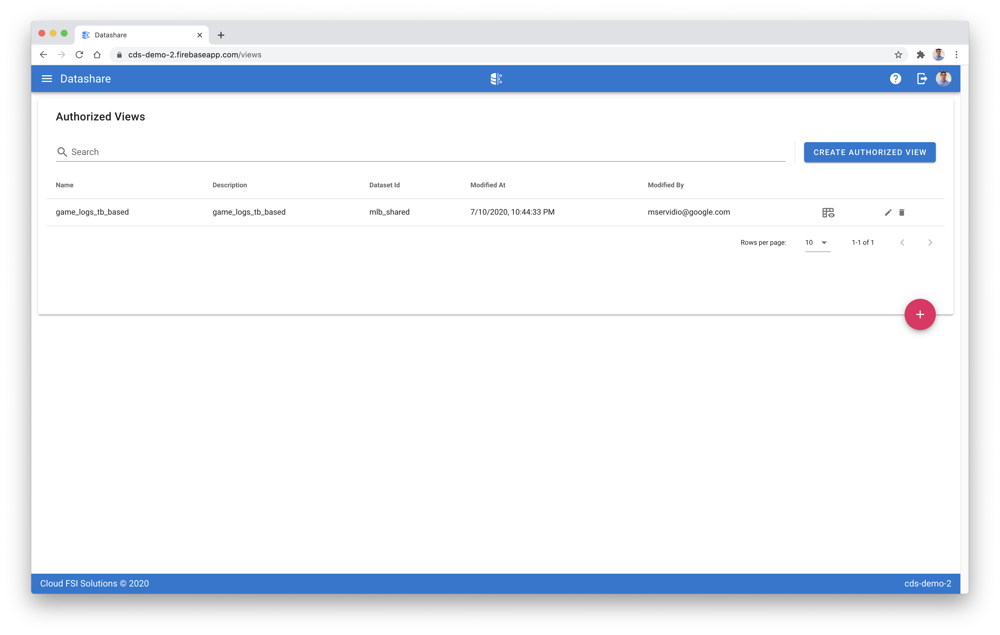
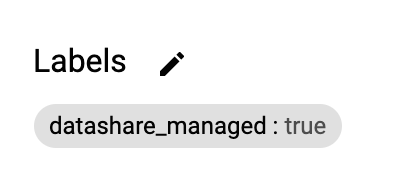
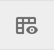
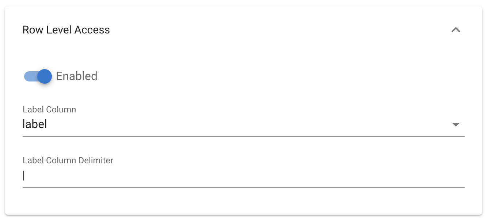
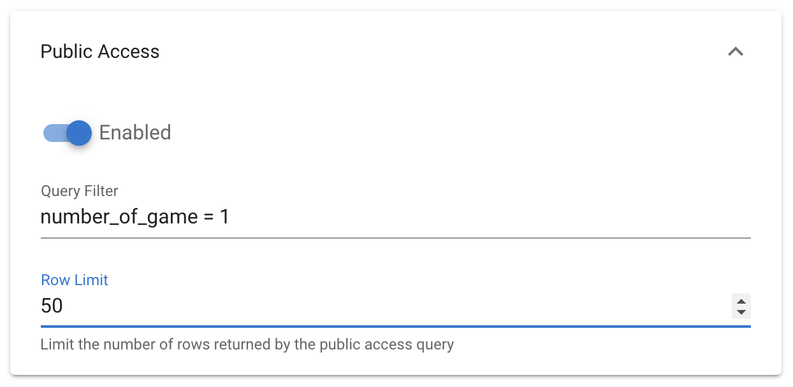
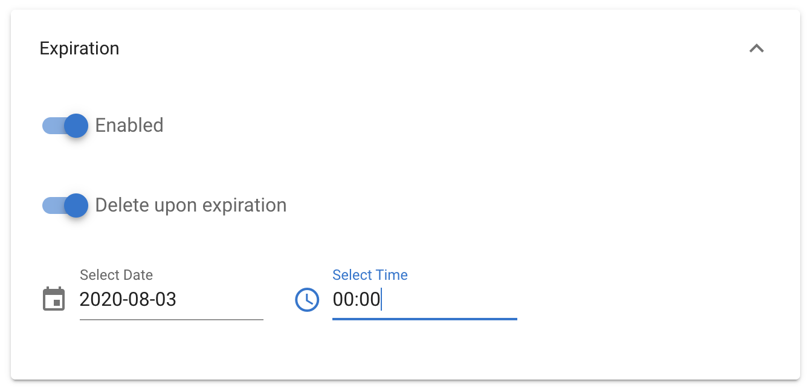

[Datashare User Guide](./../README.md)

# Authorized Views
* [Viewing Authorized Views](#viewing_authorized_views)
* [Creating a View](#creating_a_view)
* [Editing a View](#editing_a_view)
* [Deleting a View](#deleting_a_view)

  

## <a name="viewing_authorized_views">Viewing Authorized Views</a>
The authorized views UI shows a listing of all of the authorized views managed by Datashare. An authorized view is considered managed by Datashare when it is created through the 'Create Authorized View' functionality of Datashare, and is labled with key 'datashare_managed' and value of 'true'. If you want to view the authorized views that are managed and created by Datashare, click the button with the ellipsis image in the rightmost column and click 'Views'.

## <a name="view_dataset_in_bigquery">View Dataset in BigQuery</a>
To view the authorized view within BigQuery, click the button in the sixth column.

## <a name="creating_a_view">Creating a View</a>
1. Click the 'CREATE AUTHORIZED VIEW' button on the top right.
2. Provide a view name and description.
3. Select the dataset Id for where you want to create the new authorized view. It is recommended that this be created in a dataset that's used primarly for sharing data.
4. Choose if you want to configure the view using 'Source-based' or 'Custom'.
    * Source-based: provides a wizard like setup requiring little to no writing of SQL.
    * Custom: provides ability to write SQL directly.
5. If using Source-based you will also have the option to configure [public access](#public_access).
6. You can also define [row level access](#row_level_access) or [expiration](#expiration) as required.

Once you've configured everything that you want, you can click the 'VALIDATE' button on the bottom right in order to validate and ensure all of the selected and entered options are valid. Additionally, you can click 'SAMPLE DATA' to view a table of sample data that is generated at runtime.

7. Click 'SAVE' to create the view.

### <a name="row_level_access">Row Level Access</a>
Row level access configuration works in conjunction with policies. Row level access tags that accounts are entitled to are configured within [policies](./POLICIES.md/#creating_a_policy), and in this section is where you can define a single column to use for performing the row level filtering. The column may also contain a delimited list of values to use. In this example we're using a column named 'label' and there are multiple values in the column delimited by a pipe '|'.

### <a name="public_access">Public Access</a>
If you use a Source-based configuration for an authorized view, you will also have the option to configure 'Public Access'. Public access is a feature that can be enabled and is useful when you're using row-level access. If a user is granted access to a particular dataset or view, however doesn't have access to any rows, then the public access will kick in and provide the user with public access (sample data).

### <a name="expiration">Expiration</a>
In the event where you want a consumer to have limited access to an authorized view, you may define an expiration date and time. You may also choose to delete the view upon expiry, if you do not want to delete the view upon expiry, then the view will continue to exist, though the consumer will have zero rows returned, or the [public access](#public_access) data returned (if configured).

## <a name="editing_a_view">Editing a View</a>
1. Click on the pencil icon in the rightmost column.
2. Make the necessary modifications. Ensure caution as an edit to an existing view will impact all users entitled to it.
4. Click 'Save'.

## <a name="deleting_a_view">Deleting a View</a>
Ensure caution when deleting any view. If you have GCP Marketplace integration set up, this can break any solution or user associations for purchased solutions that you are selling through marketplace.

1. Click the trash image on the rightmost side.
2. Click 'DELETE' to confirm the deletion.