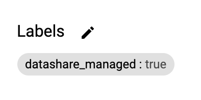

[Datashare User Guide](./../README.md)

# Datasets
* [Viewing Managed Datasets](#viewing_managed_datasets)
* [View Dataset in BigQuery](#view_dataset_in_bigquery)
* [Viewing accounts with access](#viewing_accounts_with_access)
* [Creating a Dataset](#creating_a_dataset)
* [Editing a Dataset](#editing_a_dataset)
* [Deleting a Dataset](#deleting_a_dataset)

  

## <a name="viewing_managed_datasets">Viewing Managed Datasets</a>
The datasets UI shows a listing of all of the Datasets managed by Datashare. A dataset is considered managed by Datashare when it is created through the 'Create Dataset' functionality of Datashare, and is labled with key 'datashare_managed' and value of 'true'. If you want to view the [authorized views](#./AUTHORIZED_VIEWS.md) that are managed and created by Datashare, click the button with the ellipsis image in the rightmost column and click 'Views'.

## <a name="view_dataset_in_bigquery">View Dataset in BigQuery</a>
To view the dataset within BigQuery, click the button in the fourth column.

## <a name="viewing_accounts_with_access">Viewing Accounts with Access</a>
To view accounts that have been provided access to a given dataset, click the button with the ellipsis image in the rightmost column and click 'Accounts'. Note that the accounts screen does not yet have 'Table-based' policy support. This enhancement is tracked in [#195](https://github.com/GoogleCloudPlatform/datashare-toolkit/issues/195).

## <a name="creating_a_dataset">Creating a Dataset</a>
1. Click the 'CREATE DATASET' button on the top right.
2. Provide a unique Dataset Id.
3. Provide a description for the dataset. 

## <a name="editing_a_dataset">Editing a Dataset</a>
When editing a Dataset, the only attribute that can be changed through Datashare is the description.

1. Click the button with the ellipsis image in the rightmost column and click 'Edit Dataset'.
2. Update the description as required.

## <a name="deleting_a_dataset">Deleting a Dataset</a>
Ensure caution when deleting any dataset. When deleting a dataset this will delete all child objects including views, tables, functions, procedures that are included in the dataset. If you have GCP Marketplace integration set up, this can also break any associations with solutions that you are selling through marketplace.

1. Click the button with the ellipsis image in the rightmost column and click 'Delete Dataset'.
2. Click 'DELETE' to confirm the deletion.