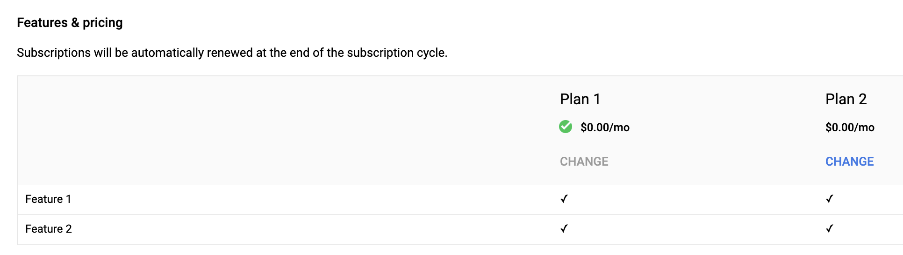
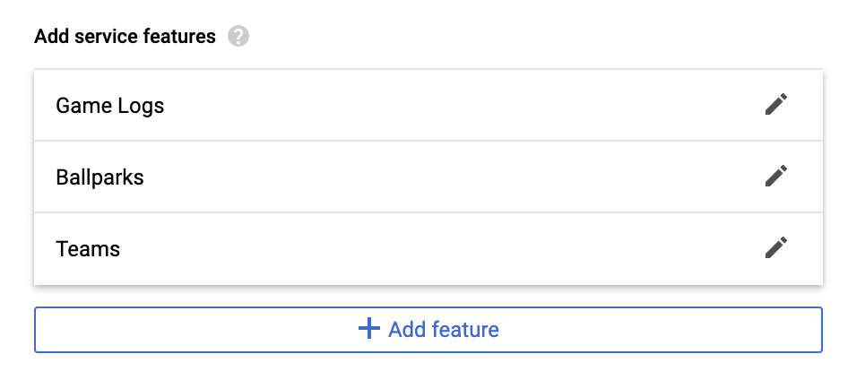
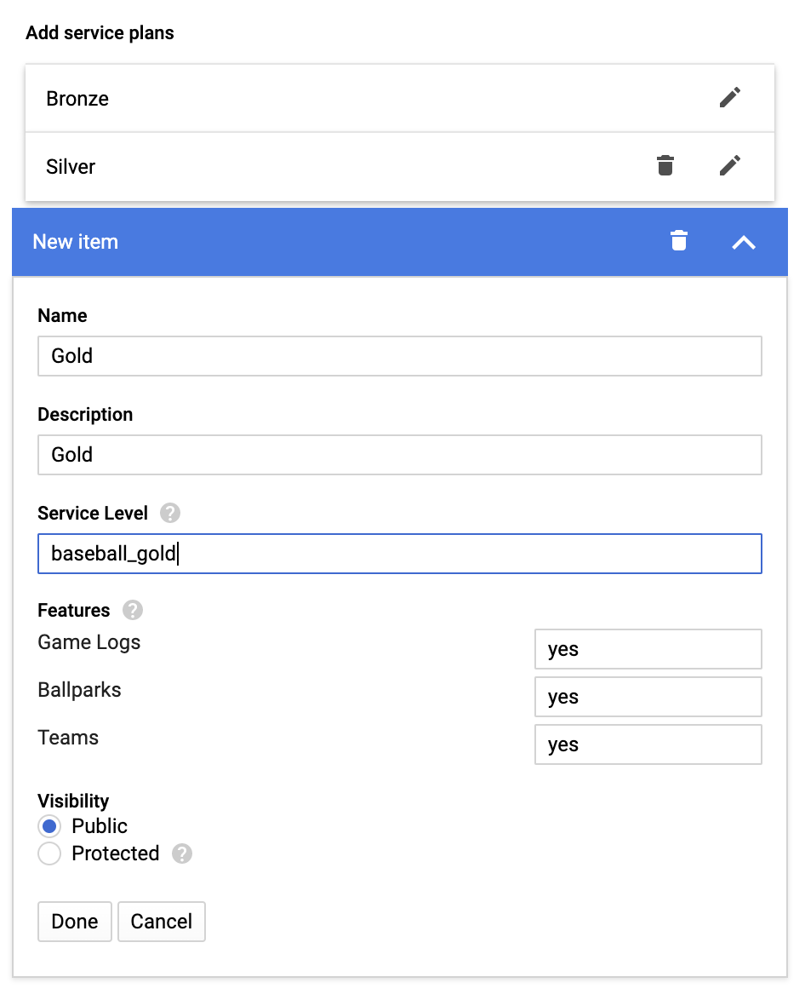
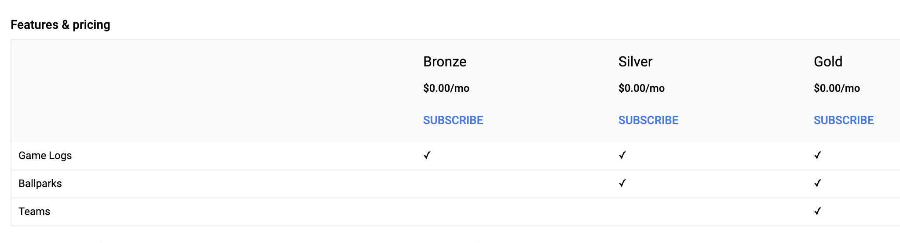

[Datashare User Guide](./../README.md)

# Marketplace Integration
* [Becoming a Marketplace vendor](#becoming_a_marketplace_vendor)
* [Pre-requistites](#prerequisites)
* [Creating your first solution](#creating_your_first_solution)
* [Marketplace Concepts](#marketplace_concepts)
    * [Plans & Features](#plans_and_features)
        * [Service Features](#service_features)
        * [Service Plans](#service_plans)

## <a name="becoming_a_marketplace_vendor">Becoming a Marketplace vendor</a>
In order to integrate Datashare with Google Cloud Marketplace, you must first sign up to become a [Google Cloud Marketplace vendor](https://cloud.google.com/marketplace/docs/partners). Once you have been approved as a partner you may then list your data solutions within Marketplace.

## Using Producer Portal

1. Enable the Cloud Commerce Producer API:
```
gcloud services enable cloudcommerceproducer.googleapis.com
```


## Using Partner Portal (Legacy)
### <a name="prerequisites">Pre-requistites</a>
1. Enable the Cloud Commerce Procurement API:

```
gcloud services enable cloudcommerceprocurement.googleapis.com
```

2. Grant the Datashare service account billing account adminstrator access.

    1. Go to the [GCP console](http://console.cloud.google.com/).
    2. Select 'Billing' from the menu.
    3. On the top right where it says 'Billing account', click the 'Manage' link.
    4. If the Info panel is not showing on the right side, click 'SHOW INFO PANEL'.
    5. Click 'ADD MEMBER', enter the Datashare service account ds-api-mgr@[your_project_id].iam.gserviceaccount.com, and select role 'Billing' > 'Billing Account Adminstrator'.
    6. Click 'SAVE'.

### <a name="creating_your_first_solution">Creating your first solution</a>
In order to create a data solution in Google Cloud Marketplace and sell it, follow the instructions below:

1. Go to [Partner Portal](https://console.cloud.google.com/partner/solutions).
2. Click "Solutions" on the left hand tab, and then click '+ ADD SOLUTION'.
3. Enter a solution name, select solution type of 'Managed service' and pricing type 'Billed by Google'.
4. Go to edit for 'SOLUTION METADATA' and fill in the required information and click 'Save'.
    * If you do not yet want to make your solution public in Google Cloud Marketplace, ensure the 'Hide solution from end users' checkbox is checked.
5. Go to edit for 'SOLUTION DETAILS' and fill in the required information and click 'Save'.
6. Go to edit for 'PLANS & FEATURES'. For more information on this section see [Plans & Features](#plans_and_features).
    * For the Signup URL, use the following: ```https://[YOUR_DATASHARE_API_DOMAIN]/v1alpha/projects/[YOUR_GCP_PROJECT]/accounts:register```
    * Leave the Account Recovery URL empty.
    * Leave SSO Login disabled.
    * For the Dashboard URL, use the following: ```https://[YOUR_DATASHARE_API_DOMAIN]/v1alpha/projects/[YOUR_GCP_PROJECT]/procurements:myProducts```
    * Add your [service features](#service_features). Service features can be included in multiple plans.
    * Configure your [service plans](#service_plans). Service plans can encompass multiple features.
7. (TODO: This is incomplete) Complete the billing on-boarding spreadsheet here - TBD. The billing setup process will take up to two weeks to complete. Reach out to the GCP Marketing Partner team for more information.
8. Go to the Datashare 'Policies' UI. In the examples below we defined three service plans. To support three service plans defined in the Google Cloud Marketplace Solution, we will need to [create](./POLICIES.md/#creating_a_policy) three separate Datashare policies.
9. Within each policy, scroll down to the 'Marketplace' section and enter in the 'Solution Id' and the 'Plan Id' (Service Level) that you defined in the services and plans section of partner portal. The 'Solution Id' was generated when you created a solution name in step 3. If you're unsure of what it is, load the [solutions](https://console.cloud.google.com/partner/solutions) page to check.

### <a name="marketplace_concepts">Marketplace Concepts</a>
#### <a name="plans_and_features">Plans & Features</a>
Marketplace has the concept of plans and features. Plans are the sellable item which include one or more features.



##### <a name="service_features">Service Features</a>
A service feature can be included in multiple plans. When selling data through Marketplace, an example of a feature could be different types of data included in the same purchase. For example using baseball data, you may sell access to multiple views containing historical data for: game logs, ballparks, and team. You could define each as a feature, so we set up features for:

* Game Logs
* Ballparks
* Teams



##### <a name="service_plans">Service Plans</a>
A service plan is a grouping of features that can be sold. Using the baseball data example above, you may decide to sell three different plans (tiers). For example:

* Bronze
* Silver
* Gold

When defining a plan, you will need to create a unique 'Service Level' identifier which will be used as the 'Plan Id' within the Datashare policy. This is how datashare will associate to a plan purchase.



Once you've finished configuring plans, you can review the matrix that was generated for 'Features & pricing'.



This is similar to the view that your potential customers will see when they're shopping Google Cloud Marketplace and are viewing your solution.