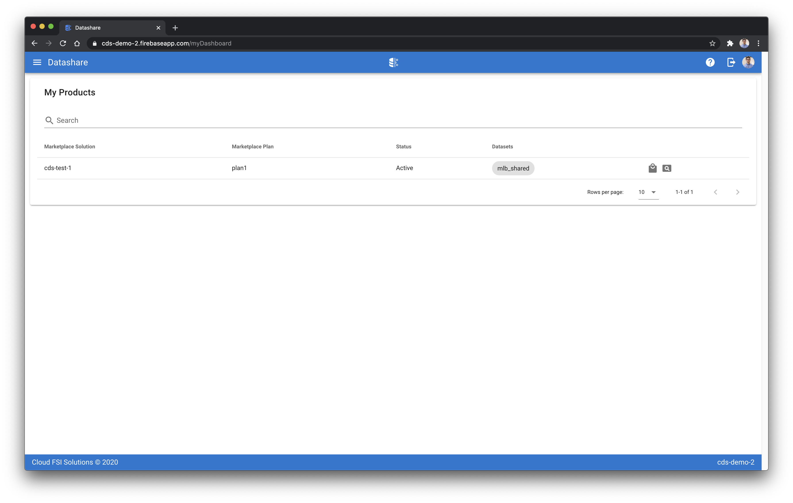
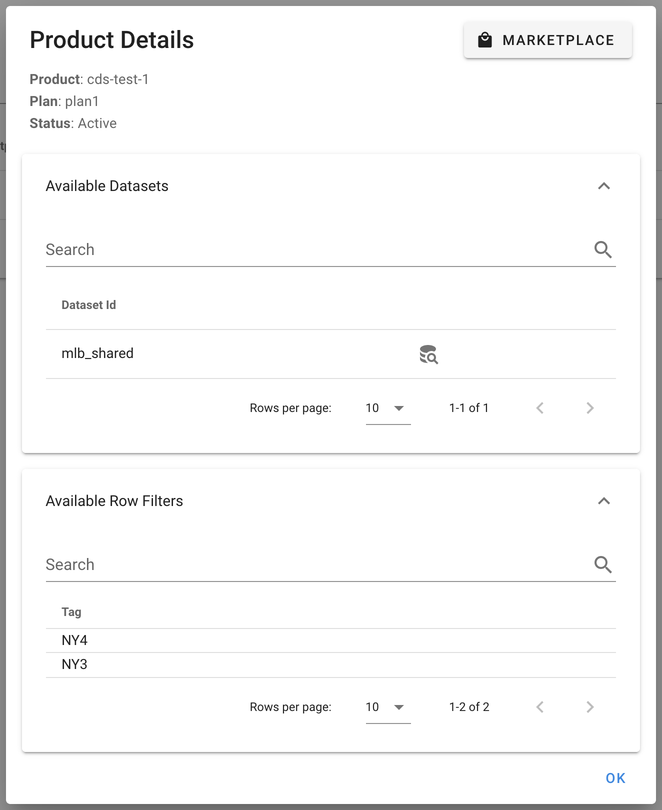

[Datashare User Guide](./../README.md)

# My Products
* [Viewing Products](#viewing_products)

  

## <a name="viewing_products">Viewing Products</a>
The my products UI shows a listing of all Datashare data products purchased through the GCP Marketplace. This is a consumer facing page. A user can click the briefcase icon in the rightmost column which will route them to the associated GCP Marketplace solution page, or if they click the icon with the magnifying glass they can view details on the Datashare product.

