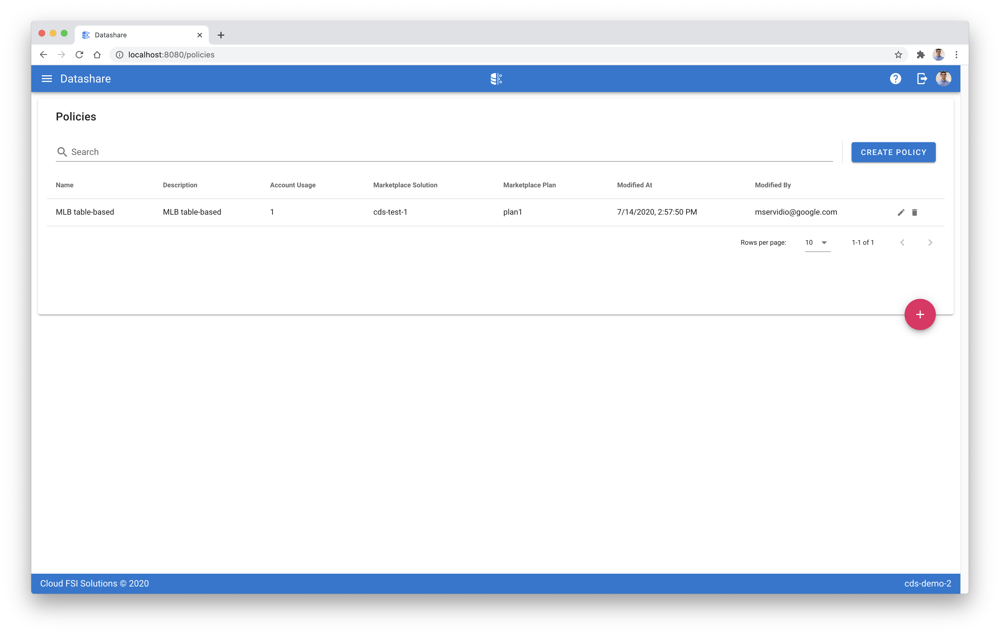

[Datashare User Guide](./../README.md)

# Policies
* [Viewing Policies](#viewing_policies)
* [Creating a Policy](#creating_a_policy)
* [Editing a Policy](#editing_a_policy)
* [Deleting a Policy](#deleting_a_policy)

  

## <a name="viewing_policies">Viewing Policies</a>
The policies UI shows a listing of all of the Policies managed by Datashare. A policy consists of datasets and tables, row level access tags (if applicable), and GCP Marketplace integration. Take caution whenever making changes to policies as they will potential impact one or many customers.

## <a name="creating_a_policy">Creating a Policy</a>
1. Click the 'CREATE POLICY' button on the top right.
2. Enter a policy name and description.
3. Choose whether you want to use Dataset-based or Table-base Access.
    * Dataset-based Access: Grants access at the more granular table or view level. Choose this option if you want any future tables/views added to the policy to automatically be granted to existing users entitled to the given policy.
    * Table-based Access: Grants access at the Dataset (grouping of tables/views) level. Choose this one if you want full control over which tables/views are included in the policy.
4. Select the list of Datasets or Tables depending on if you're using Dataset-based or Table-based access.
5. Enter the list of Row Access Tags. Row access tags are simple string filters that are used by tables/views associated with the policy in order to filter rows for users*.
6. Click 'SAVE'. Details on the 'Marketplace' section will be covered in the [Integrating with Marketplace](./MARKETPLACE_INTEGRATION.md) section.

\* Row Access Tags currently only work for users, they do not work with groups. An enhancement request is tracked in [#212](https://github.com/GoogleCloudPlatform/datashare-toolkit/issues/212).

## <a name="editing_a_policy">Editing a Policy</a>
1. Click on the pencil icon in the rightmost column.
2. Make the necessary modifications. Ensure caution as an edit to an existing policy will impact all users entitled to it.
4. Click 'Save'.

## <a name="deleting_a_policy">Deleting a Policy</a>
Ensure caution when deleting any policy. If you have GCP Marketplace integration set up, this can break any solution or user associations for purchased solutions that you are selling through marketplace.

1. Click the trash image on the rightmost side.
2. Click 'DELETE' to confirm the deletion.