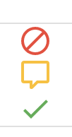

[Datashare User Guide](./../README.md)

# Procurement Requests
* [Overview of Consumer Purchase Flow](#consumer_purchase_flow)
* [Viewing Procurement Requests](#viewing_procurement_requests)
* [Update Message to User](#update_message_to_user)
* [Approving a Request](#approving_request)
* [Rejecting a Request](#rejecting_request)

  

## <a name="consumer_purchase_flow">Overview of Consumer Purchase Flow</a>
A user will subscribe to your solution from your solution details page.

They can choose a plan to purchase (if multiple options are available), and agree to the purchase terms.

Once they click 'SUBSCRIBE', they'll be routed to the subscription and activation page. Here they have to agree to the terms, and then proceed to activate and register with Datashare.

When the user clicks 'Register with [solutionId]', a pop-up window will open where they will associate their procurement account and GCP account with Datashare. Once the login is completed, they'll be redirected to the [My Products](./MY_PRODUCTS.md) page. Note that the [message to user](#update_message_to_user) is only visible through the GCP Marketplace solution page, it is not yet available in the 'My Products' page. An enhancement is being tracked to add this in  [#198](https://github.com/GoogleCloudPlatform/datashare-toolkit/issues/198).

Once the user closes the dialog, and navigates back to the solution page,  they'll see an updated status on top of the solution purchase page. While you are processing the request, you may also [update the status message](#update_message_to_user) displayed to the user.

## <a name="viewing_procurement_requests">Viewing Procurement Requests</a>
The procurement requests UI shows a listing of all of the entitlement requests pending action. You may perform one of the following three actions on these records:

* [Reject](#rejecting_request): Rejects the purchase.
* [Comment](#update_message_to_user): Updates the [status message to the user](#update_message_to_user).
* [Approve](#approving_request): Approves the purchase.

## <a name="update_message_to_user">Update Message to User</a>
When a consumer purchases your solution through the GCP Marketplace, as it may take time for you to process the request you may provide a message to the user which will be viewable to them within the Marketplace. You may use this to communicate progress and ETA for provisioning. For further information see the [Entitlement](https://cloud.google.com/marketplace/docs/partners/commerce-procurement-api/reference/rest/v1/providers.entitlements#Entitlement) documentation for the [Cloud Commerce Procurement API](https://cloud.google.com/marketplace/docs/partners/commerce-procurement-api/reference).

1. Click the yellow comment button in the rightmost column.
2. Enter a comment.
3. Click the 'SUBMIT' button.

At this point, if the consumer were to click the 'Refresh to check status' button in the solution page or refresh the page, they will now see the updated status message.

## <a name="approving_request">Approving Requests</a>
1. Click the green check button in the rightmost column.
2. Enter a comment.
3. Click the 'SUBMIT' button.

At this point, if the consumer were to click the 'Refresh to check status' button in the solution page or refresh the page, they will now see the updated status messaging informing them on their subscription details.

## <a name="rejecting_request">Rejecting Requests</a>
1. Click the red reject button in the rightmost column.
2. Enter a comment.
3. Click the 'SUBMIT' button.

At this point, if the consumer were to click the 'Refresh to check status' button in the solution page or refresh the page, they will now see the updated status message.

