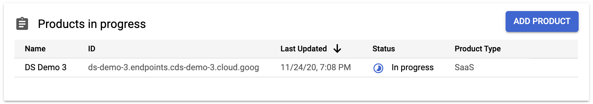
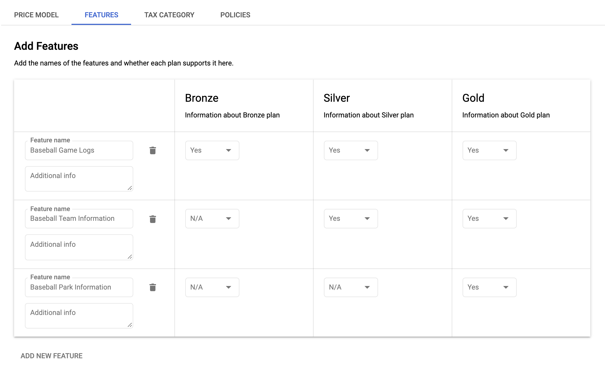

[Datashare User Guide](./../README.md)

# Producer Portal Integration
* [Using Producer Portal](#producer_portal)
* [Pre-requistites](#producer_portal_prerequisites)
* [Creating your first solution](#producer_portal_creating_your_first_solution)
* [Link Datashare Policy](#producer_portal_link_policy)
* [Marketplace Concepts](#producer_portal_marketplace_concepts)
    * [Plans & Features](#producer_portal_plans_and_features)
        * [Service Features](#producer_portal_service_features)
        * [Service Plans](#producer_portal_service_plans)

## <a name="producer_portal">Using Producer Portal</a>
Producer Portal can be accessed at: https://console.cloud.google.com/producer-portal

### <a name="producer_portal_prerequisites">Pre-requistites</a>
1. Enable the Cloud Commerce Producer API:
```
gcloud services enable cloudcommerceproducer.googleapis.com
```

2. Grant the Datashare service account billing account adminstrator access.

    1. Go to the [GCP console](http://console.cloud.google.com/).
    2. Select 'Billing' from the menu.
    3. On the top right where it says 'Billing account', click the 'Manage' link.
    4. If the Info panel is not showing on the right side, click 'SHOW INFO PANEL'.
    5. Click 'ADD MEMBER', enter the Datashare service account ds-api-mgr@[your_project_id].iam.gserviceaccount.com, and select role 'Billing' > 'Billing Account Adminstrator'.
    6. Click 'SAVE'.

### <a name="producer_portal_creating_your_first_solution">Creating your first solution</a>
In order to create a data solution in Google Cloud Marketplace and sell it, follow the instructions below:

1. Go to [Producer Portal](https://console.cloud.google.com/producer-portal).
2. Click 'ADD PRODUCT'.
3. 'SaaS' type will be selected by default.
4. Enter a Product name and a Product ID and click 'CREATE'.
5. Go to 'EDIT' for 'Product details review' and fill in the required product information and click 'NEXT'.
6. Fill in the required documentation information and click 'NEXT'.
7. Fill in the required product metadata information and click 'SUBMIT'.
8. Go to 'Pricing' and set up your pricing plan structure. Once completed, click 'SETUP'.
    * Note that Datashare only supports Pricing options of 'Free' and 'Subscription'. Usage is not supported by Datashare.
9. Go to the 'FEATURES' tab, and enter in the features applicable to each plan, then click 'NEXT'.
10. Fill in the required tax category information, and click 'NEXT'.
11. Click 'SUBMIT'.
12. Go to the 'Technical integration' menu item.
13. Link the Datashare service account for both the 'Partner Procurement API integration' and the 'Cloud Pub/Sub integration'. IE: ds-api-mgr@[YOUR_PROJECT_ID].iam.gserviceaccount.com. Click 'NEXT'.
14. For the Sign up URL, use the following: ```https://[YOUR_DATASHARE_API_DOMAIN]/v1alpha/projects/[YOUR_GCP_PROJECT]/accounts:register```
15. Leave SSO Login disabled, for the 'Login URL', use the following: ```https://[YOUR_DATASHARE_API_DOMAIN]/v1alpha/projects/[YOUR_GCP_PROJECT]/procurements:myProducts```, and click 'SUBMIT'.

### <a name="producer_portal_link_policy">Link Datashare Policy</a>
In order Marketplace purchases to work, you need to associate marketplace pricing plans to Datashare policies. There are two fields within the Datashare policy form to link a Marketplace solution, they are Solution Id and Plan Id.

You can find the Solution Id 
The Solution Id can be found on the 'Overview' page of the Producer Portal in the products section, denoted by 'ID'. You can also find it within a solution on the 'Technical integration' page in the 'Product level identifier' section.



Once a plan is defined, a unique 'Service Level' identifier will be generated which will be used as the 'Plan Id' within the Datashare policy. This is how datashare will associate to a plan purchase. To find the plan level identifiers, click the 'Technical integration' menu item and you will find the plan level identifiers in the 'Plan level identifier' section.


### <a name="producer_portal_marketplace_concepts">Marketplace Concepts</a>
#### <a name="producer_portal_plans_and_features">Plans & Features</a>
Marketplace has the concept of plans and features. Plans are the sellable item which include one or more features.


##### <a name="producer_portal_service_features">Service Features</a>
A service feature can be included in multiple plans. When selling data through Marketplace, an example of a feature could be different types of data included in the same purchase. For example using baseball data, you may sell access to multiple views containing historical data for: game logs, ballparks, and team. You could define each as a feature, so we set up features for:

* Game Logs
* Ballparks
* Teams



##### <a name="producer_portal_service_plans">Service Plans</a>
A service plan is a grouping of features that can be sold. Using the baseball data example above, you may decide to sell three different plans (tiers). For example:

* Bronze
* Silver
* Gold


Once you've finished configuring plans, you can review the plans matrix that was generated by clicking 'Full Preview':


This is similar to the view that your potential customers will see when they're shopping Google Cloud Marketplace and are viewing your solution.