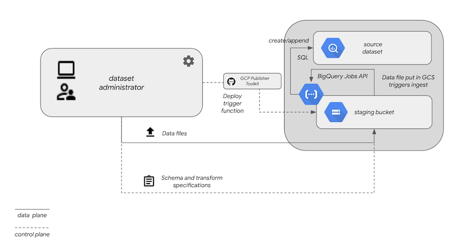

[Back to BQDS](/)

# Ingestion Cloud Function for batch data uploads

## Synopsis

`BQDS`'s entry point is through a Cloud Function that is listening for
finalize events in a Cloud Storage bucket. This function can be deployed to
a bucket of your choice using the deployment script in [bin/deploy.sh](bin/deploy.sh).

An ingestion begins when a supported file type (```csv```,
```csv.gz```, ```txt```, ```avro``` or ```json```)  is discovered by
the function through Google Cloud Functions'
[bucket trigger mechanism](https://cloud.google.com/functions/docs/calling/storage). When
the function is invoked, it looks in the same bucket (within the ```bqds``` subdirectory) for
[schema and transform](../examples/mlb/config/ingestion) configurations corresponding to the name of the
uploaded file. It then executes a series of  BigQuery actions to transform and load the data into the
specified destination BigQuery dataset and table for that file.

A summary of the logic within the function is:

0. If the file extension is of a recognized file type -
1. Extract the dataset and table names from the bucket's inbound file
   name, determined by the first two tokens of the file name delimited by `.` , e.g. `mydataset.mytable.upload.1.csv`
2. Determine whether the dataset exists and, if not, create it
3. Look for `<mytable>.schema.json` under the bucket's `/bqds`
   subdirectory to get the delimiter, field
   definitions, and write disposition for the upload. If it these do not exist, instruct the BigQuery job to
   auto-detect the schema and delimiter, and apply `WRITE_APPEND` as the
   write disposition
4. Execute a BigQuery job to load the file's contents into a temporary table
6. Execute SQL that uses the `SELECT` clause specified
   in`<mytable>.transform.sql` (or the null transform`*`), and save the
   results (creating or appending, depending on the write disposition chosen) into the specified destination table
7. Delete the temporary table after a successful transformation
   stage (temporary tables otherwise expire in 2 days).
   
## Ingestion architecture



## Installation

After cloning the repository, this command will attach the Cloud Function to a storage
bucket of your choosing:

```
cd bq-datashare-toolkit/ingestion/bin
./deploy.sh --trigger-bucket=gs://<mybucket>
```
At this point, any files uploaded to that bucket will trigger the
Cloud Function, but only files of a recognized type will be
processed. Unrecognized files, and any files placed in the bucket's `bqds`
subdirectory, will be ignored.

## Specifications for uploaded files

The ingestion Cloud Function ```processUpload``` will be triggered upon
all changes to the bucket, but will exit if the file extension is not
supported. When it detects a supported file extension,
it parses the file name to determine the destination BigQuery
dataset and table in which to load the data. For example, if you wish
to target dataset ```DS``` and table ```EXAMPLE```, files uploaded to
your storage bucket (```gs://example-bucket/```) are named:

- ```DS.EXAMPLE.csv``` (if uncompressed).
- ```DS.EXAMPLE.csv.gz``` (if compressed).

The Cloud Function will time out after *540*
seconds of execution. Depending on the size of your files, it
may not be possible to completely ingest very large files completely before this
timeout threshold is crossed. If you encounter this condition,
consider splitting up large files into smaller
ones (each no larger than 1-1.5G) to upload and process individually.

## Configuration

### Schema definition and data transformation

`BQDS` supports two stages of data ingestion, both configurable via
files stored in the same Cloud Storage bucket as the data being
uploaded.

The first stage uses a file named according to the convention
`gs://bucket/bqds/<table-name>.schema.json`. For `<table-name>`, this
file specifies the field definitions corresponding to the file
being uploaded, as well as the
[write disposition](https://cloud.google.com/bigquery/docs/reference/auditlogs/rest/Shared.Types/WriteDisposition)
to be used in ingesting the file.

If the target BigQuery dataset (as inferred from the file name) does not exist, it will be created.

Tables not found will also be created and seeded with the initial
transformed file contents. Subsequent updates to the same target will
append its rows if the table is found, unless you have specified
`truncate: true` in your `schema.json`.

If there is no ```EXAMPLE.transform.sql``` file,
the function willl default to ```*```, which signifies *no*
transformation from the originally specified schema. If the 
```EXAMPLE.schema.json``` file is omitted, BigQuery
will attempt to autodetect the schema from the file contents.

The content within ```EXAMPLE.schema.json``` is a JSON object representation. The
```metadata``` property is identical in format to BigQuery's JSON-based
[schema representation ](https://cloud.google.com/bigquery/docs/schemas). The ```delimiter``` property specifies the single character
used to delimit columns in each row of the CSV file. An example
```.schema.json```  might resemble:

```
{
    "metadata": {
        "fieldDelimiter": "|",
        "fields": [
            {"name": "ts_ms", "type": "integer"},
            {"name": "object", "type": "string"},
            {"name": "weight", "type": "float"},
            {"name": "unit_of_measurement", "type": "string"}
        ]
    }
}
```

For a `WRITE_APPEND` disposition, simply omit `truncate: "true"` from
the configuration.

A file using this schema, and being uploaded into dataset `DS` and
table `EXAMPLE` data in ```DS.EXAMPLE.20201102.csv``` might resemble:


|ts_ms|object|weight|unit_of_measurement|
|------------|-----------|------------|-----------|
|1563520733000|apple|6.5|oz|
|1563520743000|orange|8|oz|
|1563520742100|anvil|90|kg|
|1563543879292|mercury|200.59|u|
|1563543871232|liquid oxygen (1 gallon)|4.32|kg|


You may find that you need a ```schema.json``` configuration if the autodetection
by BigQuery does not yield expected results. For example, a column
representing a date as ```YYYYMMDD``` is interpreted by BigQuery as an
integer. However, ```YYYYMMDD```, if defined as a DATE in BigQuery
will fail to process, since BigQuery only interprets string DATEs in the format `YYYY-MM-DD`.

Provided that you ultimately want the data represented as a DATE type,
the source data destined for ```DS.EXAMPLE``` requires transformation from
the original data file schemas. These per-column transformations are
specified in ```EXAMPLE.transform.sql``` (stored witin the source
bucket's ```bqds``` subdirectory).

The format of ```EXAMPLE.transform.sql``` is simply a SQL fragment
that queries the original schema, either auto-detected or defined by
``` EXAMPLE.schema.json```. In ```EXAMPLE.transform.sql```, the SQL
fragment is essentially the ```SELECT``` clause (including aggregate
or synthetic columns) of a statement that queries the temporary table,
but omitting the literal ```SELECT``` and everything following and inclusive of the ```WHERE``` clause of the query.

For example, if we wanted ```DS.EXAMPLE``` to query the timestamp as a
SQL ```TIMESTAMP``` instead of the ```INTEGER```  being
auto-detected into the temporary tale, yet leave all other columns the same,
the SQL statement would be:

```
SELECT
    TIMESTAMP_MILLIS(ts_ms) AS measurement_time,
    object,
    weight,
    unit_of_measurement
FROM TMP_TABLE_76893023444
```

The associated ```EXAMPLE.transform.sql``` would be:

```
TIMESTAMP_MILLIS(ts_ms) AS measurement_time,
object,
weight,
unit_of_measurement
```

Hence, ```DS.EXAMPLE```'s  ultimate schema is inferred at runtime by the
contents of ```EXAMPLE.transform.sql``` and not explicitly as it is
for the temporary table staging the CSV file.

Configuration files are placed in the
```gs:.//example-bucket/bqds``` subdirectory of the source
bucket. They are recognized by the Cloud Function as special, so it
won't treat them as normal data files to process. They can be copied to the source bucket with this command:

```gsutil cp *.schema.json *.transform.sql gs://example-bucket/bqds/```

## Transformation options

There are generally two ways of transforming data from the
representation in your data file to the target representation that is
available to consumers. If you know the schema in advance, you can author
a ```<table>.schema.json``` file that embeds the schema in BigQuey
format.

If the schema is not available in advance, the
data can be autodetected and, in the worst case scenario, be staged
with all columns representing ```STRING```s. In this case, you can
author a ```<table>..transform.sql``` with SQL-based transformations
into the target state.

Assume a file with the following format:


|date|symbol|closing_price|
|--------|--------|---------|
|20211031|ZVZZT|4.19


The ```fields``` array of ```closing_prices.schema.json``` for this might be:

```
{"name": "date", "type": "string"},
{"name": "symbol", "type": "string"},
{"name": "price", "type": "float64"}
```

When ```schema.json``` is omitted, BigQuery's autodetect infers this as:

```
{"name": "date", "type": "int"},
{"name": "symbol", "type": "string"},
{"name": "price", "type": "float"}
```

It is straightforward to transform either of these to a BigQuery ```DATE```
type, but the integer representation requires a casting to
```STRING``` before running the ```SUBSTR``` function to further
transform it into a
```DATE``` in the ultimate destination table's associated column. Two different
```closing_prices.transform.sql``` configurations illustrate this:

```
-- as a STRING
CONCAT(SUBSTR(date, 1, 4), '-', SUBSTR(date, 5, 2), '-', SUBSTR(date, 7,2))  AS trade_date,
symbol,
price
```

```
-- as an auto-detected INT
CONCAT(SUBSTR(CAST(date AS STRING), 1, 4), '-', SUBSTR(CAST(date AS
STRING), 5, 2), '-', SUBSTR(CAST(date AS STRING), 7,2))  AS trade_date,
symbol,
price
```

Your own particular choice of ```transform.sql``` and
```schema.json``` contents depends highly on your own source data format. In
general, omitting a schema configuration and relying on auto-detect
might require more transformations. If your source data is clean and
wholly interpretable by BigQuery using a specific schema, there might
be less necessity to transform the data.

### Batch identification

When the source data file is transformed into the destination table
format using the query within ```transform.sql```, an additional
column is added by ```BQDS``` that uniquely identifies the specific
batch instance that appended each individual record. Hence, the
records appended for each ingestion instance (that is, a single file
ingested from GCS) will contain a distinct batch ID.

The data stored within the ```bqds_batch_id``` column is of a
```STRING``` type that adheres to the following convention:

```
<UNIX timestamp in milliseconds denoting the time of the batch's
execution>:<event ID of the processUpload trigger from the GCS
bucket>:<storage bucket name where file was uploaded>:<uploaded file
name that was processed>
```

## Required IAM roles

The ```processUpload``` function must be run under a service account with read permissions for the specified source Cloud Storage bucket and Admin privileges for the target BigQuery instance, as it creates, deletes and appends to BigQuery tables.

## Deployment

To deploy the ingestion function run this command from the
```function``` directory:

```npm run deploy -- --trigger-bucket=gs://example-bucket```

## Debugging

Stackdriver logging of ```processUpload``` activity can be found in
the Google Cloud Console:

https://console.cloud.google.com/logs?service=cloudfunctions.googleapis.com&key1=processUpload

## SRE / DevOps / Operations

Operational monitoring and alerting of the ingestion pipeline can
be acheived using
[logs-based alerting in Stackdriver](https://cloud.google.com/logging/docs/setup/nodejs). One
possible use case to monitor for is the failure of individual uploaded
files.
