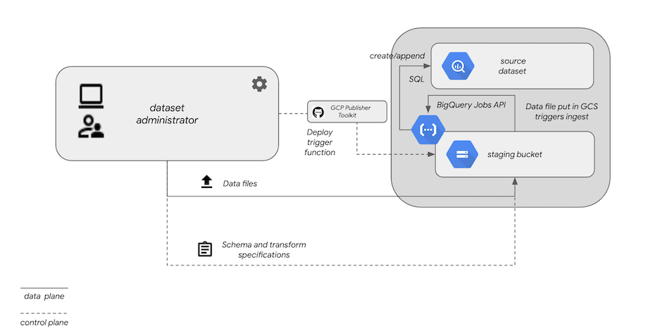

uto_[Back to BQDS](../../README.md)

# ```processUpload```: ingestion Cloud Function for batch data uploads

## Synopsis

An ingestion workflow begins when a supported file type (```csv```,
```csv.gz```, ```txt```, ```avro``` or ```json```)  is discovered by ```processUpload``` through Google Cloud Functions'
[bucket trigger mechanism](https://cloud.google.com/functions/docs/calling/storage). When ```processUpload``` is invoked, it looks
in the same bucket (within the ```bqds``` subdirectory off root) for
schema and transform configurations corresponding to the name of the
uploaded file. It then executes a series of  BigQuery actions to transform and load the data into the
specified BigQuery dataset and table for that file.

A summary of the logic within the ```processUpload``` Cloud Function
is:

0. If the file is not a configuration under `gs://<bucket>/bqds`, and
   is of a recognized file type...
1. Extract the dataset and table names from the bucket's inbound file
   name, determined by the first two tokens delimited by `.` in the
   file name, e.g. `mydataset.mytable.upload.1.csv`
2. Determine whether the dataset exists and, if not, create it
3. Look for `<table_name>.schema.json` to get the delimiter, field
   definitions, and write disposition. If it these do not exist, instruct the BigQuery job to
   auto-detect the schema and delimiters and apply a null transform to
   the data.
4. Execute a BigQuery job to load the file's contents into a temporary table
6. Execute SQL that uses the `SELECT` clause specified
   in`<table_name>.transform.sql` (or  the null transform`*`), saving the results (creating or appending) into the specified destination tablex
7. Delete the temporary table after a successful transformation
   stage (temporary tables otherwise expire in 2 days).
   
## Ingestion architecture



## Processing

The ingestion process starts after a file has been uploaded to the source
bucket where data files will be uploaded. The configured Cloud
Function trigger will be invoked with a pointer to the new file.

Files must be named according to their destination dataset and
tables. 

The Cloud Function will parse the name of the inbound file and look
for schema configurations and transformation SQL fragments for the
specified destination table.

### GCS bucket

The entry point of the ingestion workflow begins when a supported file
type (```txt```, ```csv```. ```csv.gz```, ```json``` or ```avro```) is uploaded into a
bucket. The table-specific ingestion configuration files are also stored in this bucket,
under the ```bqds``` directory off the root.

### Cloud Function with GCS trigger

To activate BQDS processing, a Cloud Function (```processUpload```) is
deployed that uses bucket mutation (file uploads) as a trigger. When a supported file type is uploaded, the Cloud
Function is notified of the event, and kicks off the workflow to
proceess the file into a BigQuery destination table.

## Specifications for uploaded files

The ingestion Cloud Function ```processUpload``` will be triggered upon
all changes to the bucket, but will exit if the file extension is not
```.csv```, ```txt```, ```.gz```, ```avro``` or ```json```. When it detects a supported file extension,
it will parse the file name to determine the destination BigQuery
dataset and table in which to load the data. For example, if you wish
to target dataset ```DS``` and table ```EXAMPLE```, files uploaded to
your storage bucket (```gs://example-bucket/```) should be named:

- ```DS.EXAMPLE.csv``` (if uncompressed).
- ```DS.EXAMPLE.csv.gz``` or ```DS.EXAMPLE.gz``` (if compressed).

The Cloud Function that performs the ingestion will time out after 540
seconds of execution. Depending on the size of your file updates, it
may not be possible to completely ingest very large files completely before the
timeout threshold is crossed. If you encounter this condition,
consider splitting up large files into smaller
parts (no larger than 1-1.5G) to upload and process individually.

## Configuration

### Schema definition and data transformation

If the target BigQuery dataset (as inferred from the file name) does not exist, it will be created.

Tables not found will also be created and seeded with the initial transformed file contents. Subsequent updates to the same target will append its rows if the table is found.

Create the ```EXAMPLE.schema.json``` and  ```EXAMPLE.transform.sql```
files. If you omit the ```EXAMPLE.transform.sql``` file,
```processUpload``` willl default to ```*```, which signifies *no*
transformation from the originally specified schema. The
```EXAMPLE.schema.json``` file can also be omitted, in which case BigQuery
will attempt to autodetect the schema from the file contents.

The content within ```EXAMPLE.schema.json``` is a JSON object with two properties. The
```fields``` property is identical in format to BigQuery's JSON-based
[schema representation ](https://cloud.google.com/bigquery/docs/schemas). The ```delimiter``` property specifies the single character
used to delimit columns in each row of the CSV file. An example
```.schema.json```  might resemble:

```
{
    "metadata": {
        "fieldDelimiter": "|",
            "fields": [
                {"name": "ts_ms", "type": "integer"},
                {"name": "object", "type": "string"},
                {"name": "weight", "type": "float"},
                {"name": "unit_of_measurement", "type": "string"}
            ]
    }
}
```

A file using this schema, and being uploaded into dataset `DS` and
table `EXAMPLE` data in ```DS.EXAMPLE.20201102.csv``` might resemble:


|ts_ms|object|weight|unit_of_measurement|
|------------|-----------|------------|-----------|
|1563520733000|apple|6.5|oz|
|1563520743000|orange|8|oz|
|1563520742100|anvil|90|kg|
|1563543879292|mercury|200.59|u|
|1563543871232|liquid oxygen (1 gallon)|4.32|kg|


You may find that you need a ```schema.json``` configuration if the autodetection
by BigQuery does not yield expected results. For example, a column
representing a date as ```YYYYMMDD``` is interpreted by BigQuery as an
integer. However, ```YYYYMMDD```, if defined as a DATE in BigQuery
will fail to process, since BigQuery only interprets string DATEs in the format `YYYY-MM-DD`.

Provided that you ultimately want the data represented as a DATE type,
the source data destined for ```DS.EXAMPLE``` requires transformation from
the original data file schemas - and these per-column transformations are
specified in ```EXAMPLE.transform.sql``` (stored witin the source
bucket's ```bqds``` subdirectory..

The format of ```EXAMPLE.transform.sql``` is simply a SQL fragment
that queries the original schema, either auto-detected or defined by
``` EXAMPLE.schema.json```. In ```EXAMPLE.transform.sql`, the SQL
fragment is essentially the ```SELECT``` clause (including aggregate
or synthetic columns) of a statement that queries the temporary table,
but omitting the literal ```SELECT``` and everything following and inclusive of the ```WHERE``` clause of the query.

For example, if we wanted ```DS.EXAMPLE``` to query the timestamp as a
SQL ```TIMESTAMP``` instead of the ```INTEGER```  being
auto-detected into the temporary tale, yet leave all other columns the same,
the SQL statement would be:

```
SELECT
    TIMESTAMP_MILLIS(ts_ms) AS measurement_time,
    object,
    weight,
    unit_of_measurement
FROM TMP_TABLE_76893023444
```

The associated ```EXAMPLE.transform.sql``` would be:

```
TIMESTAMP_MILLIS(ts_ms) AS measurement_time,
object,
weight,
unit_of_measurement
```

Hence, ```DS.EXAMPLE```'s schema is inferred at runtime by the
contents of ```EXAMPLE.transform.sql``` and not explicitly as it is
for the temporary table staging the CSV file.

The configuration files are placed in the
```gs:.//example-bucket/bqds``` subdirectory of the source
bucket. They are recognized by the Cloud Function as special, so it
won't treat them as normal data files to process. They can be copied to the source bucket with this command:

```gsutil cp *.schema.json *.transform.sql gs://example-bucket/bqds/```

## Transformation options

There are generally two ways of transforming data from the
representation in your data file to the target representation you
expose to consumers. If you know the schema in advance, you can author
a ```<table>.schema.json``` file that embeds the schema in BigQuey
format.

If you do not know or do not wish to author the schema in advance, the
data can be autodetected and, in the worst case scenario, be staged
with all columns representing ```STRING```s. In this case, you can
author a ```<table>..transform.sql``` with SQL-based transformations
into the target state.

Assume a file with the following format:


|date|symbol|closing_price|
|--------|--------|---------|
|20211031|ZVZZT|4.19


The ```fields``` array of ```closing_prices.schema.json``` for this might be:

```
{"name": "date", "type": "string"},
{"name": "symbol", "type": "string"},
{"name": "price", "type": "float"}
```

When ```schema.json``` is omitted, BigQuery's autodetect infers this as:

```
{"name": "date", "type": "int"},
{"name": "symbol", "type": "string"},
{"name": "price", "type": "float"}
```

It is straightforward to transform either of these to a BigQuery ```DATE```
type, but the integer representation requires a casting to
```STRING``` before running the ```SUBSTR``` function to further
transform it into a
```DATE``` within the ultimate destination table's column. Two different
```closing_prices.transform.sql``` configurations illustrate this:

```
-- as a STRING
CONCAT(SUBSTR(date, 1, 4), '-', SUBSTR(date, 5, 2), '-', SUBSTR(date, 7,2))  AS trade_date,
symbol,
price
```

```
-- as an auto-detected INT
CONCAT(SUBSTR(CAST(date AS STRING), 1, 4), '-', SUBSTR(CAST(date AS
STRING), 5, 2), '-', SUBSTR(CAST(date AS STRING), 7,2))  AS trade_date,
symbol,
price
```

Your own particular choice of ```transform.sql``` and
```schema.json``` contents depends highly on your own source data format. In
general, omitting a schema configuration and relying on auto-detect
might require more transformations. If your source data is clean and
wholly interpretable by BigQuery using a specific schema, there might
be less necessity to transform the data.


## Configuring ingestion

Two configuration files are used to instrument the ingestion of data files, both of which
are optional.

- ```*.schema.json```

```<table_name>.schema.json``` files are placed in the ```bqds```
subdirectory of the storage bucket, one each per destination
table. The file specifies the delimiter to be used on the source data,
as well as the column names and types for the inbound file, which
inherits the same format as BigQuery's schema definitions. By default,
the records in each individual file will be appended to the
destination table (if that table already exists - the table will be
created if it does not). If you prefer to
have existing table data cleared out for each data load (for example, when you
have tables that represent a complete set of the relevant data and it
needs to be replaced wholesale each time), add a `"truncate": "true"`
property to the JSON configuration:

```
{
    "metadata": {
        "fieldDelimiter": "|",
            "fields": [
                {"name": "ts_ms", "type": "integer"},
                {"name": "object", "type": "string"},
                {"name": "weight", "type": "float"},
                {"name": "unit_of_measurement", "type": "string"}
            ]
        },
        "truncate": "true"
}
```

- ```*.transform.sql```

```<table_name>.transform.sql``` specifies the future state of the
data from the perspective of a SQL query off a table with the schema
specified in ```schema.json``` (or auto-detected). This forms the basis of the query
that will be executed off the temporary table holding the contents of
the uploaded file. The results of that query will be appended to
the specified destination table.

If this file is omitted, the ingestor will default to ```*```, meaning no
transformation will be performed — the file will be loaded as provided in the source.

## Object naming conventions

Files uploaded to your Cloud Storage bucket should be named according
to their destination table,
i.e. ```<dataset>.<table>.<anything-else>.<csv|csv.gz|gz|txt|avro|json>```.

Any datasets or tables that do not exist will be created.

### Batch identification

When the source data file is transformed into the destination table
format using the query within ```transform.sql```, an additional
column is added by ```BQDS``` that uniquely identifies the specific
batch instance that appended each individual record. Hence, the
records appended for each ingestion instance (that is, a single file
ingested from GCS) will contain a distinct batch ID.

The data stored within the ```bqds_batch_id``` column is of a
```STRING``` type that adheres to the following convention:

```
<UNIX timestamp in milliseconds denoting the time of the batch's
execution>:<event ID of the processUpload trigger from the GCS
bucket>:<storage bucket name where file was uploaded>:<uploaded file
name that was processed>
```

## Required IAM roles

The ```processUpload``` function must be run under a service account with read permissions for the specified source Cloud Storage bucket and Admin privileges for the target BigQuery instance, as it creates, deletes and appends to BigQuery tables.

## Deployment

To deploy the ingestion function run this command from the
```processUpload``` directory:

```npm run deploy -- --trigger-bucket=gs://example-bucket```

## Debugging

Stackdriver logging of ```processUpload``` activity can be found in
the Google Cloud Console:

https://console.cloud.google.com/logs?service=cloudfunctions.googleapis.com&key1=processUpload

## SRE / DevOps / Operations

Operational monitoring and alerting of the ingestion pipeline can
be acheived using
[logs-based alerting in Stackdriver](https://cloud.google.com/logging/docs/setup/nodejs). One
possible use case to monitor for is the failure of individual uploaded
files.
