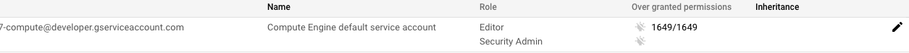
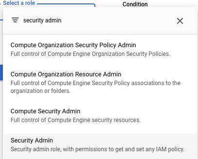

# ```Google Cloud Platform Marketplace solution prerequisites```
## Summary

In order for the Marketplace solution to launch successfully, you must include the 
`Security Admin IAM role`] on your Google 
Compute Engine service account so that it can update IAM roles on the Cloud Build service account
to build and deploy the Datashare UI and API to Cloud Run.

This role is required on your Compute Engine service account because it needs to modify other service
accounts with the appropriate permissions so that the Deployment Manager can deploy the full
solution automatically. 

##  Update Compute Engine service account from Google Cloud Console
1. Login to Google Cloud Console and select `IAM` from the menu.


2. Select the `edit` button next to the Compute Engine Service account (`project-number-compute@developer.gserviceaccount.com`).



3. Click `Add another role`.


4. Search for `Security Admin` and select it.



5. Click the `Save` button. 


Now you can click the `Launch` button on the Marketplace and deploy the Datashare solution within your GCP project. 

## Update Compute Engine service account from Cloud Shell
1. Open `Cloud Shell` from your Google Cloud console (top right corner).


2. Cloud Shell will open at the bottom of your window and it will be connected to your existing project. Execute the following commands.
These commands will clone the repository to your Cloud Shell instance, change into the correct directory and execute a 
shell script to add the Security IAM Admin role to your Compute Engine service account.

```
git clone https://github.com/GoogleCloudPlatform/datashare-toolkit.git
cd datashare-toolkit/marketplace
./update-compute-service-account-with-securityadmin-role.sh add
```

Now you can click the `Launch` button on the Marketplace and deploy the Datashare solution within your GCP project. 