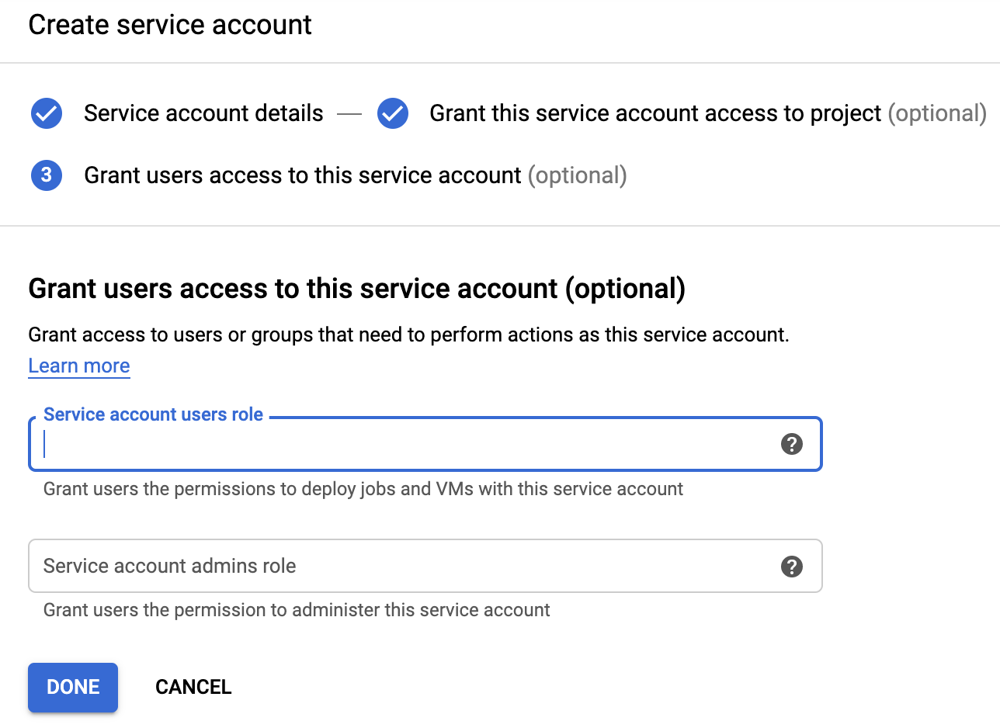

# ```Google Cloud Platform Marketplace solution prerequisites```
## Summary

In order for the Marketplace solution to launch successfully, you must create a new
service account and assign the [Security Admin IAM role](https://cloud.google.com/iam/docs/understanding-roles#iam-roles)
and the [Project Editor role](https://cloud.google.com/iam/docs/understanding-roles#primitive_role_definitions)
so that it can update IAM roles on the Cloud Build service account
to build and deploy the Datashare UI and API to Cloud Run.

The Security Admin role is required because it needs to modify other service
accounts with the appropriate permissions so that the Deployment Manager can deploy the full
solution automatically. 

Enable the Kubernetes API as well, since the Datashare API is deployed to Cloud Run on Anthos Kubernetes by default.  

## Enable the APIs

### From Cloud Console
1. [Enable the Kubernetes API from Cloud Console](https://console.cloud.google.com/apis/library/container.googleapis.com)
2. [Enable the Runtime Config API from Cloud Console](https://console.cloud.google.com/apis/library/runtimeconfig.googleapis.com)
3. [Enable the Cloud Build API from Cloud Console](https://console.cloud.google.com/apis/library/cloudbuild.googleapis.com)
4. [Enable the Commerce API from Cloud Console](https://console.cloud.google.com/apis/library/cloudcommerceprocurement.googleapis.com)

### From the command line
1. `gcloud services enable container.googleapis.com runtimeconfig.googleapis.com cloudbuild.googleapis.com cloudcommerceprocurement.googleapis.com`

## Update service account from Google Cloud Console
1. Login to Google Cloud Console and select `IAM` from the menu.


2. Select `Service Accounts` on the left side of the screen

 

3. Click `Create Service Account`.

 

4. Enter the following and then click the `Create` button. 
* `Service account name` as `datashare-deployment-manager`
* `Service account description` as `Datashare deployment manager`

5. Select the `Editor`, `Security Admin` and `Kubernetes Admin` roles.

 

6. Next add two `Service account users roles` to this service account.  These two members need to be able to execute commands on behalf of this service account. Then click the `Done` button. 
* `PROJECT_NUMBER-compute@developer.gserviceaccount.com`
* `PROJECT_NUMBER@cloudservices.gserviceaccount.com`
* `PROJECT_NUMBER@cloudbuild.gserviceaccount.com`



Now you can click the `Launch` button on the Marketplace and deploy the Datashare solution within your GCP project. 

## Create the new Service Account from Cloud Shell
1. Open `Cloud Shell` from your Google Cloud console (top right corner).


2. Cloud Shell will open at the bottom of your window and it will be connected to your existing project. Execute the following commands.
These commands will clone the repository to your Cloud Shell instance, change into the correct directory and execute a 
shell script to add the Security IAM Admin role to your Compute Engine service account.

```
gcloud config set project YOUR_PROJECT

SA="datashare-deployment-mgr"
```
Create project environment variables
```
PROJECT_ID=$(gcloud config get-value project)
PROJECT_NUMBER=$(gcloud projects describe $PROJECT_ID --format="value(projectNumber)")
```

Create the Service Account
```
gcloud iam service-accounts create $SA \
--display-name $SA \
--description "Datashare deployment manager"
```

Add a project level policy binding for the project editor role and the security admin role. 
```
gcloud projects add-iam-policy-binding $(gcloud config get-value project) \
--member=serviceAccount:$SA@$PROJECT_ID.iam.gserviceaccount.com \
--role=roles/editor

gcloud projects add-iam-policy-binding $(gcloud config get-value project) \
--member=serviceAccount:$SA@$PROJECT_ID.iam.gserviceaccount.com \
--role=roles/iam.securityAdmin
```

Assign the Compute instance service account access to the new service account.
```
gcloud iam service-accounts add-iam-policy-binding $SA@$PROJECT_ID.iam.gserviceaccount.com \
--role=roles/iam.serviceAccountUser \
--member=serviceAccount:$PROJECT_NUMBER-compute@developer.gserviceaccount.com
```

Assign the Cloud Services service access to the new service account as well. 
```
gcloud iam service-accounts add-iam-policy-binding $SA@$PROJECT_ID.iam.gserviceaccount.com \
--role=roles/iam.serviceAccountUser \
--member=serviceAccount:$PROJECT_NUMBER@cloudservices.gserviceaccount.com 
```

Assign the Cloud Build service access to the new service account as well. 
```
gcloud iam service-accounts add-iam-policy-binding $SA@$PROJECT_ID.iam.gserviceaccount.com \
--role=roles/iam.serviceAccountUser \
--member=serviceAccount:$PROJECT_NUMBER@cloudbuild.gserviceaccount.com 
```

Now you can click the `Launch` button on the Marketplace and deploy the Datashare solution within your GCP project. 

### Delete the Service Account
Delete the Service Account with the following command. 
```
gcloud iam service-accounts delete $SA@$PROJECT_ID.iam.gserviceaccount.com
```

```
gcloud projects remove-iam-policy-binding $(gcloud config get-value project) \
--member=serviceAccount:$SA@$PROJECT_ID.iam.gserviceaccount.com \
--role=roles/iam.securityAdmin

gcloud projects remove-iam-policy-binding $(gcloud config get-value project) \
--member=serviceAccount:$SA@$PROJECT_ID.iam.gserviceaccount.com \
--role=roles/editor
```
