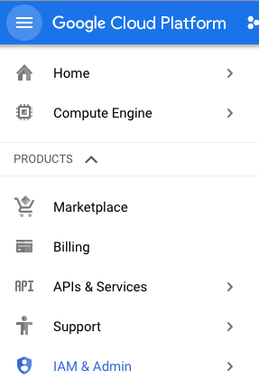
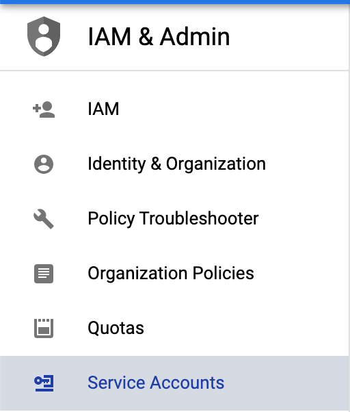
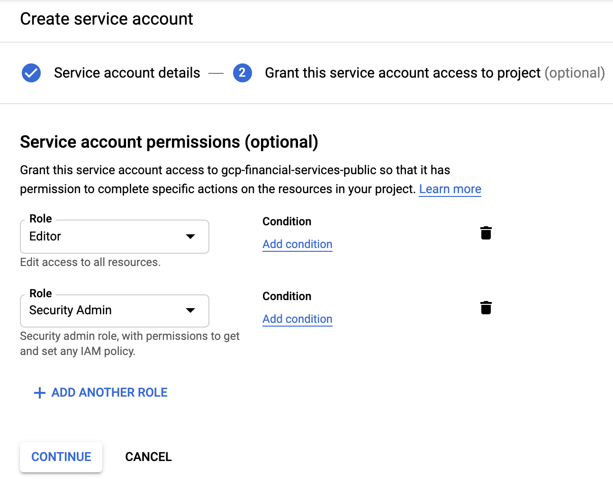

# ```Google Cloud Platform Marketplace solution prerequisites```
## Summary

In order for the Marketplace solution to launch successfully, you must create a new
service account and assign the [Security Admin IAM role](https://cloud.google.com/iam/docs/understanding-roles#iam-roles)
and the [Project Editor role](https://cloud.google.com/iam/docs/understanding-roles#primitive_role_definitions)
so that it can update IAM roles on the Cloud Build service account
to build and deploy the Datashare UI and API to Cloud Run.

The Security Admin role is required because it needs to modify other service
accounts with the appropriate permissions so that the Deployment Manager can deploy the full
solution automatically.

Enable the Kubernetes API as well, since the Datashare API is deployed to Cloud Run on Anthos Kubernetes by default.  

To create solutions in the Marketplace you must also be a marketplace vendor. See [becoming a Marketplace vendor](./../frontend/user-guide/MARKETPLACE_INTEGRATION.md/#becoming_a_marketplace_vendor) for more information.

## Enable the APIs
Note you can only enable the Cloud Commerce Producer API (cloudcommerceproducer.googleapis.com) or the Cloud Commerce Partner Procurement API (cloudcommerceprocurement.googleapis.com) if your project has been permissioned to the Producer or Partner Portal, otherwise you will need to enable this permission after you are provided with access to Producer Portal Partner Portal.

### From Cloud Console
1. [Enable the Kubernetes API from Cloud Console](https://console.cloud.google.com/apis/library/container.googleapis.com)
2. [Enable the Runtime Config API from Cloud Console](https://console.cloud.google.com/apis/library/runtimeconfig.googleapis.com)
3. [Enable the Cloud Build API from Cloud Console](https://console.cloud.google.com/apis/library/cloudbuild.googleapis.com)
4. Enable the Marketplace API
    * Producer Portal:
        * [Enable the Cloud Commerce Producer API from Cloud Console](https://console.cloud.google.com/apis/library/cloudcommerceproducer.googleapis.com)
        * See [Producer Portal Pre-requistites](./../frontend/user-guide/PRODUCER_PORTAL.md/#producer_portal_prerequisites) for more information.
    * Partner Portal:
        * [Enable the Cloud Commerce Partner Procurement API from Cloud Console](https://console.cloud.google.com/apis/library/cloudcommerceprocurement.googleapis.com)
        * See [Partner Portal Pre-requistites](./../frontend/user-guide/PARTNER_PORTAL.md/#partner_portal_prerequisites) for more information.

### From the command line
1.
```
gcloud services enable container.googleapis.com runtimeconfig.googleapis.com cloudbuild.googleapis.com cloudcommerceprocurement.googleapis.com
```

## Create the ds-api-mgr service account and custom role
You must complete this step to setup Datashare correctly.
1. Clone this repository into Google Cloud Shell.
```
git clone https://github.com/GoogleCloudPlatform/datashare-toolkit.git
```

2. Execute the `create-datashare-service-account.sh` script, which will create the `ds-api-mgr` service account and the new `custom.ds.api.mgr` role into your Google Cloud project.

```
cd datashare-toolkit/marketplace/
./create-datashare-service-account.sh
```

## Update service account from Google Cloud Console
1. Login to Google Cloud Console and select `IAM` from the menu.



2. Select `Service Accounts` on the left side of the screen



3. Click `Create Service Account`.


4. Enter the following and then click the `Create` button.
* `Service account name` as `datashare-deployment-manager`
* `Service account description` as `Datashare deployment manager`

5. Select the following roles
* [`Service Usage Admin`](https://cloud.google.com/iam/docs/understanding-roles#service-usage-roles) (roles/serviceusage.serviceUsageAdmin)
* [`Storage Admin`](https://cloud.google.com/iam/docs/understanding-roles#cloud-storage-roles) (roles/storage.admin)
* [`Cloud Runtime Config Admin`](https://cloud.google.com/iam/docs/understanding-roles#other-roles) (roles/runtimeconfig.admin)
* [`Cloud Run Admin`](https://cloud.google.com/iam/docs/understanding-roles#cloud-run-roles) (roles/run.admin)
* [`Cloud Run Service Agent` (roles/run.serviceAgent)
* [`Cloud Functions Developer`](https://cloud.google.com/iam/docs/understanding-roles#cloud-functions-roles) (roles/cloudfunctions.developer)
* [`Kubernetes Engine Cluster Admin`](https://cloud.google.com/iam/docs/understanding-roles#kubernetes-engine-roles) (roles/container.clusterAdmin)
* [`Kubernetes Engine Admin`](https://cloud.google.com/iam/docs/understanding-roles#kubernetes-engine-roles) (roles/container.admin)
* [`Kubernetes Engine Viewer`](https://cloud.google.com/iam/docs/understanding-roles#kubernetes-engine-roles) (roles/container.viewer)
* [`Service Account Creator`](https://cloud.google.com/iam/docs/understanding-roles#service-accounts-roles) (roles/iam.serviceAccountCreator)
* Project [`Role Admin`](https://cloud.google.com/iam/docs/understanding-roles#roles-roles) (roles/iam.roleAdmin)



Now you can click the `Launch` button on the Marketplace and deploy the Datashare solution within your GCP project.

## Create the new Service Account from Cloud Shell
1. Open `Cloud Shell` from your Google Cloud console (top right corner).


2. Cloud Shell will open at the bottom of your window and it will be connected to your existing project. Execute the following commands.
These commands will clone the repository to your Cloud Shell instance, change into the correct directory and execute a
shell script to add the Security IAM Admin role to your Compute Engine service account.

```
gcloud config set project YOUR_PROJECT

SA="datashare-deployment-mgr"
```
Create project environment variables
```
PROJECT_ID=$(gcloud config get-value project)
PROJECT_NUMBER=$(gcloud projects describe $PROJECT_ID --format="value(projectNumber)")
```

Create the Service Account
```
gcloud iam service-accounts create $SA \
--display-name $SA \
--description "Datashare deployment manager"
```

Add a project level policy binding for the project editor role and the security admin role.
```
gcloud projects add-iam-policy-binding $(gcloud config get-value project) \
--member=serviceAccount:$SA@$PROJECT_ID.iam.gserviceaccount.com \
--role=roles/editor

gcloud projects add-iam-policy-binding $(gcloud config get-value project) \
--member=serviceAccount:$SA@$PROJECT_ID.iam.gserviceaccount.com \
--role=roles/iam.securityAdmin

gcloud projects add-iam-policy-binding $(gcloud config get-value project) \
--member=serviceAccount:$SA@$PROJECT_ID.iam.gserviceaccount.com \
--role=roles/iam.ContainerAdmin

gcloud projects add-iam-policy-binding $(gcloud config get-value project) \
--member=serviceAccount:$SA@$PROJECT_ID.iam.gserviceaccount.com \
--role=roles/iam.ContainerAdmin

gcloud projects add-iam-policy-binding $(gcloud config get-value project) \
--member=serviceAccount:$SA@$PROJECT_ID.iam.gserviceaccount.com \
--role=roles/iam.roleAdmin

gcloud projects add-iam-policy-binding $(gcloud config get-value project) \
--member=serviceAccount:$SA@$PROJECT_ID.iam.gserviceaccount.com \
--roles/serviceusage.serviceUsageAdmin

gcloud projects add-iam-policy-binding $(gcloud config get-value project) \
--member=serviceAccount:$SA@$PROJECT_ID.iam.gserviceaccount.com \
--roles/storage.admin

gcloud projects add-iam-policy-binding $(gcloud config get-value project) \
--member=serviceAccount:$SA@$PROJECT_ID.iam.gserviceaccount.com \
--roles/resourcemanager.projectIamAdmin

gcloud projects add-iam-policy-binding $(gcloud config get-value project) \
--member=serviceAccount:$SA@$PROJECT_ID.iam.gserviceaccount.com \
--roles/runtimeconfig.admin

gcloud projects add-iam-policy-binding $(gcloud config get-value project) \
--member=serviceAccount:$SA@$PROJECT_ID.iam.gserviceaccount.com \
--roles/cloudfunctions.developer

gcloud projects add-iam-policy-binding $(gcloud config get-value project) \
--member=serviceAccount:$SA@$PROJECT_ID.iam.gserviceaccount.com \
--roles/container.clusterAdmin

gcloud projects add-iam-policy-binding $(gcloud config get-value project) \
--member=serviceAccount:$SA@$PROJECT_ID.iam.gserviceaccount.com \
--roles/container.admin

gcloud projects add-iam-policy-binding $(gcloud config get-value project) \
--member=serviceAccount:$SA@$PROJECT_ID.iam.gserviceaccount.com \
--roles/container.viewer
```


Now you can click the `Launch` button on the Marketplace and deploy the Datashare solution within your GCP project.

### Delete the Service Account
Delete the Service Account with the following command.
```
gcloud iam service-accounts delete $SA@$PROJECT_ID.iam.gserviceaccount.com
```

```
gcloud projects remove-iam-policy-binding $(gcloud config get-value project) \
--member=serviceAccount:$SA@$PROJECT_ID.iam.gserviceaccount.com \
--role=roles/iam.securityAdmin

gcloud projects remove-iam-policy-binding $(gcloud config get-value project) \
--member=serviceAccount:$SA@$PROJECT_ID.iam.gserviceaccount.com \
--role=roles/editor
```
